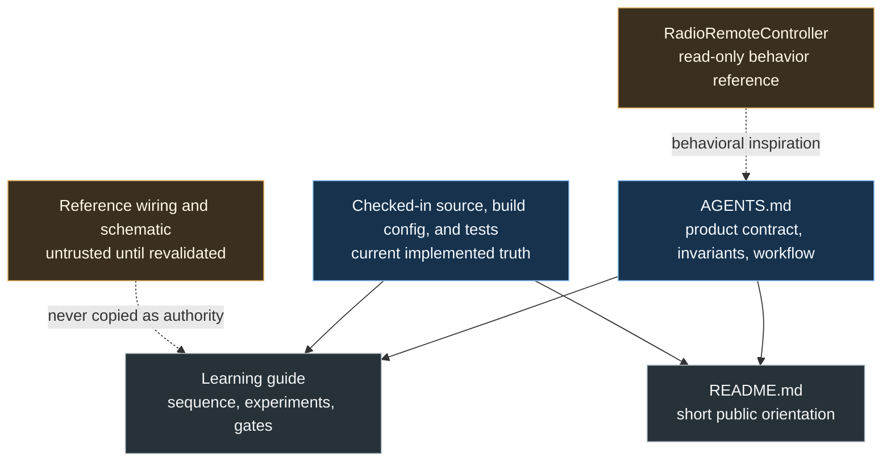
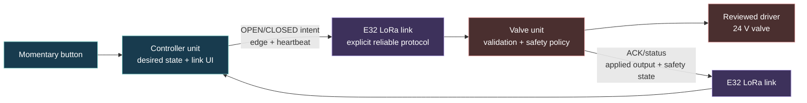

# ESP32 LoRa Remote Controller Learning Redesign Plan

## 1. Summary

Replace the repository's autonomous garden-watering documentation with a
coherent learning path toward a production-quality ESP32-S3 LoRa remote valve
controller modeled on the behavior of
`C:\Users\Public\Arduino\RadioRemoteController`.

This is a documentation-only change. It will:

- replace and rename the learning guide;
- rewrite `AGENTS.md` around the correct product and teaching workflow;
- align `README.md`;
- add a starter `LEARNING_LOG.md` for predictions, measurements, and
  acceptance evidence;
- preserve the existing ESP32-S3, ESP-IDF, PlatformIO, flash, and PSRAM
  configuration;
- leave firmware and hardware unchanged.

The approved concept is
`.claude/concepts/esp32-lora-remote-controller-learning-redesign.md`.

## 2. Problem Analysis

### Requirements

- Teach ESP32 programming comprehensively through observable, cumulative
  experiments.
- End with the behavior of the reference controller:
  - wall-side momentary input;
  - hold to request OPEN and release to request CLOSED;
  - feedback for the valve unit's applied electrical output state, without
    falsely claiming physical valve-position sensing;
  - connection indicators;
  - desired-state heartbeats that repair lost edge messages;
  - maximum-open, link-loss, malformed-message, and recovery safety behavior.
- Use the checked-in ESP32-S3-WROOM-1-N16R8, ESP-IDF, C++, and PlatformIO
  baseline.
- Retain E32 LoRa as the proposed transport and teach the additional software
  reliability that nRF24 previously provided in hardware.
- Keep hardware, safety, protocol, and regulatory unknowns explicit.
- Provide measurable completion criteria and a learning log.
- Make the guide and contributor instructions mutually consistent.

### Constraints

- The exact development/carrier board is not yet confirmed.
- E32 LoRa is accepted as the transport family; its exact model, frequency band,
  mode, power, UART settings, antenna, and regional constraints are unresolved.
- GPIO assignments and the valve-driver circuit are unresolved.
- The final packaging as separate PlatformIO environments, separate projects,
  or another compile-time role arrangement is unresolved.
- The reference source, `WIRING.md`, and schematic contradict one another.
- The reference firmware is not bench-validated and does not force the valve
  output OFF before initializing the radio.
- The current source is a single external-LED ESP-IDF experiment.
- Existing build files and the untracked `clang-format` file belong to the user
  and must not be changed.
- Uploading, erasing flash, transmitting, or energizing a valve is not
  authorized by this documentation task.

### Risks

- Treating the reference as a literal port would copy Arduino/nRF24 assumptions,
  contradictory wiring, and unverified electrical claims.
- Keeping the current guide and editing terminology would leave soil, battery,
  deep-sleep, MQTT, and field-node assumptions embedded throughout 74 days.
- A "production" label could overstate hardware verification.
- Excessive FreeRTOS architecture could obscure a controller simple enough for
  a single event loop.
- Calling the reported output state an "actual valve state" could imply a
  mechanical position/flow sensor that the design does not have.
- Silently copying the reference's auto-reopen-after-link-loss behavior could
  conflict with the approved deliberate-recovery safety direction.
- An overly detailed future wire format could prematurely freeze unresolved
  protocol and security decisions.
- Documentation could drift if the renamed guide is not linked everywhere.

## 3. Goals and Non-Goals

### Goals

- Establish one clear product contract and vocabulary.
- Teach fundamentals before abstractions or real valve power.
- Separate pure, host-testable policy/protocol logic from ESP-IDF hardware
  adapters.
- Define production gates based on evidence, not completion of code alone.
- Document deliberate improvements over the reference.
- Preserve a small-step workflow suitable for a learner.
- Introduce RAII, multiple tasks, queues, or other concurrency mechanisms only
  when a demonstrated ownership/lifetime problem needs them.

### Non-Goals

- Implement controller or valve firmware.
- Select GPIOs, an E32 SKU, radio parameters, a valve, transistor, diode, or
  power supply.
- Adopt a final wire format or authentication primitive.
- Claim knowledge of mechanical valve position or water flow without a sensor.
- Modify partitions, PlatformIO environments, or SDK configuration.
- Upload firmware, transmit a radio signal, or operate a valve.
- Retain autonomous soil watering, deep sleep, MQTT, or phone control in the
  core roadmap.

## 4. Options and Decision

### Option A: Repair the existing 74-day guide | Complexity: High

**Approach:** Rewrite individual days while retaining the current week/day
structure.

**Pros:**

- Preserves the existing document shape.
- Can reuse some ESP32, FreeRTOS, UART, CRC, and safety explanations.

**Cons:**

- The final product changes nearly every later lesson.
- High risk of stale Arduino, soil, battery, MQTT, and sleeping-node assumptions.
- A fixed 74-day schedule encourages artificial sequencing and oversized
  copy-paste examples.
- Harder to keep hardware decision gates visible.

### Option B: Replace it with milestone-based learning stages | Complexity: Medium

**Approach:** Create a new guide organized by cumulative stages. Each stage
contains outcomes, concepts, small labs, evidence, and a gate.

**Pros:**

- Directly follows the approved product.
- Makes prerequisites and safety gates explicit.
- Allows lessons to take the time the learner actually needs.
- Easier to maintain and extend without renumbering dozens of days.
- Supports test-first pure logic before radio or valve hardware.

**Cons:**

- Discards the familiar daily numbering.
- Requires a clean rewrite instead of localized edits.

**Decision:** Option B. The user approved a clean product realignment, and a
staged guide is the simplest way to remove the old system rather than hide it.

## 5. Documentation Architecture and Intended System

### Source-of-truth relationship



### Target runtime relationship



### Reference behavior versus hardened target

| Concern | `RadioRemoteController` behavior | ESP32/E32 target |
| --- | --- | --- |
| User command | Button held = OPEN; release = CLOSED | Preserve |
| Lost edge repair | Every 1 Hz ping repeats desired state | Preserve the concept; cadence remains a measured protocol decision |
| Feedback | ACK payload reports whether firmware energizes its output | Report applied electrical output and safety state; do not call it sensed valve position |
| Maximum-open limit | Five-minute timer starts on closed-to-open; repeated OPEN does not extend it; CLOSED intent clears the lockout | Preserve non-extension and lockout concept; final duration requires explicit safety approval |
| Link loss while open | Close after five seconds, then auto-reopen if the link returns while desired state is still OPEN | Deliberate hardening: remain fail-closed until a CLOSED intent is observed and a later fresh OPEN edge is received; timeout remains unresolved |
| Malformed message | Enter error lockout; a later explicit Enable edge clears and opens | Preserve fail-closed behavior; require a documented fresh-user-action recovery and test stale heartbeat rejection |
| Radio reinitialization | Reconfigure after sustained silence; failure does not itself enter protocol lockout | Preserve transport recovery separation; reinitialization can never directly energize the output |
| Corruption/loss/duplication | nRF24 hardware supplies CRC, auto-ACK, and retries; payload has no software sequence | E32 protocol explicitly owns framing, CRC, ACK matching, bounded retry/backoff, sequence/duplicate/stale handling |
| Command authenticity | Address/channel only | Production gate requires a threat model and authenticated commands; exact primitive remains unresolved |

### Learning-stage design

| Stage | Outcome | Required evidence |
| --- | --- | --- |
| 0. Product and safety contract | Explain the two units, momentary behavior, and why the reference is not copied literally | Written behavior prediction and unresolved-hardware list |
| 1. Reproducible toolchain | Build the checked-in project and identify compiler, linker, partition, and flash artifacts | Build transcript notes; no upload required |
| 2. ESP32-S3 mental model | Explain boot, reset, memory, tasks, GPIO, 3.3 V limits, and return-code handling | Annotated boot flow and pin-decision checklist |
| 3. C++ for firmware | Use value types, enums, bounded data, const-correctness, and host tests; introduce RAII later when a real resource owner appears | Small native tests with no ESP-IDF dependency |
| 4. GPIO output | Understand and extend the current LED exercise | Predicted and observed timing/error behavior |
| 5. Button input | Wire only after board confirmation; learn pull-ups, bounce, sampling, and edge events | Raw bounce capture and tested debouncer |
| 6. Time and execution | Use rollover-safe deadlines and non-blocking state machines; learn FreeRTOS task/queue concepts in an optional controlled lab and adopt them only if later ownership needs justify them | Timing tests; optional concurrency observations kept separate from the product architecture |
| 7. Simulated valve safety | Model valve behavior with an LED and pure policy before any power stage | Host tests for open, close, timeout, lockout, and recovery |
| 8. E32 hardware gate | Confirm module, band, legal settings, logic levels, supply, antenna, and UART wiring | Reviewed datasheets, wiring table, and receive-only/low-risk bring-up plan |
| 9. UART and radio transport | Exchange bounded bytes and recover from UART/radio errors | Measured framing behavior and error log |
| 10. Wire protocol | Define explicit serialization, version, framing, CRC, ranges, sequence numbers, and status messages | Golden vectors and corruption/length/range tests |
| 11. Reliable link | Add ACK matching, bounded retries/backoff, duplicate handling, desired-state heartbeat, link freshness, and radio recovery | Loss/duplication/delay simulations and counters |
| 12. Controller unit | Debounce button, maintain intent, send edge plus heartbeat, display live link and reported valve-unit output state | LED-only end-to-end controller demonstration |
| 13. Valve unit | Force safe output first, validate intent, apply safety policy, report actual/safety state, and require deliberate recovery | Reset/link-loss/corruption/max-open tests using LED load |
| 14. Electrical valve gate | Review driver topology and protection; measure before attaching water | Signed bench checklist, voltage/current/temperature measurements |
| 15. Production verification | Threat model/authentication, diagnostics, fault injection, range, soak, brownout/reset, release evidence | Completed traceability matrix and release checklist |

### Intended future component boundaries

- `input`: button GPIO sampling and debounced edge events.
- `protocol`: pure byte encoding/decoding, validation, sequence logic, ACK
  matching, duplicate handling, and protocol counters.
- `radio`: exclusive E32 UART/mode-pin ownership; no valve decisions.
- `valve_policy`: pure state machine for desired state, maximum-open deadline,
  link-loss/error lockout, and deliberate recovery.
- `valve_driver`: smallest possible GPIO adapter that can only command safe OFF
  or reviewed ON.
- `diagnostics`: reset reason, link health, safety trips, counters, and concise
  status records.
- `controller_app` and `valve_app`: separate logical composition roots sharing
  the above logic. The final PlatformIO/source-layout mechanism is chosen when
  the second role is introduced, not fixed by this documentation rewrite.

Boundaries are introduced only when their learning stage needs them.

## 6. Implementation Steps

### Step 1: Replace and rename the learning guide

**Files:**

- Delete `docs/esp32-lora-watering-daily-guide.md`.
- Add `docs/esp32-lora-remote-controller-learning-guide.md`.

The new guide will contain:

- purpose, prerequisites, vocabulary, and the predict/observe/explain method;
- a verified-current-state section;
- a behavior traceability table from the reference to the ESP32/E32 target;
- an explicit table separating preserved reference behavior from deliberate
  safety hardening;
- the 16 learning stages above, each with:
  - outcome;
  - concepts to understand;
  - focused experiments;
  - expected observations;
  - evidence to record;
  - a completion gate;
- hardware decision gates before button, radio, and valve wiring;
- a product safety state model;
- a production definition of done;
- optional post-parity extensions clearly separated from the core roadmap.

The guide may illustrate intended policy types without claiming they already
exist:

```cpp
enum class DesiredValveState : std::uint8_t {
    closed,
    open,
};

enum class ValveSafetyState : std::uint8_t {
    closed,
    open,
    maximum_open_lockout,
    link_loss_lockout,
    protocol_error_lockout,
};
```

#### Implementer Context

> Write a learning roadmap, not a monolithic tutorial application. Do not include
> unverified GPIO numbers or copy Arduino calls. Make every real-hardware section
> stop at an explicit evidence gate. Preserve useful concepts from the old guide
> only when they directly serve the controller product.

### Step 2: Rewrite the contributor contract

**File:** `AGENTS.md`

Replace the field-node/base-station architecture with:

- controller-unit and valve-unit product behavior;
- current state accurately naming `src/main.cpp`;
- accepted and unresolved decisions;
- source-of-truth precedence;
- deliberate differences from `RadioRemoteController`;
- progressive component boundaries;
- valve safety invariants;
- E32 protocol requirements;
- learning-oriented implementation workflow;
- documentation synchronization rules;
- verification and authorization limits.

Document the intended information contracts without freezing a byte layout:

```cpp
struct ControllerIntent {
    DesiredValveState desired_state;
    std::uint32_t sequence;
};

struct ValveStatus {
    DesiredValveState applied_state;
    ValveSafetyState safety_state;
    std::uint32_t acknowledged_sequence;
};
```

#### Implementer Context

> `AGENTS.md` must be authoritative enough to stop future agents from rebuilding
> the garden/MQTT system, yet concise enough to remain usable. Separate current
> facts from future targets. Any numerical timeout not already approved must be
> labeled provisional or unresolved.

### Step 3: Align the repository landing page and concept record

**Files:**

- `README.md`
- `LEARNING_LOG.md`
- `.claude/concepts/esp32-lora-remote-controller-learning-redesign.md`

Update the README title, product summary, unit roles, current status, build
command, guide link, and safety disclaimer. Add a compact learning-log template
for predictions, observed results, measurements, environment, and unresolved
questions. Append the concept approval to the decision log.

No application structure changes in this step:

```cpp
// Documentation-only redesign:
// src/main.cpp remains the existing external-LED learning experiment.
extern "C" void app_main();
```

#### Implementer Context

> Keep README short. It should orient a new reader and link to the guide, not
> duplicate `AGENTS.md`. State clearly that the final controller is not yet
> implemented or hardware-validated. Keep the log template useful from the
> current LED exercise onward; do not pre-populate unobserved measurements.

### Step 4: Perform a cross-document consistency audit

Check:

- all links target existing files;
- no document claims `src/main.c` is current;
- core scope no longer describes soil sensing, autonomous watering, deep sleep,
  MQTT, phone dashboards, or a sleeping field node;
- E32 is not described using nRF24-only ACK payload behavior;
- output feedback is not described as mechanical valve-position or water-flow
  sensing;
- reference link-loss auto-reopen is distinguished from the hardened target's
  deliberate-recovery rule;
- the reference path is described as read-only and non-authoritative for
  wiring;
- all real hardware work has decision gates;
- safety and production claims match across README, guide, and `AGENTS.md`;
- no firmware/build/config file changed;
- Markdown has no whitespace errors.

```cpp
// Production C++ remains unchanged by this documentation audit.
// Future interfaces shown in the guide are design targets, not implemented APIs.
```

#### Implementer Context

> Use `rg`, `git diff --check`, and a final read of every touched document.
> Distinguish an optional future-extension mention from accidental core scope.
> Do not run uploads or hardware tests.

## 7. Test Strategy

This change has no runtime behavior, so verification is documentary:

1. **Worktree and diff scope**
   - `git status --short` is recorded before and after the work.
   - `git diff --name-status` shows only the guide rename/replacement,
     `AGENTS.md`, `README.md`, `LEARNING_LOG.md`, and `.claude` concept/plan
     artifacts added by this task.
   - Existing `clang-format` remains untouched.
2. **Whitespace and patch validity**
   - `git diff --check` returns no errors.
3. **Link integrity**
   - Every local Markdown link resolves.
   - No file links to the deleted guide remain.
   - A read-only local link-check command reports no missing relative targets.
4. **Markdown structure**
   - Heading levels are coherent, fenced code blocks are balanced, and tables
     have headers.
   - If no Markdown linter is installed, this is explicitly reported as a
     structural/manual check rather than a linter pass.
5. **Scope regression search**
   - Search for old product terms.
   - Any remaining match must be an explicit exclusion or optional future
     extension.
6. **Current-state accuracy**
   - Compare README/AGENTS statements against `platformio.ini`,
     `sdkconfig.defaults`, `partitions.csv`, and `src/main.cpp`.
7. **Reference traceability**
   - Check each implemented reference behavior named in its README/source has a
     corresponding guide stage or an explicit deliberate difference.
8. **Safety traceability**
   - Check boot-safe OFF, external pull-down/flyback protection, no toggle,
     maximum-open behavior, link-loss behavior, malformed-frame behavior,
     deliberate recovery, antenna requirement, and no unauthorized valve power
     are present in `AGENTS.md` and the relevant guide gates.

No firmware build is required because build inputs do not change. Verification
is documentary only. The final report must not imply firmware, radio, electrical,
mechanical-valve, water-flow, or hardware verification.

## 8. Pitfalls and Mitigations

| Pitfall | Consequence | Mitigation |
| --- | --- | --- |
| Copying the reference pin map or schematic | Incorrect or unsafe ESP32 wiring | Treat all reference wiring as untrusted; require board/module datasheets |
| Calling a transistor "logic level" from threshold voltage alone | Overheating or incomplete valve drive | Require specified conduction at the actual 3.3 V drive and measured margins |
| Reusing nRF24 ACK assumptions | Broken E32 reverse path and reliability | Specify explicit bidirectional frames, ACKs, retry, and status |
| Calling output feedback "actual valve state" | False belief that mechanical movement or flow was sensed | Use "applied electrical output"; require a sensor before claiming physical state |
| Repeating OPEN heartbeats resets the max timer | A held button defeats the hard limit | Arm only on a real closed-to-open transition; test it |
| Reopening after a safety trip from a stale OPEN heartbeat | Valve restarts without a fresh user action | Require a documented deliberate recovery sequence |
| Treating CRC as authentication | Any transmitter can issue a valid command | Add a deployment threat-model/authentication gate |
| Teaching tasks before simple timing | Accidental races and needless complexity | Start with pure state machines and one owner; add FreeRTOS where evidence justifies it |
| Calling documentation "production-ready" | False confidence before bench evidence | Define production readiness as a checklist of measurements and fault tests |
| Freezing unresolved numeric limits | Unsafe inherited assumptions | Mark limits provisional until hardware and risk decisions are approved |
| README duplicates detailed rules | Future drift | Keep README as orientation and link to authoritative documents |

## 9. Compatibility and Rollout

- The old guide path is intentionally removed and replaced. README and
  `AGENTS.md` will be updated in the same change.
- No compatibility promise is needed for old guide anchors because the product
  itself is being corrected before implementation.
- Existing firmware continues to build and behave exactly as before.
- Existing flash layout remains unchanged even though OTA/FATFS are not core
  roadmap features; they are documented as reserved, not implemented.
- E32 remains the accepted transport family, while its SKU and configuration
  remain gated. The two logical application roles do not commit this change to
  a particular PlatformIO environment layout.
- Future code work begins at the next incomplete learning stage and requires
  explicit agreement before any hardware, safety, persistence, protocol, or
  security decision.

## 10. Acceptance Criteria

- The repository is described everywhere as an ESP32-S3/E32 remote valve
  controller learning project.
- A reader can explain how the target relates to and improves upon
  `RadioRemoteController`.
- Controller and valve-unit responsibilities are unambiguous.
- Hold-to-open/release-to-close, idempotent set-state commands, desired-state
  heartbeat, applied-output feedback, and link health are documented.
- The documents explicitly state that no mechanical valve-position or flow
  sensor exists in the current target.
- Reference auto-recovery behavior and the target's deliberate safety hardening
  are traceable and cannot be mistaken for one another.
- Safety behavior covers boot/reset, maximum-open time, link loss, malformed or
  stale commands, deliberate recovery, external electrical protection, and
  radio/antenna constraints.
- The guide progresses from the current LED exercise to simulated safety, radio,
  protocol, integration, real-valve bench validation, and production evidence.
- Exact hardware and regional settings are not guessed.
- Soil/moisture autonomy, battery/deep sleep, MQTT, and phone control are absent
  from core scope.
- `AGENTS.md` accurately reflects `src/main.cpp` and checked-in build settings.
- README links to the renamed guide and does not claim implementation is
  complete.
- The consistency checks in Section 7 pass.

## 11. Task Breakdown

1. **Write the replacement guide**
   - Files: add
     `docs/esp32-lora-remote-controller-learning-guide.md`; delete
     `docs/esp32-lora-watering-daily-guide.md`.
   - Done when: all 16 stages, evidence gates, traceability, safety model, and
     production criteria are present without unverified wiring.
2. **Rewrite the contributor guide**
   - File: `AGENTS.md`.
   - Done when: product, current state, authority, architecture, safety,
     protocol, workflow, verification, and unresolved decisions match the new
     target.
3. **Align the landing page**
   - File: `README.md`.
   - Done when: title, summary, roles, current status, safety disclaimer, and
     guide link are accurate.
4. **Add the evidence-log template**
   - File: `LEARNING_LOG.md`.
   - Done when: it has reusable fields for prediction, setup, observation,
     measurements, explanation, and next question without invented results.
5. **Record concept approval**
   - File:
     `.claude/concepts/esp32-lora-remote-controller-learning-redesign.md`.
   - Done when: approval is appended without rewriting previous decision-log
     entries.
6. **Run mechanical consistency checks**
   - Files: all touched Markdown.
   - Done when: no stale links, whitespace errors, old current-state claims, or
     accidental old core scope remains.
7. **Perform final semantic audit**
   - Inputs: reference README/source, checked-in config/source, all rewritten
     documents.
   - Done when: behavior and safety traceability are complete and all remaining
     unknowns are explicitly marked.
