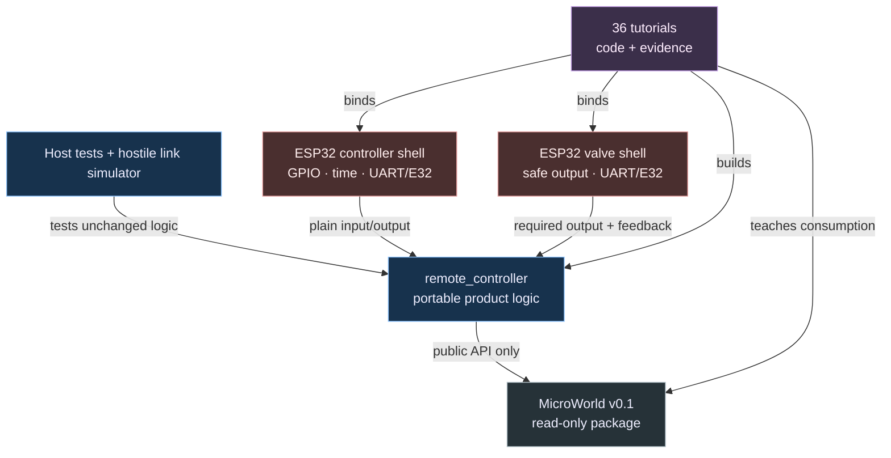

# ESP32 Documentation Change Plan: MicroWorld Remote Controller Tutorial

| Field | Value |
|---|---|
| **Created** | 2026-07-18 |
| **Status** | In Review |
| **Change Type** | Redesign |
| **Author** | Codex with project owner |
| **Target Module** | `docs/esp32-tutorial` |
| **Priority** | High |
| **Estimated Scope** | XL (sprint+) |
| **P4 CL / Branch** | Planning only; documentation session selected later |

---

## 0 · TL;DR

**What the user sees:** The current ESP32 document is a broad roadmap. It names
topics and gates but does not provide a reproducible one-hour sequence with
enough theory, reasoning, complete code changes, failure exercises, and
objective evidence.

**Why it happens:** The guide tries to describe the final system and invent its
portable framework at the same time. MicroWorld changes are mixed with GPIO,
FreeRTOS, UART, radio, safety, and security learning, so neither the framework
nor each tutorial checkpoint has a stable starting point.

**What the fix does:** Replace the monolithic roadmap with 36 cumulative
tutorials that consume released MicroWorld v0.1 read-only, implement the
portable remote-controller application, then bind it to ESP32-S3/E32 adapters.
Every checkpoint is mechanically built; physical evidence remains an explicit,
repeatable gate.

---

## 1 · 🎯 Objective & Motivation

### 1.1 Problem Statement

Teach ESP32 development comprehensively by evolving the current external-LED
exercise into a production-minded two-device remote valve controller. Preserve
the useful intent, heartbeat, status, watchdog, lockout, and recovery behavior
of `C:\Users\Public\Arduino\RadioRemoteController`, but replace its
Arduino/nRF24 coupling and unverified hardware assumptions with ESP-IDF,
MicroWorld, explicit E32 transport, host-tested policy, authenticated protocol,
and measured safety gates.

### 1.2 Success Criteria

- [ ] One index, one architecture/API chapter, one verification matrix, and
  nine modules contain exactly 36 numbered tutorials.
- [ ] Every tutorial contains Result, Starting point, Theory, Reasoning and
  alternatives, Plan and prediction, Implementation, Build and verification,
  Failure exercise, Explain and record, and Done when—in that order.
- [ ] Every tutorial gives exact file paths, complete new files or precise
  edits, commands, expected output, and an objective gate.
- [ ] Each focused lesson is planned for about one hour; hardware evidence gates
  explicitly allow repeated sessions.
- [ ] Released MicroWorld v0.1 is pinned and never implemented or patched by a
  normal tutorial step.
- [ ] Portable `remote_controller` code contains no ESP-IDF, FreeRTOS, GPIO,
  UART, E32, or Arduino headers.
- [ ] Actor/Component lifecycle and independent tick settings are used and
  explained rather than reimplemented.
- [ ] MicroWorld's adapted UE5 naming is used consistently: `F` for non-UObject
  classes/structs, `T` for templates, `E` for enums, `b` for booleans, and
  unprefixed unit-explicit scalar aliases, with PascalCase public identifiers;
  lessons explain why `A`/`U` do not apply.
- [ ] Every introduced class has an adjacent one-to-three-sentence Doxygen
  comment stating purpose, ownership/lifetime, or a safety invariant.
- [ ] Every directory created by the documentation or cumulative tutorial has a
  concise scoped `AGENTS.md`, including intermediate namespace/source folders.
- [ ] Product `Tick(input) -> result/effects` methods stage input, invoke
  MicroWorld `FApplication::Advance(Now)`, and expose runtime failures.
- [ ] Controller and valve roles build independently from explicit source
  selection; no recursive composition-root glob remains.
- [ ] Host tests cover input, time, valve safety, protocol, authentication,
  replay, reliability, and two-application failure simulation.
- [ ] Valve OFF is the first valve-side hardware action and cannot be dropped by
  an optional-effect queue.
- [ ] Critical valve safety evaluation is an unconditional application phase,
  not behavior that can be disabled or delayed by a TickFunction.
- [ ] Adapter execution feedback is not described as electrical or physical
  valve confirmation.
- [ ] Authentication/replay design precedes the wire envelope; implemented,
  vector-verified production authentication and key provisioning precede RF.
- [ ] The production security profile's algorithm, nonce/session construction,
  tag/key-id sizes, and authenticated coverage are selected before envelope
  fields are frozen.
- [ ] No real valve is energized before reviewed electrical and safe-failure
  evidence.
- [ ] Tutorials measure flash/static RAM, stack high-water marks, update cycles
  or latency, allocations, buffer occupancy, blocking, and radio airtime before
  applying an optimization.
- [ ] Retained optimizations preserve portable behavior and safety deadlines;
  each has target before/after evidence and no unexplained regression over 10%.
- [ ] Checkpoints 1–3 reproduce the starting build; checkpoints 4–36 run
  relevant native tests and both ESP32 role builds.

### 1.3 Out of Scope

- Implementing or changing MicroWorld itself.
- Uploading firmware, configuring/transmitting radios, energizing a valve,
  connecting water, or changing irreversible eFuses during documentation work.
- Guessing carrier-board pins, E32 model/settings, regional rules, valve
  current, driver topology, or security keys.
- Soil sensing, MQTT, Wi-Fi dashboards, battery optimization, deep sleep, or
  irrigation policy beyond the momentary remote controller.
- Claiming physical valve position, water flow, range, security, or electrical
  behavior without measured evidence.
- Preserving the reference project's Arduino, nRF24, two-byte wire format, pin
  assignments, timing constants, or driver schematic.

---

## 2 · 🔍 Context & Current State Analysis

### 2.1 Affected Systems Map

| System / Class | Role in Change | Ownership |
|---|---|---|
| `docs/esp32-tutorial` | New modular curriculum | Documentation |
| `lib/microworld` | Versioned read-only prerequisite | MicroWorld plan/session |
| `lib/remote_controller` | Portable product code created by lessons | Tutorial learner |
| `FControllerApplication` | Button intent, heartbeat, status | Portable application |
| `FValveApplication` | Network intent, safety result, required output | Portable application |
| ESP32 controller shell | GPIO input, timing, E32, indicators | Platform |
| ESP32 valve shell | Safe-first output, E32, diagnostics | Platform |
| `AGENTS.md` | Contributor/safety/tutorial rules | Repository |
| Scoped `AGENTS.md` files | Local folder/dependency/naming/hot-path rules | Closest folder |
| `LEARNING_LOG.md` | Predictions, observations, evidence | Learner |
| `RadioRemoteController` | Read-only behavioral reference | External reference |

### 2.2 Existing Code Audit

```text
.
├── AGENTS.md
├── README.md
├── LEARNING_LOG.md
├── platformio.ini               # one ESP32-S3 environment
├── partitions.csv               # N16R8 OTA/storage/coredump layout
├── sdkconfig.defaults
├── src/
│   ├── main.cpp                 # GPIO10 external LED exercise
│   └── CMakeLists.txt           # recursive source glob
└── docs/
    └── esp32-lora-remote-controller-learning-guide.md
                                # rejected roadmap-style guide
```

- Current architecture pattern: one ESP-IDF `app_main`; no portable application
  or tests yet.
- Confirmed target: ESP32-S3-WROOM-1-N16R8, ESP-IDF, PlatformIO, E32 family.
- Known tech debt: one build role, unpinned platform package, GPIO10 not
  product-approved, recursive source glob, no host tests.
- Current test coverage: none; only the firmware build has previously been
  established.
- Reference audit: one shared Arduino sketch implements server/client roles,
  explicit enable/disable plus desired-state ping, ACK status, maximum-open
  watchdog, link-loss closure, error lockout, connection LEDs, and radio
  reinitialization. It also contains contradictory wiring/driver descriptions,
  nRF24-specific behavior, startup ordering risk, status overclaiming, and no
  real-hardware validation.

### 2.3 UE5-Specific Constraints Checklist

| Constraint | Relevant? | Notes |
|---|---|---|
| Reflection system (UPROPERTY/UFUNCTION) | No | MicroWorld is ordinary C++17 |
| Garbage Collection considerations | No | Deterministic owned values |
| Blueprint exposure needed | No | Embedded application |
| Replication / Multiplayer | No | Custom point-to-point protocol |
| Gameplay Ability System (GAS) | No | Not applicable |
| Enhanced Input System | No | ESP-IDF GPIO input |
| World Subsystems | No | MicroWorld World/Network concepts only |
| Async / Latent actions | No | FreeRTOS taught only when measured need exists |
| Soft/Hard object references | No | No assets |
| Data Assets / Data Tables | No | Validated settings may arrive later |
| Plugins / Module boundaries | No | C++ libraries and PlatformIO environments |
| Editor tooling / Details panel | No | Serial/telemetry observability |

### 2.4 Risks & Constraints

- MicroWorld implementation may not yet exist when tutorial writing starts.
- A planned API can differ from the released v0.1 API; the release wins.
- Thirty-six cumulative code states can drift unless every one is materialized
  and built while authoring.
- A one-hour label can pressure unsafe hardware shortcuts.
- ESP-IDF/PlatformIO source discovery can accidentally compile both roles.
- E32 model, frequency, timing, and regulatory rules are unresolved.
- Security cannot be bolted on after the wire contract or first RF exchange.
- Generic effects can drop safety-critical OFF work.
- GPIO API success is not electrical or mechanical confirmation.
- The learning guide can become a code dump if theory/reasoning budgets are not
  enforced.
- UE-looking names can falsely imply UObject/GC/reflection behavior.
- “Microcontroller optimization” can become speculative flag/type churn unless
  every change begins with a reproducible target measurement.
- Per-folder `AGENTS.md` files can contradict or duplicate one another unless
  they inherit parents and contain only local rules.

---

## 3 · 🤔 Options Considered

| # | Approach | Pros | Cons | Complexity | Verdict |
|---|---|---|---|---|---|
| 1 | Consume released MicroWorld; teach product/platform only | Stable API; clear learning focus; portable app remains real | Tutorial waits for framework v0.1 | High | Selected |
| 2 | Implement MicroWorld during lessons | Everything grows in one narrative | Framework instability overwhelms ESP32 learning | High | Rejected |
| 3 | Ignore framework and write ESP32-specific apps | Shortest initial route | Violates portability/extension goal; duplicates roles | Medium | Rejected |

---

## 4 · ✅ Selected Approach

**Option:** Consume released MicroWorld; teach product/platform only |
**Complexity:** High

Author a 36-checkpoint course against the actual MicroWorld v0.1 public API. The
course builds a separate portable remote-controller library and two thin ESP32
shells. Framework implementation remains immutable; product policy, protocol,
and hardware adapters evolve through host-first vertical slices, measured
optimization, and explicit evidence gates.

### Key Design Decisions

| Decision | Rationale |
|---|---|
| MicroWorld v0.1 is a prerequisite and pinned | Prevents tutorial-driven framework churn |
| 36 tutorials in nine four-hour modules | Predictable pacing and navigation |
| Exact ten-heading tutorial contract | Ensures theory, code, failure, and evidence |
| One cumulative codebase | Skills compound toward the production target |
| Portable application separate from ESP32 shell | Enables host tests and future MCU ports |
| Product protocol stays outside MicroWorld | Avoids application policy in framework |
| Separate `native`, `controller`, `valve` environments at Tutorial 4 | Proves both roles and host logic continuously |
| Required valve output is not an optional effect | OFF cannot be dropped by overflow |
| Safety evaluation is a direct application phase | Public tick controls cannot disable fail-close decisions |
| Security contract before envelope; real auth before RF | Prevents deployed unauthenticated legacy |
| Hardware lessons have repeatable evidence gates | Safety is not time-boxed |
| Adapted UE5 `F`/`T`/`E`/`b` names | Familiar vocabulary without false UObject semantics |
| Concise class contracts are mandatory and linted | Keeps ownership/safety discoverable without comment noise |
| Scoped `AGENTS.md` appears with every folder | Teaches dependency boundaries where code lives |
| Measure, profile, optimize, re-verify | Prevents speculative changes and protects safety timing |

### Assumptions & Prerequisites

- **Assumes:** MicroWorld plan
  `.claude/plans/microworld-framework.md` has been implemented and verified.
- **Requires:** `MicroWorld::Version == 0.1.0` and the exact full source commit
  recorded by the framework release probes. Any change requires a tutorial
  dependency revision.
- **Requires:** Current ESP32 LED project remains the Tutorial 1 starting point.
- **Requires:** Physical actions remain user-authorized and exact hardware data
  is supplied at the relevant gates.
- **Constraint:** If a lesson needs a missing MicroWorld feature, stop, create a
  separate framework concept/plan/version, then update the tutorial dependency.

---

## 5 · 🏗️ Architecture

### 5.1 Component Diagram



### 5.2 Sequence Diagram

```mermaid
sequenceDiagram
    participant Shell as ESP32 valve shell
    participant App as FValveApplication
    participant Net as FRemoteControllerNetwork
    participant World as FValveWorld
    participant Actor as FValveActor + Components

    Shell->>Shell: Force driver OFF before logs/radio/app
    Shell->>App: BeginPlay(now)
    loop Each bounded platform update
        Shell->>App: Tick(input + prior adapter feedback)
        App->>App: stage input; FApplication::Advance(now)
        App->>Net: Supply received bytes; Advance(now)
        Net-->>App: Authenticated typed events
        App->>Actor: Route accepted intent/error events synchronously
        App->>Actor: EvaluateSafetyNow(now) unconditionally
        App->>World: Advance optional scheduled ticks
        World->>Actor: Due Component ticks, then due Actor tick
        Actor-->>App: Required state + status
        App-->>Shell: Required valve request + optional effects
        Shell->>Shell: Execute required valve output first
        alt adapter accepts request
            Shell->>Shell: Execute bounded TX/LED/log effects
        else adapter rejects ON or OFF
            Shell->>Shell: EmergencyForceSafe; suppress optional work
            Shell->>Shell: Lockout and reset/watchdog policy
        end
    end
```

**Alternative / Error Paths:**

- MicroWorld version mismatch stops Tutorial 4.
- Invalid/unavailable hardware value keeps its adapter behind a disabled,
  buildable gate.
- Failed native/controller/valve checkpoint blocks the next tutorial.
- Malformed, stale, replayed, or unauthenticated input is counted and never
  reaches ValveActor.
- Failed ON adapter call invokes emergency-safe behavior and output lockout.
- Failed OFF adapter call suppresses optional work and enters platform
  emergency/reset recovery.
- A latching valve cannot pass Tutorial 35 without a different reviewed safe
  mechanism and feedback model.

### 5.3 Components Summary

| Component | Responsibility |
|---|---|
| MicroWorld v0.1 | Lifecycle, World/Actor/Component ownership, independent ticks |
| `FButtonIntentComponent` | Debounce, boot arming, desired-state edge |
| `FValveSafetyComponent` | Maximum-open, link/error lockouts, recovery |
| `FLinkHealthComponent` | Freshness and connection status |
| `FRemoteControllerNetwork` | Product framing, validation, auth, replay, reliability |
| `FControllerApplication` | Controller World/Network composition and effects |
| `FValveApplication` | Valve World/Network composition and mandatory output |
| ESP32 controller shell | GPIO input, monotonic clock, E32, indicators |
| ESP32 valve shell | Safe-first driver, E32, adapter feedback, emergency path |

### 5.4 Interfaces

```cpp
/** Carries one platform observation into the portable controller application. */
struct FControllerApplicationInput {
    MicroWorld::TimePointMilliseconds NowMilliseconds;
    bool bRawButtonLevel;
    FByteBatch ReceivedBytes;
};

/** Reports driver API acceptance without claiming physical valve movement. */
struct FValveAdapterExecutionFeedback {
    EDesiredValveState RequestedState;
    std::uint32_t Generation;
    EAdapterExecutionStatus Status;
};

/** Returns the mandatory valve request separately from optional bounded work. */
struct FValveApplicationEffects {
    FValveOutputRequest RequiredValveOutput;
    FBoundedTransmitBatch Transmissions;
    FBoundedDiagnosticBatch Diagnostics;
};

/** Combines runtime status with effects that must be executed in defined order. */
struct FValveApplicationTickResult {
    MicroWorld::ERuntimeResult RuntimeResult;
    FValveApplicationEffects Effects;
};
```

- `FControllerApplication::Tick(Input)` — stages input, calls inherited
  `FApplication::Advance(Now)`, and returns runtime status plus bounded effects.
- `FValveApplication::Tick(Input)` — initializes required output to CLOSED,
  stages input, calls `FApplication::Advance(Now)`, and returns runtime status
  plus exactly one required output even when Advance fails.
- `FRemoteControllerNetwork` derives from MicroWorld `FNetwork` but owns the
  complete product protocol.
- Actor/Component tick controls use MicroWorld APIs; production code does not
  expose disabling the safety Component.
- Adapter “accepted” means the driver API accepted a command, not that voltage,
  current, movement, or flow was observed.
- Accepted valve events and safety deadlines are handled synchronously before
  optional World ticks; scheduled Actor/Component ticks may update diagnostics
  but cannot change required valve state.

### 5.5 Cross-Plan Handoff Contract

| MicroWorld deliverable | Tutorial use | Failure policy |
|---|---|---|
| `Version.h` / manifest | Compile-time Tutorial 4 pin | Stop on mismatch |
| Application lifecycle | Controller/Valve application base | No local reimplementation |
| World/Actor/Component | Portable product structure | No framework patch in lesson |
| Independent TickFunction | Button, link, status, actor cadence | Configure; do not copy scheduler |
| Network lifecycle base | Product network subsystem | Protocol stays in app |
| CMake/host tests | Framework release evidence | Tutorial starts only when green |

### 5.6 Naming and Concise Documentation Contract

The tutorial copies the released MicroWorld style instead of inventing local
variants:

| Kind | Rule | Tutorial example |
|---|---|---|
| Namespace | PascalCase | `namespace RemoteController` |
| Non-UObject class/struct | `F` prefix | `FValveApplication` |
| Class template | `T` prefix | `TBoundedBatch<Capacity>` |
| Enum | `E` prefix; PascalCase values | `EDesiredValveState::Closed` |
| Scalar alias | No aggregate prefix; spell units | `TimePointMilliseconds` |
| Boolean | `b` prefix | `bRawButtonLevel` |
| Public header/type/method | PascalCase | `ValveSafetyComponent.h`, `EvaluateSafetyNow` |

Tutorial 5 explains that `A`/`U`, reflection, GC, and Blueprint semantics are not
present. Every class/class-template snippet has an adjacent one-to-three-sentence
`/** ... */` contract. It names purpose and the most important ownership,
lifetime, or safety invariant; implementation narration is removed. A mechanical
check scans every cumulative checkpoint.
The tutorial runs the released MicroWorld checker with an explicit product
scan root; using the tool does not authorize changing the framework package.

### 5.7 Per-Folder `AGENTS.md` Contract

Each folder is introduced together with a short local guide. The parent defines
shared rules; the child states only purpose, allowed dependency direction,
naming/documentation rules, hot-path or safety constraints, and the narrow
verification command. Generated/build directories are excluded explicitly.
The released folder-coverage checker is invoked read-only with the cumulative
tutorial workspace as its scan root.

Required cumulative guides are:

- `docs/AGENTS.md`, `docs/esp32-tutorial/AGENTS.md`;
- `lib/AGENTS.md`, `lib/remote_controller/AGENTS.md`,
  `lib/remote_controller/include/AGENTS.md`,
  `lib/remote_controller/include/RemoteController/AGENTS.md`, and
  `lib/remote_controller/src/AGENTS.md`;
- `src/AGENTS.md`, `src/composition/AGENTS.md`, `src/platform/AGENTS.md`, and
  `src/platform/esp32/AGENTS.md`;
- `test/AGENTS.md`, `test/remote_controller/AGENTS.md`,
  `test/simulation/AGENTS.md`, and `test/platform/AGENTS.md`;
- any later directory added by a lesson, in the same change that creates it.

### 5.8 Measurement-Led Optimization Thread

Tutorials first establish correct portable behavior, then collect host and
ESP32-S3 baselines. The learner considers fixed capacities, buffer occupancy,
early exits, tick cadence, batching, task count/ownership, stack sizing,
blocking timeouts, compiler `-Os`/`-O2`, and LTO. Each retained change records
toolchain/flags, full source commit, before/after flash/static RAM, stack margin,
cycles or latency, allocations, and relevant radio/power effects.

Virtual dispatch removal, boolean packing, narrower time types, forced inline,
custom allocators, extra tasks, and protocol compression are deferred unless a
named budget fails and target evidence justifies the added complexity. Every
candidate reruns safety, protocol, simulation, and role-build gates.
Timing samples repeat enough times to record variance; the 10% regression gate
applies only beyond that established noise envelope. Flash and static-RAM size
comparisons use identical source/configuration except for the named candidate.

Tutorial 25 adds `controller-profile` and `valve-profile` PlatformIO
environments with explicit source filters and serial-reporting entry points in
`src/platform/esp32`. RF stays disabled and the valve remains an LED/fake
output. Each profile warms up 1,000 updates, measures 10,000 updates per trial,
repeats 30 trials, subtracts timer/counter overhead, and reports stable CSV:
toolchain, flags, source commit, CPU frequency, flash/static RAM, object sizes,
heap delta, stack high-water mark, median, p95, and worst update cost.

The controller workload replays a deterministic press/release/ACK trace. The
valve workload replays accepted OPEN, heartbeat, silence trip, CLOSED recovery,
and rejected-output traces, failing immediately if any required state differs
from the host-tested expectation. Upload/run remains an explicit physical-action
gate; compile/map evidence cannot be mislabeled as observed timing evidence.

### 5.9 Thirty-Six Tutorial Contract

| # | Tutorial | Working result or evidence by completion |
|---:|---|---|
| 1 | Reproduce the build | Recorded tools and successful starting firmware build |
| 2 | Reset to `app_main` | Bounded boot/reset diagnostics with explained startup |
| 3 | Know the ESP32-S3 memory map | Observed flash/PSRAM/partition facts and limits |
| 4 | Consume MicroWorld v0.1 | Native/controller/valve environments compile the pinned API and naming contract |
| 5 | Learn names, lifecycle, and ticks | Host trace proves lifecycle/ticks; concise class docs pass |
| 6 | Create product Actors/Components | Real controller/valve behavior begins CLOSED |
| 7 | Route events through Worlds | Typed logical intent crosses concrete Worlds |
| 8 | Run two portable Applications | Fake shells perform simulated OPEN then CLOSED |
| 9 | Put GPIO behind an adapter | LED output no longer leaks into application logic |
| 10 | Observe the real button | Approved GPIO records raw bounce transitions |
| 11 | Debounce with MicroWorld time | Measured tick interval yields one armed edge |
| 12 | Measure and choose the ESP32 runtime | Flash/RAM/stack/cycle baseline supports event-loop/task/queue ownership |
| 13 | Model valve safety states | Host-tested CLOSED/OPEN/lockout state machine |
| 14 | Enforce fail-closed policy | Max-open, link/error trips, and deliberate recovery pass |
| 15 | Separate required output | Generation/feedback/emergency ordering passes in fakes |
| 16 | Compose the LED-safe valve | OFF-first ESP32 role survives injected failures |
| 17 | Freeze the security profile | Threat model plus algorithm, nonce/session, tag/key-id, replay, and coverage precede bytes |
| 18 | Serialize an authenticated envelope | Bounded explicit fields and coverage compile |
| 19 | Detect corruption/forgery | CRC/tag golden and negative vectors pass |
| 20 | Decode hostile streams | Valid typed events only emerge after full validation |
| 21 | Handle session and sequence | Duplicate/stale/reorder/reboot cases are deterministic |
| 22 | Bound retry behavior | ACK/timeout/backoff/jitter succeeds or fails observably |
| 23 | Repair desired state | Semantics pass; buffer occupancy, retries, and airtime are observable |
| 24 | Simulate a hostile link | Two unchanged Applications hold safety invariants under faults |
| 25 | Build and baseline the ESP32 shell | Bounded runtime plus size/stack/update evidence compile |
| 26 | Own UART correctly | Loopback transport handles timeout/overflow/errors |
| 27 | Resolve the E32 gate | Exact hardware/legal configuration recorded; RF stays disabled |
| 28 | Drive E32 modes safely | AUX/mode/UART/recovery state machine passes non-RF tests |
| 29 | Implement production authentication | The frozen profile passes official vectors, replay tests, and local key recovery |
| 30 | Exchange authenticated RF | First legal packet succeeds with valve disconnected |
| 31 | Compose and profile controller firmware | Host-tested logic stays unchanged; target bottlenecks are measured |
| 32 | Compose and profile valve firmware | LED-safe role passes faults and retains only evidenced optimizations |
| 33 | Measure radio behavior | Repeatable fault/range/latency/recovery evidence recorded |
| 34 | Harden security operations | Forgery/replay/key-loss/reset/replacement evidence recorded |
| 35 | Prove the valve driver | Reviewed electrical and emergency-safe evidence passes |
| 36 | Earn release confidence | Safety/security/range/soak and optimization-regression evidence are complete |

---

## 6 · 📝 Implementation Steps

### Step 0: Establish scoped documentation guides
**Files:** `docs/AGENTS.md`, `docs/esp32-tutorial/AGENTS.md` | new

```text
docs/AGENTS.md: documentation truth, link/evidence rules
docs/esp32-tutorial/AGENTS.md: ten-heading lesson contract, cumulative code,
                              UE5-style naming, concise class docs, checkpoint checks
```

#### Implementer Context
> - Create these guides before the first tutorial document.
> - Inherit repository safety rules; do not duplicate them.
> - Add a folder-coverage check to the authoring workflow and make every lesson
>   create a local guide in the same edit as a new source/test directory.

### Step 1: Freeze the MicroWorld prerequisite and curriculum contract
**File:** `docs/esp32-tutorial/microworld-contract.md` | new

```cpp
#include <MicroWorld/Version.h>
static_assert(MicroWorld::Version.Major == 0);
static_assert(MicroWorld::Version.Minor == 1);
static_assert(MicroWorld::Version.Patch == 0);
```

```sh
python lib/microworld/tools/CheckClassDocumentation.py --root docs/esp32-tutorial --root lib/remote_controller --root src --root test --exclude build --exclude .pio --exclude __pycache__ --scan-markdown-fences --require-doxygen --max-sentences 3
python lib/microworld/tools/CheckFolderAgents.py --root docs/esp32-tutorial --root lib/remote_controller --root src --root test --require-file docs/AGENTS.md --require-file lib/AGENTS.md --exclude build --exclude .pio --exclude __pycache__
```

#### Implementer Context
> - Read the implemented public headers, README, changelog, and test results;
>   planned names do not override released code.
> - List APIs the tutorial may consume and the rule forbidding inline framework
>   changes.
> - Record the exact full source commit used to compile all checkpoints and
>   verify it matches the clean-worktree native/ESP32 probe evidence.

---

### Step 2: Write the curriculum index and architecture chapter
**Files:** `docs/esp32-tutorial/README.md`, `architecture.md` | new

```cpp
// Dependency direction enforced throughout the course:
// ESP32 shell -> RemoteController -> MicroWorld
// MicroWorld never points back outward.
```

#### Implementer Context
> - Explain prerequisites, one-hour pacing, repeated evidence gates, navigation,
>   safety notation, cumulative-code policy, and the ten-heading template.
> - Include dependency, runtime, and required-output diagrams.
> - Contrast framework use, product logic, and platform code with exact folder
>   ownership.
> - Teach the `F`/`T`/`E`/`b` table, no-`A`/`U` rationale, concise class
>   contract, performance evidence method, and scoped-guide inheritance before
>   the first product class.

---

### Step 3: Write Module 1 — ESP32-S3 build and mental model
**File:** `docs/esp32-tutorial/module-01-esp32-foundations.md` | new

```cpp
extern "C" void app_main() {
    // Tutorial 2: bounded boot diagnostics before the LED loop.
}
```

Tutorials:

1. Reproduce the current build and record tool versions/artifacts.
2. Follow reset to `app_main`; add bounded reset/boot diagnostics.
3. Understand ESP32-S3 CPU, flash, PSRAM, partitions, stack/heap, and inspect
   configured values without changing product behavior.
4. Add `native`, `controller`, and `valve` environments; pin and compile
   MicroWorld v0.1 through explicit source selection, and record the starting
   flash/static-RAM map for each target environment.

#### Implementer Context
> - Begin from checked-in files, not an imagined clean project.
> - Show complete PlatformIO/CMake changes in Tutorial 4 and remove recursive
>   role-source discovery.
> - Checkpoints 1–3 use the starting build; checkpoint 4 establishes all three
>   continuing environments.
> - Tutorial 4 adds `lib/AGENTS.md` and `test/AGENTS.md` before those roots gain
>   tutorial-owned contents.

---

### Step 4: Write Module 2 — consume MicroWorld and create the portable app
**File:** `docs/esp32-tutorial/module-02-microworld-application.md` | new

```cpp
/** Converts raw button samples into armed, debounced desired-state intent. */
class FButtonIntentComponent final : public MicroWorld::FActorComponent {
public:
    FButtonIntentComponent()
        : FActorComponent({true, true, MeasuredSampleIntervalMilliseconds}) {}
private:
    void TickComponent(const MicroWorld::FTickContext& Context) override;
};

/** Owns the portable controller composition and emits bounded platform effects. */
class FControllerApplication final : public MicroWorld::FApplication {
public:
    FControllerApplicationTickResult Tick(
        const FControllerApplicationInput& Input);
private:
    MicroWorld::ERuntimeResult OnAdvance(
        MicroWorld::TimePointMilliseconds NowMilliseconds) override;
};
```

Tutorials:

5. Run and explain MicroWorld lifecycle/tick example without changing it.
6. Create real `FControllerActor`/`FButtonIntentComponent` and `FValveActor`
   Components
   with closed startup.
7. Create fixed `FControllerWorld`/`FValveWorld` aliases and route typed local
   intent.
8. Create `FControllerApplication`/`FValveApplication` and run
   press-to-simulated-OPEN then release-to-CLOSED through fake host shells.

#### Implementer Context
> - Every class is retained product behavior; no counter/test architecture
>   rehearsal.
> - Teach Actor and Component ticks as independent; demonstrate disabling Actor
>   tick while a Component continues.
> - Show the product bridge explicitly: stage plain input, call inherited
>   `Advance(NowMilliseconds)`, then return runtime status and product effects.
> - Use a simulated output only; no ESP32 driver action in this module.
> - Create the `lib/remote_controller` and `test/remote_controller` folder guides
>   from §5.7 before adding their files; Tutorial 8 adds
>   `test/simulation/AGENTS.md`.
> - Every class code block begins with its concise purpose/ownership/safety
>   contract and passes the class-documentation check.

---

### Step 5: Write Module 3 — GPIO, time, input, and FreeRTOS
**File:** `docs/esp32-tutorial/module-03-esp32-runtime-input.md` | new

```cpp
/** Holds one time-stamped controller observation made by the ESP32 shell. */
struct FEsp32ControllerObservation {
    MicroWorld::TimePointMilliseconds NowMilliseconds;
    bool bRawButtonLevel;
};
```

Tutorials:

9. Replace direct LED logic with a small ESP32 output adapter and safe startup.
10. Resolve the board/GPIO/electrical gate; record raw button bounce.
11. Use `esp_timer` monotonic time and measured MicroWorld Component tick rate
    to implement/test debounce and boot arming.
12. Measure flash/static RAM, stack high-water marks, allocations, and update
    cycles/latency; compare event loop, task, delay, queue, and ownership, then
    compose controller firmware with the simplest evidenced FreeRTOS design.

#### Implementer Context
> - Explain polling versus interrupts and why a button does not justify an ISR
>   by default.
> - No guessed GPIO. Keep a buildable disabled placeholder until the gate.
> - Tick interval derives from recorded bounce data; it is not copied from the
>   Arduino Debounce library.
> - Tutorial 9 creates `src`, `src/platform`, `src/platform/esp32`, and
>   `test/platform` with their scoped `AGENTS.md` files before adapter code.
> - Record the unoptimized/reference target profile before changing compiler
>   flags, tick cadence, task structure, or stack sizes.

---

### Step 6: Write Module 4 — valve safety and required output
**File:** `docs/esp32-tutorial/module-04-valve-safety-output.md` | new

```cpp
/** Owns fail-closed valve state and cannot be bypassed by optional ticking. */
class FValveSafetyComponent final : public MicroWorld::FActorComponent {
public:
    EDesiredValveState RequiredOutput() const noexcept;
    void HandleIntent(const FValveIntent& Intent);
    void HandleLinkExpired();
    void EvaluateSafetyNow(
        MicroWorld::TimePointMilliseconds NowMilliseconds);
};
```

Tutorials:

13. Model closed/open/lockout states and test safe startup.
14. Add non-refreshable maximum-open, link-loss, protocol-error, and deliberate
    CLOSED-then-fresh-OPEN recovery.
15. Add mandatory output generation, adapter-execution feedback, generation
    matching, and fake `EmergencyForceSafe` failure ordering.
16. Compose valve firmware with an LED, force OFF before all other hardware
    work, and inject reset/ON-failure/OFF-failure/link/max-open cases.

#### Implementer Context
> - Construct the safety Component with `bCanEverTick == false`. Its critical
>   `EvaluateSafetyNow` command is called directly on every `FValveApplication`
>   Advance before any optional World ticks; no public tick setter can suppress
>   it.
> - Route accepted intent/protocol/link events synchronously before evaluation.
>   Scheduled Actor/Component ticks must not mutate required valve state.
> - Repeated OPEN/heartbeat never extends the original open deadline.
> - Optional queues cannot contain required valve output.
> - LED/API acceptance is not electrical or physical valve proof.

---

### Step 7: Write Module 5 — authenticated protocol before transport
**File:** `docs/esp32-tutorial/module-05-authenticated-protocol.md` | new

```cpp
/** Validates authenticated product frames and emits bounded typed events. */
class FRemoteControllerNetwork final : public MicroWorld::FNetwork {
private:
    void TickNetwork(const MicroWorld::FTickContext& Context) override;
    FFrameDecoder Decoder;
    FReplayWindow ReplayWindow;
};
```

Tutorials:

17. Define assets/attackers/pairing/key boundaries and select the production
    security profile: algorithm, nonce/session construction, tag/key-id sizes,
    replay rules, authenticated coverage, and deterministic test double.
18. Only after that profile is accepted, implement bounded byte writer/reader
    and the versioned authenticated envelope with explicit byte order/coverage.
19. Add CRC, authentication tag comparison, golden vectors, and malformed/tag
    tests; explain corruption versus authorization.
20. Add streaming framing/decoder/validation and `FRemoteControllerNetwork`;
    survive partial, concatenated, noisy, oversized, forged input.

#### Implementer Context
> - No ABI-dependent structs on wire.
> - Authenticate before emitting typed application events.
> - The deterministic authenticator is test-only and cannot unlock RF.
> - Algorithm availability and all wire-affecting parameters are resolved in
>   Tutorial 17. Secret provisioning and the real ESP32 implementation remain
>   Tutorial 29 gates.

---

### Step 8: Write Module 6 — reliability and hostile host simulation
**File:** `docs/esp32-tutorial/module-06-reliable-link-simulation.md` | new

```cpp
FControllerApplication Controller;
FValveApplication Valve;
FDeterministicHostileLink Link(Seed);
Simulation.Step(Controller, Valve, Link, NowMilliseconds);
```

Tutorials:

21. Add peer/session/sequence rules for duplicate, stale, reordered, rebooted,
    and wrap/boundary traffic.
22. Add matching ACK, bounded timeout/retry/backoff, injected jitter, and
    observable final failure.
23. Add edge plus desired-state heartbeat, honest valve status, link freshness,
    bounded diagnostics, buffer high-water counters, retry counts, and airtime
    estimates.
24. Run unchanged applications through deterministic corruption, loss,
    duplication, delay, reorder, replay, forgery, and reboot scenarios.

#### Implementer Context
> - Heartbeat repairs a lost edge but never clears safety lockout.
> - Commands never disappear silently.
> - Simulator has no ESP32 headers and produces reproducible traces from seed.

---

### Step 9: Write Module 7 — ESP32 UART and E32 preparation
**File:** `docs/esp32-tutorial/module-07-uart-e32-transport.md` | new

```cpp
/** Exclusively owns one ESP32 UART and performs bounded transport operations. */
class FEsp32UartTransport final {
public:
    FTransportResult Receive(FMutableByteView Destination);
    FTransportResult Transmit(FByteView Frame);
};
```

Tutorials:

25. Build the bounded ESP32 application shell and reset/watchdog diagnostics;
    record role flash/static RAM, object sizes, stack margin, allocations, and
    update latency before optimization using executable `controller-profile`
    and `valve-profile` environments.
26. Implement UART loopback with one peripheral owner, bounded RX/TX, timeout,
    overflow, and error counters.
27. Resolve exact E32 SKU, datasheet, band, supply, logic, AUX/mode pins,
    antenna, UART mode, transmit power, and regional/legal evidence—with RF
    disabled.
28. Implement E32 mode/AUX/UART transport state machine and recovery using
    disabled-RF/bench-safe tests.

#### Implementer Context
> - Never invent E32 values or transmit without the correct antenna.
> - A queue is added only if measured blocking/ownership justifies it.
> - Radio recovery never changes desired/required valve state.
> - Profile entry points run with RF disabled and LED/fake valve output. Always
>   compile the profiles; upload/monitor only after explicit user authorization:

```sh
pio run -e controller-profile
pio run -e valve-profile
# Only after explicit upload authorization:
pio run -e controller-profile -t upload
pio run -e valve-profile -t upload
pio device monitor -b 115200
```

---

### Step 10: Write Module 8 — production authentication, RF, and composition
**File:** `docs/esp32-tutorial/module-08-authenticated-radio-composition.md` | new

```cpp
/** Binds the frozen production authentication profile to ESP-IDF crypto APIs. */
class FEsp32MessageAuthenticator final : public FMessageAuthenticator {
public:
    EAuthenticationResult Sign(
        FByteView Message,
        FMutableTagView Tag) override;
    EAuthenticationResult Verify(FByteView Message, FTagView Tag) override;
};
```

Tutorials:

29. Implement the Tutorial-17 production profile, pass official algorithm
    vectors and forged/replayed-frame tests, and provision recoverable local
    non-repository keys on both roles.
30. Perform the first legal authenticated E32 exchange with valve disconnected.
31. Compose and profile controller World/Actors/Components/Network with its
    ESP32 shell; identify target bottlenecks before changing code/flags.
32. Compose and profile valve World/Actors/Components/Network with LED output,
    apply only evidenced low-risk optimizations, and repeat all radio
    failure/safe-output cases.

#### Implementer Context
> - Tutorial 30 stays disabled until every Tutorial 27/29 gate passes.
> - Do not prescribe irreversible secure-boot/eFuse operations here.
> - Make reused host-tested files explicit; no ESP32 reimplementation of policy.
> - Compare `-Os`, `-O2`, and LTO only on actual target builds. For each retained
>   change, record before/after metrics and rerun native safety/protocol/
>   simulation tests plus both role builds.
> - Tutorial 31 creates `src/composition/AGENTS.md` before composition roots.

---

### Step 11: Write Module 9 — production evidence gates
**File:** `docs/esp32-tutorial/module-09-production-evidence.md` | new

```cpp
/** Records whether each independent production evidence gate has passed. */
struct FReleaseEvidence {
    bool bRadioFaultsPassed;
    bool bAuthenticationRecoveryPassed;
    bool bDriverSafeFailurePassed;
    bool bOptimizationRegressionPassed;
    bool bSoakPassed;
};
```

Tutorials:

33. Repeat RF fault/range/latency/recovery experiments until evidence and
    counters are recorded.
34. Test production authentication, replay/forgery, key loss/replacement, reset
    behavior, and decide secure boot/flash/NVS protection separately.
35. Review exact valve, driver, power, flyback, bias, fuse, grounding, enclosure,
    and emergency-safe behavior; integrate only after measurements pass.
36. Complete end-to-end reset, loss, interference, range, safety, real-load,
    thermal, long-duration soak, performance-budget, and optimization-regression
    evidence.

#### Implementer Context
> - These are one-hour instructional preparations plus multi-session evidence
>   gates.
> - A latching valve requires a different plan; do not adapt the
>   de-energize-to-close driver casually.
> - No deployment-ready claim until every physical/security result is recorded.

---

### Step 12: Rewrite repository contributor and learning records
**Files:** `AGENTS.md`, every scoped `AGENTS.md` in §5.7, `README.md`,
`LEARNING_LOG.md` | modify/create

```cpp
// Forbidden dependency direction:
// namespace MicroWorld { /* no RemoteController or ESP32 */ }
// namespace RemoteController { /* no ESP-IDF/FreeRTOS/UART/GPIO */ }
```

#### Implementer Context
> - AGENTS becomes authoritative about the MicroWorld read-only boundary,
>   portable product ownership, tick use, required output, tutorial contract,
>   safety, security, and verification.
> - Each scoped guide inherits the root and states only folder purpose, allowed
>   dependencies, `F`/`T`/`E`/`b` and concise-class-doc rules, relevant
>   hot-path/safety rules, and its narrow validation command.
> - Run the folder coverage checker; intermediate `include`, `src/platform`,
>   and `examples`-style directories are not exempt.
> - README stays short and links both plans/framework docs/tutorial.
> - LEARNING_LOG gains tutorial, prediction, exact versions/commit, failure
>   result, measured values, explanation, and gate status.

---

### Step 13: Materialize and verify every cumulative checkpoint
**File:** `docs/esp32-tutorial/verification.md` | new

```cpp
// Example checkpoint compile guard:
static_assert(MicroWorld::Version.Major == 0);
static_assert(MicroWorld::Version.Minor == 1);
static_assert(MicroWorld::Version.Patch == 0);
```

#### Implementer Context
> - Apply each tutorial's edits to an isolated authoring workspace in order.
> - Checkpoints 1–3: run the documented starting ESP32 build.
> - Checkpoints 4–36: run relevant native tests plus controller and valve builds.
> - Record exact commands/results; mark physical evidence separately
>   pending/passed/blocked.
> - Validate links, headings, fences, tables, numbering, forbidden includes,
>   stale guide references, RadioRemoteController terminology, UE5-style
>   naming, adjacent concise class docs, folder-guide coverage, and recorded
>   performance comparisons.

### Implementation Summary

| # | Step | Files | Est. Time | Depends On | Status |
|---|---|---|---|---|---|
| 0 | Documentation contributor guides | `docs/**/AGENTS.md` | 2h | Framework v0.1 | ☐ |
| 1 | MicroWorld contract | `microworld-contract.md` | 1d | 0 | ☐ |
| 2 | Index/architecture | two docs | 1d | 1 | ☐ |
| 3 | Module 1 | module 1 | 2d | 2 | ☐ |
| 4 | Module 2 | module 2 | 2d | 3 | ☐ |
| 5 | Module 3 | module 3 | 3d | 4 | ☐ |
| 6 | Module 4 | module 4 | 3d | 5 | ☐ |
| 7 | Module 5 | module 5 | 3d | 6 | ☐ |
| 8 | Module 6 | module 6 | 3d | 7 | ☐ |
| 9 | Module 7 | module 7 | 3d | 8 | ☐ |
| 10 | Module 8 | module 8 | 3d | 9 | ☐ |
| 11 | Module 9 | module 9 | 3d | 10 | ☐ |
| 12 | Contributor/navigation/log | root plus scoped guides/docs | 2d | 1–11 | ☐ |
| 13 | All-checkpoint verification | verification matrix | 5d+ | 1–12 | ☐ |

### File Change Map

```text
docs/
├── + AGENTS.md
├── - esp32-lora-remote-controller-learning-guide.md
└── + esp32-tutorial/
    ├── + AGENTS.md
    ├── + README.md
    ├── + architecture.md
    ├── + microworld-contract.md
    ├── + verification.md
    ├── + module-01-esp32-foundations.md
    ├── + module-02-microworld-application.md
    ├── + module-03-esp32-runtime-input.md
    ├── + module-04-valve-safety-output.md
    ├── + module-05-authenticated-protocol.md
    ├── + module-06-reliable-link-simulation.md
    ├── + module-07-uart-e32-transport.md
    ├── + module-08-authenticated-radio-composition.md
    └── + module-09-production-evidence.md
lib/
├── ~ AGENTS.md
└── + remote_controller/
    ├── + AGENTS.md
    ├── include/
    │   ├── + AGENTS.md
    │   └── RemoteController/
    │       └── + AGENTS.md
    └── src/
        └── + AGENTS.md
src/
├── + AGENTS.md
├── composition/
│   └── + AGENTS.md
└── platform/
    ├── + AGENTS.md
    └── esp32/
        ├── + AGENTS.md
        ├── + ControllerProfileMain.cpp
        └── + ValveProfileMain.cpp
test/
├── + AGENTS.md
├── remote_controller/
│   └── + AGENTS.md
├── simulation/
│   └── + AGENTS.md
└── platform/
    └── + AGENTS.md
~ AGENTS.md
~ README.md
~ LEARNING_LOG.md
~ platformio.ini
```

The source/test trees above show the mandatory guides in the cumulative
tutorial result; lessons also create the documented code files in those folders.
Any additional directory introduced while materializing checkpoints must appear
in this map and receive its own `AGENTS.md`.

Legend: `+` new · `~` modified · `-` deleted

### Module / Plugin Dependencies

| Dependency Module | Why Needed | Already Referenced? |
|---|---|---|
| MicroWorld v0.1 | Portable lifecycle/ownership/ticking | Planned separately |
| ESP-IDF / Espressif32 PlatformIO | Target firmware/platform APIs | Yes |
| Host native toolchain | Portable tests/simulator | No |
| Exact E32 documentation | UART/radio integration | Hardware gate |
| Production crypto API | Authentication implementation | Tutorial 29 gate |
| UE5 modules/plugins | Not applicable | No |

---

## 7 · 🧪 Test Strategy

### Existing Tests (Validation)

| Test Suite / Filter | File | Purpose |
|---|---|---|
| Starting ESP32 build | `src/main.cpp` | Tutorial 1 baseline |
| MicroWorld standalone suite | `lib/microworld/tests` | Prerequisite API behavior |
| RadioRemoteController audit | external sketch/docs | Behavioral traceability only |

### New Tests (Creation)

| Test Name | Code Under Test | Why | Scenario | Expectation | Type |
|---|---|---|---|---|---|
| `Input.BootHeld` | `FButtonIntentComponent` | Prevent startup OPEN | Button held at boot | No OPEN until release/new press |
| `Input.Bounce` | `FButtonIntentComponent` | One event per action | Recorded bounce trace | One press/one release |
| `Tick.IndependentUse` | Product Actor/Component | Teach framework correctly | Disable Actor tick | Component cadence continues |
| `Application.InputEffectsBridge` | product Applications | API seam | Stage input then Advance | Runtime status and effects returned |
| `Valve.StartClosed` | `FValveSafetyComponent` | Fail closed | BeginPlay | Required output CLOSED |
| `Valve.MaxOpen` | `FValveSafetyComponent` | Flood protection | Repeated OPEN | Original deadline trips |
| `Valve.LinkLoss` | `FValveSafetyComponent` | Link safety | Silence while OPEN | CLOSED lockout |
| `Valve.Recovery` | `FValveSafetyComponent` | Prevent stale reopen | Old OPEN heartbeat | Remains CLOSED until recovery sequence |
| `Valve.SafetyBypassesTick` | `FValveApplication` | Structural safety | Disable every optional tick | Deadline/link/error still force CLOSED |
| `Valve.OptionalTicksCannotOpen` | `FValveApplication` | Prevent scheduler bypass | Optional tick after lockout | Required output remains CLOSED |
| `Output.OnFailure` | ESP32/fake shell | Emergency safety | Adapter rejects ON | Emergency OFF path before optional work |
| `Output.OffFailure` | ESP32/fake shell | Worst-case safety | Adapter rejects OFF | Optional work suppressed; recovery entered |
| `Protocol.GoldenVectors` | Encoder/decoder | Wire stability | Known messages | Exact bytes and round trip |
| `Security.ProfileContract` | envelope/authenticator | Prevent late crypto redesign | Compile selected profile | Nonce/tag/key-id/coverage match vectors |
| `Protocol.HostileInput` | Decoder | Memory/safety | Partial/noisy/oversized | Reject safely and count |
| `Security.ForgeryReplay` | Auth/replay | Unauthorized input | Modified/replayed frame | Reject before typed event |
| `Reliability.Duplicate` | session/sequence | Idempotence | Same OPEN repeated | One execution, matching response |
| `Reliability.LossRepair` | heartbeat | Repair edge loss | Drop edge, keep heartbeat | Desired state repairs if not locked |
| `Simulation.FailureMatrix` | two applications | Integration | seeded hostile link | All safety invariants hold |
| `Build.ControllerValve` | compositions | Role isolation | both env builds | Only selected root links |
| `Style.UeNames` | all tutorial C++ | Stable vocabulary | Static scan each checkpoint | `F`/`T`/`E`/`b`, PascalCase, no false `A`/`U` |
| `Docs.ClassContracts` | class declarations | Short ownership/safety docs | Static scan each checkpoint | Every class/template has adjacent 1–3 sentence comment |
| `Guides.DirectoryCoverage` | cumulative tree | Local contributor rules | Folder scan each checkpoint | Every non-generated folder has `AGENTS.md` |
| `Performance.TargetProfiles` | both ESP32 roles | Evidence-led optimization | Baseline/candidate/final builds | Metrics recorded; behavior and safety unchanged |

### Test Quality Gates

- [ ] Every production behavior has positive/negative or normal/failure pairs.
- [ ] Host tests have real Act steps and assert observable results.
- [ ] No sleep-based portable tests.
- [ ] Safety tests include startup, transition, steady-state, and failure paths.
- [ ] Safety tests disable all scheduled Actor/Component ticks and still prove
  unconditional deadline/link/error closure.
- [ ] Protocol vectors cover version/type/length/range/auth/replay boundaries.
- [ ] Simulator seed and fault schedule are recorded.
- [ ] Hardware observations are not substituted with mocks in evidence claims.
- [ ] Tutorial N uses only files/types introduced by 1..N plus pinned MicroWorld.
- [ ] Naming, concise class-documentation, and folder-guide scans pass at every
  materialized checkpoint.
- [ ] Every optimization candidate reruns the relevant native tests and both
  role builds before it can be retained.

### Performance Budget

| Metric | Acceptable Threshold | How to Measure |
|---|---|---|
| Portable steady-state allocation | 0 | Host allocation probe/review |
| Valve safety response | Every platform update | Tick trace and fault injection |
| Optional effect buffers | Compile-time bounded | Capacity tests/counters |
| Radio retry work | Bounded attempts/time | Measured airtime/latency |
| Task stack | Measured margin, threshold decided from evidence | FreeRTOS high-water marks |
| Controller/valve flash and static RAM | Baseline and final recorded; no unexplained >10% regression | PlatformIO size/map reports |
| Platform update time/cycles | Safety deadline met; no unexplained >10% regression | `esp_timer`/cycle counter fixed trace |
| Buffer high-water marks | Below compile-time capacity with overflow policy exercised | Runtime counters/host simulation |
| Compiler profile | `-Os`, `-O2`, optional LTO compared; selected result documented | Clean target builds and map/timing comparison |
| Class object sizes | Recorded for major application/framework-facing types | Host/target `sizeof` report |
| Tutorial duration | ~60 min instruction | Author dry run; hardware gate excluded |

---

## 8 · ⚠️ Pitfalls

- **The tutorial starts before MicroWorld release.** Planned APIs are not a
  dependency; wait for verified v0.1 and pin it.
- **A lesson patches MicroWorld for convenience.** Stop and make a separate
  framework version/change plan.
- **Framework theory crowds out ESP32 learning.** Explain only public concepts
  used by the current product slice.
- **Tutorial code drifts.** Materialize and build every cumulative checkpoint,
  not only module endings.
- **Both firmware roots link accidentally.** Use explicit environment/source
  selection and remove recursive composition globs.
- **Tick interval becomes a safety delay.** Critical CLOSE/error handling occurs
  through direct `EvaluateSafetyNow` every application Advance; slow or disabled
  optional ticks never gate it.
- **Output status is overclaimed.** Adapter acceptance is not voltage/current,
  valve position, or flow.
- **Security arrives after RF.** Tutorial 30 remains impossible until
  production algorithm vectors, replay tests, and keys pass.
- **One-hour label rushes hardware.** Separate instruction completion from
  physical evidence completion.
- **Reference values are copied as facts.** Treat Arduino pins, nRF24 settings,
  timing, TIP142/MOSFET documentation, and state wording as untrusted inputs.
- **Documentation becomes code-only.** Preserve theory, alternatives,
  prediction, failure, explanation, and next-step context in every lesson.
- **UE prefixes claim features that are absent.** Use `F`/`T`/`E`/`b`, never
  `A`/`U`, unless the underlying UObject inheritance and behavior actually
  exist.
- **Class comments overwhelm a learning example.** Keep each contract to one to
  three sentences about purpose, ownership/lifetime, or a safety invariant.
- **A new directory appears without local rules.** Create its scoped
  `AGENTS.md` in the same checkpoint and fail folder coverage otherwise.
- **Optimization precedes measurement.** Preserve the reference behavior,
  baseline the actual ESP32 role, change one factor, and rerun all affected
  safety/protocol/build gates.
- **Smaller/faster is assumed better.** Reject a candidate that obscures the
  application/platform boundary, narrows correct time ranges, adds unbounded
  work, or saves resources only on the host.

---

## 9 · 🔄 Rollback Plan

- [ ] Git revert commit(s): documentation redesign commit range.
- [ ] Asset rollback needed: No.
- [ ] Data migration reversal: No.
- [ ] Config revert: No production config is changed by documentation work.
- [ ] Restore old guide only if the modular curriculum fails structural review;
  keep its history available in Git until replacement is verified.
- [ ] If MicroWorld v0.1 changes incompatibly, leave tutorial blocked at its
  pinned version until a deliberate tutorial revision plan is approved.

---

## 10 · ✅ Verification

- [ ] MicroWorld prerequisite file references an implemented passing release.
- [ ] MicroWorld prerequisite records exact `0.1.0` and the full source commit
  that passed both downstream probes.
- [ ] Exactly 36 tutorials exist, numbered once with no gaps.
- [ ] Every tutorial contains all ten required headings in order.
- [ ] All module/index/architecture/contract links resolve.
- [ ] Every code block names its file and cumulative starting point.
- [ ] Checkpoints 1–3 reproduce the starting ESP32 build.
- [ ] Checkpoints 4–36 pass relevant native tests and both ESP32 role builds.
- [ ] `verification.md` records exact commands/results and separates physical
  evidence.
- [ ] Portable snippets contain no forbidden platform includes/types.
- [ ] All C++ snippets/checkpoints follow the released namespace and
  `F`/`T`/`E`/`b` naming contract; no `A`/`U` or reflection vocabulary implies
  absent UObject behavior.
- [ ] Every class/class-template declaration has an adjacent one-to-three-
  sentence purpose/ownership/safety comment.
- [ ] Folder coverage confirms every documentation, portable library, source,
  platform, composition, and test directory has a scoped `AGENTS.md`.
- [ ] MicroWorld files are never edited by a normal tutorial.
- [ ] Controller/valve source selection is explicit and mutually exclusive.
- [ ] Required valve output and emergency ordering are traceable through code,
  tests, and prose.
- [ ] Valve safety evaluation remains effective with all optional ticks disabled.
- [ ] Product Tick methods explicitly bridge staged input/effects to MicroWorld
  Application Advance and propagate runtime errors.
- [ ] Authentication/replay precedes framing/RF as planned.
- [ ] Radio and valve tutorials contain stop gates and no guessed values.
- [ ] Tutorials 12, 23, 25, 31, 32, and 36 record the planned performance
  evidence with target/toolchain/flags/source commit.
- [ ] Authorized controller/valve profile output records 30 trials after 1,000
  warm-up updates, 10,000 measured updates/trial, counter overhead, CPU
  frequency, median, p95, worst, heap delta, stack high-water mark, and
  map-derived flash/static RAM.
- [ ] The valve target trace includes OPEN, heartbeat, silence trip, CLOSED
  recovery, and rejected-output cases and matches the host safety oracle.
- [ ] Each retained optimization shows before/after target evidence, preserves
  safety/protocol/simulation behavior, and has no unexplained regression over
  10%.
- [ ] Search finds no claim that adapter output equals physical valve/flow.
- [ ] Search finds no stale non-history links to the rejected guide.
- [ ] Markdown headings, fences, tables, and relative links pass mechanical
  checks.
- [ ] `git diff --check` passes.

---

## 11 · 🤖 Task Breakdown (for Implementation LLM)

| # | Task | File | Action | Ref | Done When |
|---|---|---|---|---|---|
| 0 | Create documentation guides | `docs/AGENTS.md`, `docs/esp32-tutorial/AGENTS.md` | Create | Step 0 | Local authoring rules exist before tutorials |
| 1 | Verify MicroWorld release API | `docs/esp32-tutorial/microworld-contract.md` | Create | Step 1 | Version/API/test evidence recorded |
| 2 | Write tutorial index | `docs/esp32-tutorial/README.md` | Create | Step 2 | Pacing/template/modules/gates linked |
| 3 | Write architecture chapter | `docs/esp32-tutorial/architecture.md` | Create | Step 2 | Layers, runtime, output and anti-goals explained |
| 4 | Write Tutorials 1–4 | `module-01-esp32-foundations.md` | Create | Step 3 | Four complete tutorial contracts |
| 5 | Verify checkpoints 1–4 | authoring workspace | Verify | Step 13 | Starting and three-env results recorded |
| 6 | Write Tutorials 5–8 | `module-02-microworld-application.md` | Create | Step 4 | Public API usage and host vertical slice complete |
| 7 | Verify checkpoints 5–8 | authoring workspace | Verify | Step 13 | Native/controller/valve green |
| 8 | Write Tutorials 9–12 | `module-03-esp32-runtime-input.md` | Create | Step 5 | GPIO/time/input/FreeRTOS lessons complete |
| 9 | Verify checkpoints 9–12 | authoring workspace | Verify | Step 13 | Code green; hardware/performance baseline labeled |
| 10 | Write Tutorials 13–16 | `module-04-valve-safety-output.md` | Create | Step 6 | Safety/output failure lessons complete |
| 11 | Verify checkpoints 13–16 | authoring workspace | Verify | Step 13 | Safety tests and role builds green |
| 12 | Write Tutorials 17–20 | `module-05-authenticated-protocol.md` | Create | Step 7 | Threat-first protocol lessons complete |
| 13 | Verify checkpoints 17–20 | authoring workspace | Verify | Step 13 | Protocol/security host tests green |
| 14 | Write Tutorials 21–24 | `module-06-reliable-link-simulation.md` | Create | Step 8 | Reliability/simulator lessons complete |
| 15 | Verify checkpoints 21–24 | authoring workspace | Verify | Step 13 | Hostile simulation, occupancy/airtime evidence, and builds green |
| 16 | Write Tutorials 25–28 | `module-07-uart-e32-transport.md` | Create | Step 9 | UART/E32 prep lessons complete |
| 17 | Verify checkpoints 25–28 | authoring workspace | Verify | Step 13 | Builds/target baseline green; RF remains gated |
| 18 | Write Tutorials 29–32 | `module-08-authenticated-radio-composition.md` | Create | Step 10 | Auth/RF/composition lessons complete |
| 19 | Verify checkpoints 29–32 | authoring workspace | Verify | Step 13 | Code and optimized profiles green; RF evidence honest |
| 20 | Write Tutorials 33–36 | `module-09-production-evidence.md` | Create | Step 11 | Production gate lessons complete |
| 21 | Verify checkpoints 33–36 | authoring workspace | Verify | Step 13 | Builds, physical gates, and regression budgets recorded |
| 22 | Rewrite contributor rules | `AGENTS.md` | Modify | Step 12 | Split boundaries/tutorial/safety authoritative |
| 23 | Add cumulative scoped guides | every source/test `AGENTS.md` in §5.7 | Create/modify | Step 12 | Folder coverage passes at every checkpoint |
| 24 | Update orientation | `README.md` | Modify | Step 12 | Framework and tutorial links correct |
| 25 | Update learning log | `LEARNING_LOG.md` | Modify | Step 12 | Prediction/evidence/performance template ready |
| 26 | Delete rejected guide | `docs/esp32-lora-remote-controller-learning-guide.md` | Delete | File map | No live link depends on it |
| 27 | Finalize verification matrix | `docs/esp32-tutorial/verification.md` | Create | Step 13 | All 36 code statuses and performance gates recorded |
| 28 | Run naming/class-doc/folder checks | every checkpoint | Verify | §10 | UE names, concise docs, scoped guides pass |
| 29 | Run structural/semantic checks | all changed docs | Verify | §10 | Every binary checklist item is green |

### Execution Rules

> - Write and verify one module at a time; do not author all prose before testing
>   code continuity.
> - Read the released MicroWorld public API before every module that introduces
>   a new framework concept.
> - Never patch MicroWorld inside this plan.
> - Create a scoped `AGENTS.md` in the same checkpoint as every new directory.
> - Run naming and class-documentation checks after every tutorial code state.
> - Baseline the actual target before optimizing; record one-factor
>   before/after evidence and rerun affected safety/protocol/build gates.
> - Stop at unresolved hardware, radio, security, or valve facts; leave a
>   buildable disabled gate and record the blocker.
> - Do not claim physical results from inspection or simulation.
> - Preserve unrelated repository changes and do not upload/transmit/energize.

---

## 12 - Plan History

| # | Date | Reviewer | Changes Made |
|---|---|---|---|
| 1 | 2026-07-18 | Project owner | Rejected roadmap; required one-hour theory/reasoning/code tutorials |
| 2 | 2026-07-18 | Project owner | Selected MicroWorld Application/World/Network/Actor/Component concepts |
| 3 | 2026-07-18 | Project owner | Required independent configurable Actor/Component ticking |
| 4 | 2026-07-18 | Project owner | Split MicroWorld implementation into a different session/plan |
| 5 | 2026-07-18 | Codex | Made released MicroWorld v0.1 a read-only prerequisite and rebuilt 36-tutorial progression |
| 6 | 2026-07-18 | Sceptic critic | Made safety evaluation unconditional, defined the product Tick/effects bridge, and froze wire-affecting security parameters before serialization |
| 7 | 2026-07-18 | Sceptic critic | Pinned exact MicroWorld `0.1.0` patch and full downstream-tested source commit |
| 8 | 2026-07-18 | Project owner | Required adapted UE5 naming, measured embedded optimization, concise class documentation, and scoped `AGENTS.md` files in every folder |
| 9 | 2026-07-18 | Sceptic critic | Clarified scalar aliases, added exact reusable lint commands, and required executable controller/valve target profiles with fixed sampling |
