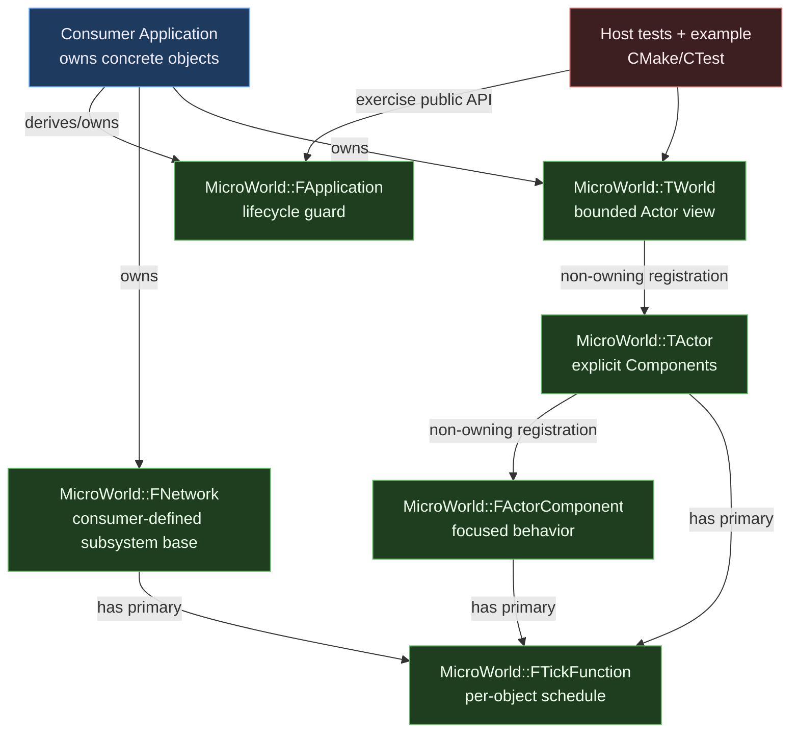

# MicroWorld C++ Change Plan: Standalone Framework v0.1

| Field | Value |
|---|---|
| **Created** | 2026-07-18 |
| **Status** | In Review |
| **Change Type** | New Feature |
| **Author** | Codex with project owner |
| **Target Module** | `lib/microworld` |
| **Priority** | High |
| **Estimated Scope** | L (weeks) |
| **P4 CL / Branch** | Planning only; implementation branch selected later |

---

## 0 · TL;DR

**What the user sees:** MicroWorld currently exists only as an architectural
idea inside an ESP32 curriculum plan. There is no stable package, lifecycle
implementation, configurable tick system, host test suite, or API contract for
the tutorial to consume.

**Why it happens:** Framework design and product teaching were planned as one
activity. That made the ESP32 course responsible for inventing its own
foundation while also teaching hardware, and it left every framework API liable
to change between lessons.

**What the fix does:** Implement and release a small, standalone C++17
MicroWorld v0.1 package first. It provides `FApplication`, `TWorld`,
`FNetwork`, `TActor`, `FActorComponent`, deterministic lifecycle, bounded
registration, and independent UE5-inspired primary ticking. It contains no
ESP32 or remote-controller code.

---

## 1 · 🎯 Objective & Motivation

### 1.1 Problem Statement

Create a reusable embedded-oriented framework whose public behavior is stable
before the remote-controller tutorial is authored. The framework must make
ownership, lifecycle, and periodic work explicit without importing UE5's
reflection, object system, scene model, or scheduler complexity.

### 1.2 Success Criteria

- [ ] `lib/microworld` builds and tests independently with a C++17 host
  toolchain.
- [ ] Public headers contain no ESP-IDF, FreeRTOS, Arduino, E32, or
  remote-controller dependency.
- [ ] `FApplication`, `TWorld`, `FNetwork`, `TActor`, and `FActorComponent`
  have documented, deterministic `BeginPlay`/`Advance`/`EndPlay` behavior.
- [ ] Every Actor and ActorComponent has an independent primary tick with
  `bCanEverTick`, start-enabled state, runtime enable/disable, and interval.
- [ ] Disabling an Actor tick does not suppress its Components.
- [ ] Interval zero ticks once per World update; late ticks never produce a
  catch-up burst.
- [ ] Tick delta is measured from that object's previous executed tick.
- [ ] Actor/component registration is bounded, duplicate-safe, and closed after
  play begins.
- [ ] Registered Actors belong to one World and Components to one Actor; runtime
  objects are non-copyable/non-movable and their lifetime order is documented.
- [ ] No heap allocation occurs in steady-state lifecycle or ticking.
- [ ] Public C++ follows the adapted UE5 naming table: `F` for non-UObject
  classes/structs, `T` for templates, `E` for enums, `b` for booleans, and
  unprefixed unit-explicit scalar aliases, with PascalCase public
  identifiers/header names.
- [ ] Every class declaration has a concise one-to-three-sentence Doxygen
  comment stating purpose, ownership/lifetime, or a critical invariant.
- [ ] Every directory created under `lib/microworld` contains a short scoped
  `AGENTS.md`; `lib/AGENTS.md` defines the parent library boundary.
- [ ] Performance evidence records object sizes, dispatch cycles, flash/static
  RAM, stack margin, steady-state allocations, and compiler optimization/LTO
  comparisons before v0.1 is frozen.
- [ ] Dispatch remains single-pass `O(Actors + Components)`, performs no
  container mutation or allocation in a tick path, and has no unexplained
  baseline regression greater than 10%.
- [ ] `-fno-exceptions -fno-rtti` consumer compilation succeeds.
- [ ] Exact-version PlatformIO native, basic ESP32-S3, and executable ESP32-S3
  benchmark consumers compile without adding platform dependencies to
  MicroWorld sources.
- [ ] Version, package metadata, API guide, porting guide, and a host example
  are delivered with the library.
- [ ] The ESP32 tutorial can pin one MicroWorld version and treat it as
  read-only.

### 1.3 Out of Scope

- ESP32, ESP-IDF, FreeRTOS, Arduino, UART, GPIO, E32, or any hardware adapter.
- Remote-controller messages, valve safety, debounce, protocol framing,
  authentication, ACK/retry, or heartbeat policy.
- Reflection, GC, transforms, rendering, physics, dynamic spawning, component
  lookup by type/name, event buses, service locators, or an ECS.
- Tick groups, prerequisites, pause/time dilation, parallel ticks, multiple tick
  functions per object, or runtime task creation.
- A separate Git repository, package registry publication, ABI stability, or
  semantic-version guarantees beyond the first source release.
- Micro-optimizations that lack measurement, reduce safety, obscure ownership,
  or change the public API without a failing budget.

---

## 2 · 🔍 Context & Current State Analysis

### 2.1 Affected Systems Map

| System / Class | Role in Change | Ownership |
|---|---|---|
| `lib/microworld` | New standalone framework package | MicroWorld |
| `FApplication` | Guards top-level lifecycle; product app derives from it | MicroWorld |
| `TWorld` | Bounded Actor registration and deterministic dispatch | MicroWorld |
| `TActor` | Base entity and explicit Component container | MicroWorld |
| `FActorComponent` | Actor-owned reusable behavior | MicroWorld |
| `FNetwork` | Application-defined network subsystem lifecycle boundary | MicroWorld |
| `FTickFunction` | Independent per-object scheduling state | MicroWorld |
| Performance probes | Record size, stack, cycles, allocations, and compiler comparisons | MicroWorld |
| Scoped `AGENTS.md` files | Enforce local dependency, naming, documentation, and verification rules | Repository |
| Host test executable | Behavioral and portability verification | MicroWorld |
| ESP32 tutorial | Future read-only package consumer | Separate plan |

### 2.2 Existing Code Audit

```text
lib/
└── README                         # placeholder only
src/
├── main.cpp                       # ESP-IDF GPIO10 LED experiment
└── CMakeLists.txt                 # recursive source glob
.claude/
├── concepts/
│   └── microworld-framework.md    # approved split concept
└── plans/
    └── microworld-framework.md    # this plan
```

- Current architecture pattern: no framework; one ESP-IDF `app_main`.
- Known tech debt: MicroWorld API exists only in superseded planning prose; no
  package/version boundary; the root ESP-IDF CMake file recursively globs
  sources.
- Test coverage: no executable tests in this repository.
- Reference behavior: `RadioRemoteController` informs the future application,
  not the framework.

### 2.3 UE5-Specific Constraints Checklist

| Constraint | Relevant? | Notes |
|---|---|---|
| Reflection system (UPROPERTY/UFUNCTION) | No | MicroWorld uses ordinary C++17 |
| Garbage Collection considerations | No | Deterministic externally owned values |
| Blueprint exposure needed | No | No editor/runtime reflection |
| Replication / Multiplayer | No | Network is only a lifecycle boundary |
| Gameplay Ability System (GAS) | No | Not applicable |
| Enhanced Input System | No | Not applicable |
| World Subsystems | No | `Network` is a small explicit subsystem |
| Async / Latent actions | No | v0.1 is single-threaded and synchronous |
| Soft/Hard object references | No | No asset system |
| Data Assets / Data Tables | No | No data asset layer |
| Plugins / Module boundaries | No | Standalone C++ package, not a UE plugin |
| Editor tooling / Details panel | No | No editor |

### 2.4 Risks & Constraints

- The framework can become a miniature UE5 and distract from the actual
  controller.
- Common base classes can become ceremonial if they do not own real shared
  behavior.
- Independent Component ticking can tempt a global dynamic registry.
- Fixed capacities can leak implementation policy into every application.
- Virtual dispatch is useful for heterogeneous actors/components but RTTI and
  exceptions remain forbidden.
- A `Network` base can accidentally absorb product protocol policy.
- Lifecycle order, registration mutation, and late ticks must be specified
  before tests can be authoritative.
- The package must compile on desktop and embedded C++17 toolchains with a
  conservative standard-library subset.
- UE5 prefixes can mislead if `A`/`U` imply UObject semantics that do not exist;
  the adapted mapping must be explicit and mechanically checked.
- Optimization work can trade comprehensibility for theoretical gains unless
  each change starts from a baseline and keeps a before/after record.
- A per-folder contributor guide can become duplicated noise unless each child
  file inherits its parent and contains only local rules.

---

## 3 · 🤔 Options Considered

| # | Approach | Pros | Cons | Complexity | Verdict |
|---|---|---|---|---|---|
| 1 | Same-repository independent package | Stable boundary now; simple local consumption; extraction-ready | Repository still contains framework and product | Medium | Selected |
| 2 | Implement framework inside ESP32 lessons | Every abstraction has immediate product use | Curriculum and API continually destabilize each other | Medium | Rejected |
| 3 | Separate Git repository immediately | Strongest physical isolation | Versioning, CI, dependency and release overhead before second consumer | High | Deferred |

---

## 4 · ✅ Selected Approach

**Option:** Same-repository independent package | **Complexity:** Medium

Build MicroWorld under `lib/microworld` with its own public headers, sources,
CMake/CTest build, package metadata, tests, benchmarks, docs, scoped contributor
guides, and version. Applications own concrete values; MicroWorld stores only
bounded non-owning registrations. Heterogeneous lifecycle dispatch uses small
virtual interfaces, while ticking state is shared through one non-polymorphic
`FTickFunction`. Baseline first, optimize second, and release only the measured
result.

### Key Design Decisions

| Decision | Rationale |
|---|---|
| Framework and tutorial have separate plans/sessions | Stabilizes dependency before teaching it |
| C++17, exceptions/RTTI not required | Fits ESP-IDF and other capable MCUs |
| Composition root owns all objects | Deterministic lifetime and no framework heap |
| `TWorld<MaxActors>` and `TActor<MaxComponents>` use compile-time capacities | Bounded memory without a global registry |
| Registration stores non-owning pointers | Framework dispatches but does not manage lifetime |
| Components tick before their owning Actor | Actor can aggregate fresh Component state in the same World update |
| Disabled Actor tick does not disable Components | Preserves independent UE-style tick control |
| One primary tick per Actor/Component | Meets current need without tick groups/functions |
| Late tick executes once and schedules from actual execution time | Avoids burst work and embedded starvation |
| Tick setters take no time value | Only the dispatcher supplies canonical monotonic time |
| Runtime objects are non-copyable/non-movable and single-registered | Prevents duplicate dispatch and stale ownership pointers |
| Network base owns lifecycle/tick only | Protocol and transport stay in consumers |
| No mutation after `BeginPlay` | Avoids iterator invalidation and dynamic object machinery |
| Adapted UE5 names: `F`/`T`/`E`/`b`, PascalCase | Familiar conventions without falsely implying UObject features |
| Source include directory is `include/MicroWorld` | Public header paths and filenames match PascalCase type names |
| Concise class contracts are mandatory and linted | Documentation stays useful without turning headers into tutorials |
| Baseline before optimization | Avoids speculative complexity and gives regressions a reference |
| Fixed storage, early tick skips, one-pass dispatch first | High-confidence embedded wins with low conceptual cost |
| Virtual dispatch, 64-bit time, and ordinary booleans stay by default | Preserve clarity/correctness unless target evidence justifies change |
| Scoped `AGENTS.md` in every directory | Keeps dependency and hot-path rules next to the files they govern |

### Assumptions & Prerequisites

- **Assumes:** A C++17 host compiler, CMake, and CTest are available during the
  framework implementation session.
- **Requires:** The approved concept at
  `.claude/concepts/microworld-framework.md`.
- **Requires:** A conservative standard-library subset (`array`, `cstddef`,
  `cstdint`, `type_traits`); no mandatory threads, chrono, filesystem, or heap.
- **Requires:** A host size/cycle benchmark and ESP32-S3 map/stack/cycle probe
  toolchain for optimization evidence; host-only numbers cannot approve a
  target-specific optimization.
- **Constraint:** The future tutorial may consume public headers but must not
  patch MicroWorld as part of a normal lesson.

---

## 5 · 🏗️ Architecture

### 5.1 Component Diagram



### 5.2 Sequence Diagram

```mermaid
sequenceDiagram
    participant Shell as Consumer shell
    participant App as Derived Application
    participant Net as Network
    participant World as World
    participant Comp as Components
    participant Actor as Actor

    Shell->>App: BeginPlay(now)
    App->>Net: BeginPlay(now)
    App->>World: BeginPlay(now)
    World->>Comp: BeginPlay() in registration order
    World->>Actor: BeginPlay()
    loop Each consumer update
        Shell->>App: Tick(now)
        App->>Net: Advance(now)
        Net->>Net: TickNetwork(ctx) if due
        App->>App: route consumer-defined events
        App->>World: Advance(now)
        World->>Comp: TickComponent(ctx) if independently due
        World->>Actor: Tick(ctx) if independently due
    end
    Shell->>App: EndPlay()
    App->>World: EndPlay() in reverse registration order
    App->>Net: EndPlay()
```

**Alternative / Error Paths:**

- Duplicate registration returns `ERuntimeResult::Duplicate` without changing
  storage.
- Capacity exhaustion returns `ERuntimeResult::CapacityExceeded`; no partial
  registration.
- Registration after `BeginPlay` returns
  `ERuntimeResult::LifecycleLocked`.
- `SetTickEnabled(true)` on `bCanEverTick == false` returns
  `ERuntimeResult::CannotEverTick`.
- Repeated or out-of-order lifecycle calls return an explicit result and do not
  invoke user hooks twice.
- A backward/non-monotonic time input is rejected and the previous schedule is
  preserved.

### 5.3 Components Summary

| Component | Responsibility |
|---|---|
| `TimePointMilliseconds`, `DurationMilliseconds`, `FTickContext` | Platform-neutral monotonic timing values |
| `FTickFunction` | Enablement, interval, due calculation, and per-object delta |
| `FTickable` | Shared Actor/Component/Network tick API |
| `FActorComponent` | Owner link and Component lifecycle hooks |
| `TActor<MaxComponents>` | Bounded explicit Component registration and dispatch |
| `TWorld<MaxActors>` | Bounded Actor registration and deterministic lifecycle |
| `FNetwork` | Consumer network-subsystem lifecycle/tick base |
| `FApplication` | Top-level lifecycle guard and consumer hooks |

### 5.4 Interfaces

- `FApplication::BeginPlay(TimePointMilliseconds)` — starts the application once.
- `FApplication::Advance(TimePointMilliseconds)` — validates monotonic time and invokes the
  consumer's frame hook.
- `FApplication::EndPlay()` — ends once and is idempotent after success.
- `TWorld<>::AddActor(FActorBase&)` — registers before play, without ownership.
- `TActor<>::AddComponent(FActorComponent&)` — registers before play and sets the
  owner link.
- `FTickable::SetTickEnabled(bool)` — changes only that object's primary tick;
  the next dispatcher update establishes schedule time.
- `FTickable::SetTickInterval(DurationMilliseconds)` — reschedules on the next dispatcher
  update but never
  enables.
- `FNetwork::Advance(TimePointMilliseconds)` — executes `TickNetwork` only when due.

### 5.5 UE5-Style Naming and Documentation Contract

| Kind | Rule | Example |
|---|---|---|
| Namespace | PascalCase product name | `namespace MicroWorld` |
| Non-UObject class/struct | `F` prefix | `FApplication`, `FTickContext` |
| Class template | `T` prefix | `TWorld<4>`, `TActor<8>` |
| Enum | `E` prefix; PascalCase values | `ERuntimeResult::Success` |
| Scalar alias | No aggregate prefix; spell units | `TimePointMilliseconds` |
| Boolean | `b` prefix | `bCanEverTick`, `bShouldTick` |
| Public method/member | PascalCase; no unclear abbreviation | `SetTickInterval` |
| Public header | PascalCase type-aligned filename | `MicroWorld/TickFunction.h` |

`A` and `U` prefixes are forbidden in v0.1 because no type derives from Unreal
`AActor` or `UObject`. Macro/reflection vocabulary such as `UCLASS`, `UPROPERTY`,
and `GENERATED_BODY` is also forbidden.

Every class or class template declaration has a `/** ... */` comment immediately
above it, limited to one to three sentences. The comment states purpose and, when
relevant, ownership/lifetime or a critical invariant. Brief comments are also
required on lifecycle, tick, ownership-transfer/registration, and error-contract
methods; trivial accessors need no narration. `tools/CheckClassDocumentation.py`
fails when a class/template declaration lacks its adjacent comment.

### 5.6 Embedded Optimization Decision Process

1. Build the correct unoptimized/reference behavior and record the baseline.
2. Profile host dispatch for repeatability, then measure the actual ESP32-S3
   target for flash, static RAM, stack high-water mark, and cycles/update.
3. Apply low-risk techniques first: compile-time capacities, early disabled
   tick skips, single-pass iteration, no steady-state allocation, no container
   mutation in tick, cached counts, bounded work, `const`, and `noexcept`.
4. Compare `-Os` and `-O2`; evaluate LTO only with map/cycle/build evidence.
5. Keep virtual dispatch, 64-bit monotonic time, ordinary booleans, and readable
   branches unless a named budget fails. If changed, add a benchmark and a
   design note showing the recovered bytes/cycles and the complexity cost.
6. Reject any optimization that changes lifecycle/tick semantics, weakens error
   handling, increases unbounded stack/heap use, or hides safety-relevant work.

The report records baseline and candidate values with toolchain, build flags,
target, configuration, and full source commit. An unexplained regression over
10% beyond the established measurement-noise envelope in dispatch cycles,
flash, static RAM, or stack blocks release; an explained trade-off requires
owner approval.

| Technique family | v0.1 evaluation |
|---|---|
| Fixed-capacity arrays and non-owning pointers | Required; measure capacity-dependent RAM |
| Heap elimination and bounded stack | Required in steady state; inspect constructors and hooks |
| One-pass loops, cached counts, early disabled-tick exit | Required unless benchmark disproves value |
| Object layout, padding, field order | Measure `sizeof`; reorder only without harming meaning |
| `final`, normal inlining, dead-code elimination | Allow compiler to optimize; inspect map/disassembly |
| `-Os`, `-O2`, and LTO | Compare target builds; select documented profile |
| Virtual hook cost | Benchmark; retain virtual boundary unless a budget fails |
| Template specialization/code bloat | Measure flash per capacity/use; avoid duplicate machinery |
| 64-bit monotonic arithmetic | Inspect hot-path instructions; preserve correctness, avoid division/modulo |
| Boolean bit fields/packing | Defer unless measured RAM recovery outweighs access/clarity cost |
| Forced inline, branch hints, prefetch, custom allocators | Rejected by default; require target evidence |
| Locks, tasks, atomics, SIMD | Out of v0.1 single-threaded scope; do not add for speed |

---

## 6 · 📝 Implementation Steps

### Step 0: Create the package skeleton and scoped contributor guides
**Files:** `lib/AGENTS.md` and every `AGENTS.md` listed in the file map | new

```text
Parent rules: package independence, UE5-style names, concise class docs
Child rules: local purpose, allowed dependency direction, hot-path limits,
             and the narrow build/test/lint command for that folder
```

#### Implementer Context
> - Create each directory together with its `AGENTS.md` before adding source
>   files there.
> - Child files inherit the closest parent and must not copy the repository
>   safety guide wholesale.
> - `include/MicroWorld/AGENTS.md` owns public API/naming/documentation rules;
>   `src/AGENTS.md` owns implementation-only dependency rules;
>   `benchmarks/AGENTS.md` forbids benchmark-driven semantic changes; test,
>   consumer, docs, tools, and example guides state their local verification.
> - A directory-coverage script compares actual package directories against
>   `AGENTS.md` presence, excluding build outputs and generated caches.

### Step 1: Add platform-neutral time and result types
**File:** `lib/microworld/include/MicroWorld/Time.h` | new

```cpp
namespace MicroWorld {
using TimePointMilliseconds = std::uint64_t;
using DurationMilliseconds = std::uint32_t;

/** Carries canonical dispatcher time for one executed tick. */
struct FTickContext {
    TimePointMilliseconds NowMilliseconds;
    DurationMilliseconds DeltaMilliseconds;
};

/** Reports framework outcomes without exceptions or platform logging. */
enum class ERuntimeResult : std::uint8_t {
    Success,
    Duplicate,
    CapacityExceeded,
    LifecycleLocked,
    InvalidLifecycle,
    CannotEverTick,
    NonMonotonicTime,
    AlreadyOwned,
};

/** Combines tick eligibility, timing, and any dispatcher error. */
struct FTickDecision {
    ERuntimeResult Result;
    bool bShouldTick;
    FTickContext Context;
};
}
```

#### Implementer Context
> - Use only `<cstdint>`.
> - Keep time units explicit in names; no implicit platform clock access.
> - Saturate an unrepresentable delta at `DurationMilliseconds` max and test it.
> - Do not use `std::chrono`; embedded ports provide the time point.

---

### Step 2: Implement the reusable primary tick state
**Files:** `TickFunction.h`, `TickFunction.cpp` | new

```cpp
/** Configures one object's primary tick before lifecycle start. */
struct FTickConfiguration {
    bool bCanEverTick{false};
    bool bStartWithTickEnabled{false};
    DurationMilliseconds TickIntervalMilliseconds{0};
};

/** Owns the bounded scheduling state for one independently tickable object. */
class FTickFunction final {
public:
    explicit FTickFunction(FTickConfiguration Configuration) noexcept;
    void BeginPlay(TimePointMilliseconds NowMilliseconds) noexcept;
    void EndPlay() noexcept;
    ERuntimeResult SetEnabled(bool bEnabled) noexcept;
    ERuntimeResult SetInterval(
        DurationMilliseconds IntervalMilliseconds) noexcept;
    FTickDecision Advance(TimePointMilliseconds NowMilliseconds) noexcept;
    bool IsEnabled() const noexcept;
    DurationMilliseconds GetInterval() const noexcept;
};
```

#### Implementer Context
> - `bStartWithTickEnabled` is ignored when `bCanEverTick` is false.
> - First enabled tick after BeginPlay/re-enable is due on the next Advance and
>   reports delta zero.
> - Interval zero is due once per caller update, never more.
> - A late tick executes once; set next due to `now + interval`.
> - Setters mark schedule reset but never receive a separate clock snapshot.
> - Changing interval does not change enabled state; the next `Advance`
>   reschedules from its canonical `NowMilliseconds`.
> - `Advance` returns `ERuntimeResult::NonMonotonicTime` explicitly and
>   preserves timestamps; timing errors cannot hide behind a false
>   `bShouldTick`.

---

### Step 3: Share tick controls without sharing object policy
**File:** `lib/microworld/include/MicroWorld/Tickable.h` | new

```cpp
/** Adds one primary tick to a runtime type without defining its behavior. */
class FTickable {
public:
    FTickable(const FTickable&) = delete;
    FTickable& operator=(const FTickable&) = delete;
    FTickable(FTickable&&) = delete;
    FTickable& operator=(FTickable&&) = delete;
    ERuntimeResult SetTickEnabled(bool bEnabled) noexcept;
    ERuntimeResult SetTickInterval(
        DurationMilliseconds IntervalMilliseconds) noexcept;
    bool IsTickEnabled() const noexcept;
    DurationMilliseconds GetTickInterval() const noexcept;

protected:
    explicit FTickable(FTickConfiguration Configuration) noexcept;
    FTickDecision AdvancePrimaryTick(
        TimePointMilliseconds NowMilliseconds) noexcept;
    void BeginPrimaryTickLifecycle(
        TimePointMilliseconds NowMilliseconds) noexcept;
    void EndPrimaryTickLifecycle() noexcept;

private:
    FTickFunction PrimaryTick;
};
```

#### Implementer Context
> - `FTickable` is a small non-polymorphic implementation base.
> - It owns scheduling only; it must not know Actor, Component, or Network.
> - Keep command/query wrappers trivial and `noexcept`.

---

### Step 4: Add guarded lifecycle state
**File:** `lib/microworld/include/MicroWorld/Lifecycle.h` | new

```cpp
/** Identifies the only legal lifecycle phases for a runtime object. */
enum class ELifecycleState : std::uint8_t {
    Constructed,
    Playing,
    Failed,
    Ended,
};

/** Validates lifecycle transitions without invoking hooks or platform code. */
class FLifecycleGuard final {
public:
    ERuntimeResult Begin() noexcept;
    ERuntimeResult RequirePlaying() const noexcept;
    void Fail() noexcept;
    ERuntimeResult End() noexcept;
    ELifecycleState State() const noexcept;
};
```

#### Implementer Context
> - A successful transition occurs once.
> - Invalid calls return errors without changing state.
> - Do not log, assert, allocate, or call platform code.

---

### Step 5: Implement ActorComponent ownership and lifecycle
**Files:** `ActorComponent.h`, `ActorComponent.cpp` | new

```cpp
/** Defines reusable behavior registered with exactly one externally owned Actor. */
class FActorComponent : public FTickable {
public:
    FActorBase* GetOwner() const noexcept;
    FActorComponent(const FActorComponent&) = delete;
    FActorComponent& operator=(const FActorComponent&) = delete;
    FActorComponent(FActorComponent&&) = delete;
    FActorComponent& operator=(FActorComponent&&) = delete;

protected:
    explicit FActorComponent(FTickConfiguration TickConfiguration) noexcept;
    virtual ~FActorComponent() = default;
    virtual void BeginPlay() {}
    virtual void TickComponent(const FTickContext& Context) {}
    virtual void EndPlay() {}

private:
    friend class FActorBase;
    FActorBase* Owner{nullptr};
    FLifecycleGuard Lifecycle;
};
```

#### Implementer Context
> - The owning concrete Actor still owns the Component value.
> - Forward-declare `FActorBase` in the header; the class-documentation checker
>   ignores forward declarations and checks complete definitions.
> - Owner assignment happens exactly once during registration.
> - An already owned Component returns `ERuntimeResult::AlreadyOwned`, including registration
>   with a second Actor.
> - Virtual dispatch is justified by heterogeneous Component lists; do not add
>   RTTI, casts, lookup, activation, or event APIs.

---

### Step 6: Implement bounded explicit Actor composition
**Files:** `Actor.h`, `Actor.cpp` | new

```cpp
/** Supplies common lifecycle and owner state for fixed-capacity Actor templates. */
class FActorBase : public FTickable {
public:
    FActorBase(const FActorBase&) = delete;
    FActorBase& operator=(const FActorBase&) = delete;
    FActorBase(FActorBase&&) = delete;
    FActorBase& operator=(FActorBase&&) = delete;
    FWorldBase* GetWorld() const noexcept;
protected:
    explicit FActorBase(FTickConfiguration TickConfiguration) noexcept;
    virtual ~FActorBase() = default;
    virtual void BeginPlay() {}
    virtual void Tick(const FTickContext& Context) = 0;
    virtual void EndPlay() {}
};

/** Registers and dispatches a compile-time-bounded set of non-owning Components. */
template <std::size_t MaxComponents>
class TActor : public FActorBase {
public:
    ERuntimeResult AddComponent(FActorComponent& Component) noexcept;
private:
    std::array<FActorComponent*, MaxComponents> Components{};
    std::size_t ComponentCount{0};
};
```

#### Implementer Context
> - Provide dispatch helpers used only by World.
> - Forward-declare `FWorldBase`; keep the complete ownership contract on its
>   definition rather than duplicating it on the declaration.
> - Components BeginPlay/tick in registration order; EndPlay in reverse.
> - Component ticking remains independent when the Actor's primary tick is off.
> - Reject duplicate Component and cross-Actor ownership.
> - No removal or registration after play begins in v0.1.
> - Actor dispatch helpers own Component lifecycle calls; the template delegates
>   owner assignment through `FActorBase` so friendship is valid.

---

### Step 7: Implement the fixed, deterministic World
**File:** `lib/microworld/include/MicroWorld/World.h` | new

```cpp
/** Holds common non-owning World state needed by registered Actors. */
class FWorldBase {
public:
    FWorldBase(const FWorldBase&) = delete;
    FWorldBase& operator=(const FWorldBase&) = delete;
    FWorldBase(FWorldBase&&) = delete;
    FWorldBase& operator=(FWorldBase&&) = delete;
protected:
    FWorldBase() = default;
    ~FWorldBase() = default;
};

/** Deterministically dispatches a compile-time-bounded set of non-owning Actors. */
template <std::size_t MaxActors>
class TWorld final : public FWorldBase {
public:
    ERuntimeResult AddActor(FActorBase& Actor) noexcept;
    ERuntimeResult BeginPlay(TimePointMilliseconds NowMilliseconds) noexcept;
    ERuntimeResult Advance(TimePointMilliseconds NowMilliseconds) noexcept;
    ERuntimeResult EndPlay() noexcept;

private:
    std::array<FActorBase*, MaxActors> Actors{};
    std::size_t ActorCount{0};
    FLifecycleGuard Lifecycle;
    TimePointMilliseconds LastUpdateMilliseconds{0};
};
```

#### Implementer Context
> - World never deletes Actors and never owns their storage.
> - AddActor rejects an Actor already registered with any World.
> - The composition root declares Actors before World so reverse destruction
>   destroys World before registered Actors; document this lifetime precondition.
> - Per Actor: due Components tick first, then the Actor if due.
> - Actors process in registration order; shutdown reverses Actor order.
> - Validate monotonic time once before dispatch so no object advances on error.

---

### Step 8: Add the consumer-defined Network subsystem base
**Files:** `Network.h`, `Network.cpp` | new

```cpp
/** Defines policy-free lifecycle and ticking for a consumer-owned network subsystem. */
class FNetwork : public FTickable {
public:
    ERuntimeResult BeginPlay(TimePointMilliseconds NowMilliseconds) noexcept;
    ERuntimeResult Advance(TimePointMilliseconds NowMilliseconds) noexcept;
    ERuntimeResult EndPlay() noexcept;

protected:
    explicit FNetwork(FTickConfiguration TickConfiguration) noexcept;
    virtual void OnNetworkBeginPlay() {}
    virtual void TickNetwork(const FTickContext& Context) = 0;
    virtual void OnNetworkEndPlay() {}
};
```

#### Implementer Context
> - Do not add bytes, packets, identities, queues, ACKs, security, UART, or radio.
> - Consumers define ingress, egress, and event routing.
> - Network has independent primary tick because polling/retry cadence is an
>   application choice.

---

### Step 9: Add the top-level Application lifecycle
**Files:** `Application.h`, `Application.cpp` | new

```cpp
/** Guards a consumer-owned composition root's lifecycle and monotonic updates. */
class FApplication {
public:
    FApplication(const FApplication&) = delete;
    FApplication& operator=(const FApplication&) = delete;
    FApplication(FApplication&&) = delete;
    FApplication& operator=(FApplication&&) = delete;
    virtual ~FApplication() = default;
    ERuntimeResult BeginPlay(TimePointMilliseconds NowMilliseconds) noexcept;
    ERuntimeResult Advance(TimePointMilliseconds NowMilliseconds) noexcept;
    ERuntimeResult EndPlay() noexcept;

protected:
    virtual ERuntimeResult OnBeginPlay(
        TimePointMilliseconds NowMilliseconds) = 0;
    virtual void OnBeginPlayFailed() noexcept = 0;
    virtual ERuntimeResult OnAdvance(
        TimePointMilliseconds NowMilliseconds) = 0;
    virtual void OnEndPlay() = 0;
};
```

#### Implementer Context
> - `FApplication` guards lifecycle and monotonic frame time.
> - It does not own a World or Network; the derived application owns and orders
>   concrete subsystems.
> - If `OnBeginPlay` fails, call `OnBeginPlayFailed` exactly once and enter a
>   terminal failed lifecycle state; retry requires reconstructing the
>   composition root.
> - The consumer rollback hook tracks which owned subsystems began and ends only
>   those, in reverse order.
> - No run loop, sleeps, logging, or platform input/effect types.
> - The different name is intentional: a consumer may expose
>   `Tick(ProductInput) -> ProductResult`, stage its input, call
>   `FApplication::Advance(Input.NowMilliseconds)`, then return product effects.

---

### Step 10: Add standalone package and build metadata
**Files:** `lib/microworld/CMakeLists.txt`, `library.json`, `VERSION`,
`include/MicroWorld/Version.h` | new

```cpp
#include <MicroWorld/Application.h>
#include <MicroWorld/World.h>

// Public content of MicroWorld/Version.h:
namespace MicroWorld {
/** Identifies the exact source-level MicroWorld package contract. */
struct FVersion {
    std::uint16_t Major;
    std::uint16_t Minor;
    std::uint16_t Patch;
};

inline constexpr FVersion Version{0, 1, 0};
}

static_assert(__cplusplus >= 201703L);
static_assert(std::is_nothrow_destructible_v<MicroWorld::FApplication>);
static_assert(MicroWorld::Version.Major == 0);
static_assert(MicroWorld::Version.Minor == 1);
static_assert(MicroWorld::Version.Patch == 0);
```

#### Implementer Context
> - CMake exposes target `microworld`, public include directory, tests, and one
>   example; no download-at-configure dependencies.
> - Compile with high warnings and a dedicated `-fno-exceptions -fno-rtti`
>   consumer probe where supported.
> - `library.json` exposes `include/` and `src/` for later PlatformIO
>   consumption.
> - Start version at `0.1.0`; keep `VERSION`, manifest, `Version.h`, and
>   changelog synchronized. Source compatibility before 1.0 is not promised.

---

### Step 11: Add exact-version downstream consumer probes
**Files:** `lib/microworld/tests/consumer/platformio.ini`,
`src/NativeMain.cpp`, `src/Esp32Main.cpp`, `src/Esp32BenchmarkMain.cpp` | new

```cpp
#include <MicroWorld/Version.h>
#include <MicroWorld/World.h>

static_assert(MicroWorld::Version.Major == 0);
static_assert(MicroWorld::Version.Minor == 1);
static_assert(MicroWorld::Version.Patch == 0);
MicroWorld::TWorld<1> ConsumerCompileProbe;
```

#### Implementer Context
> - Provide `native`, `esp32-s3`, and `esp32-s3-benchmark` PlatformIO
>   environments that consume the local package exactly as the tutorial will.
> - Use explicit source filters so each environment links exactly one entry
>   point; the basic and benchmark `app_main` files never link together.
> - The basic ESP32 compile probe may define an empty `app_main`.
>   `Esp32BenchmarkMain.cpp` is an executable, serial-reporting target workload;
>   no ESP32 header may enter MicroWorld itself.
> - Run all compile probes as a release gate and record
>   PlatformIO/Espressif versions.
> - After an implementation commit is explicitly authorized, rerun all probes
>   from a clean worktree at that exact commit and record its full hash with the
>   results. The tutorial pins the hash, not only semantic version.

---

### Step 12: Test tick configuration and scheduling
**File:** `lib/microworld/tests/TickFunctionTests.cpp` | new

```cpp
TEST_CASE("disabled tick can be enabled without changing interval");
TEST_CASE("interval zero ticks once per world update");
TEST_CASE("late interval ticks once without catch-up");
TEST_CASE("delta belongs to the individual tick function");
TEST_CASE("interval change does not enable tick");
TEST_CASE("cannot-ever-tick rejects enable");
TEST_CASE("backward time preserves schedule");
```

#### Implementer Context
> - Use a repository-owned minimal test harness; do not fetch a framework.
> - Assert observable due/delta behavior, not private fields.
> - Cover boundary values, first tick, disable/re-enable, and saturated delta.

---

### Step 13: Test lifecycle, ownership, and independent dispatch
**File:** `lib/microworld/tests/WorldTests.cpp` | new

```cpp
TEST_CASE("components begin before actor and end after actor");
TEST_CASE("components tick before actor in registration order");
TEST_CASE("disabled actor does not disable component ticks");
TEST_CASE("disabled component does not disable actor tick");
TEST_CASE("duplicate and over-capacity registration are atomic");
TEST_CASE("registration is locked after begin play");
TEST_CASE("actor and component reject second owners");
TEST_CASE("runtime objects cannot be copied or moved");
TEST_CASE("non-monotonic world update dispatches nothing");
```

#### Implementer Context
> - Test doubles record public hook calls in a fixed buffer.
> - Include positive/negative lifecycle pairs.
> - Verify no hook fires twice on repeated invalid lifecycle calls.

---

### Step 14: Test Application and Network boundaries
**File:** `lib/microworld/tests/ApplicationNetworkTests.cpp` | new

```cpp
TEST_CASE("derived application controls network and world order");
TEST_CASE("network tick interval is independent from world update");
TEST_CASE("failed application begin rolls back once and becomes terminal");
TEST_CASE("application rejects advance before begin and after end");
TEST_CASE("product Tick input stages data then calls Application Advance");
TEST_CASE("application propagates consumer errors without platform policy");
```

#### Implementer Context
> - The test application explicitly sequences Network, event routing, and World.
> - Prove MicroWorld does not assume a protocol or transport.
> - Keep fake data fixed-size and allocation-free.

---

### Step 15: Measure and optimize the embedded runtime
**Files:** `benchmarks/DispatchBenchmark.cpp`, `docs/Performance.md`,
`benchmarks/Results/Host.md`, `benchmarks/Results/Esp32S3N16R8.md`,
`tools/CheckClassDocumentation.py`, `tools/CheckFolderAgents.py` | new

```cpp
/** Captures comparable size and dispatch measurements for one build profile. */
struct FPerformanceSample {
    std::size_t FlashBytes;
    std::size_t StaticRamBytes;
    std::size_t PeakStackBytes;
    std::uint32_t CyclesPerUpdate;
    std::uint32_t SteadyStateAllocations;
};
```

```sh
python lib/microworld/tools/CheckClassDocumentation.py --root lib/microworld --exclude build --exclude .pio --exclude __pycache__ --require-doxygen --max-sentences 3
python lib/microworld/tools/CheckFolderAgents.py --root lib/microworld --require-file lib/AGENTS.md --exclude build --exclude .pio --exclude __pycache__
pio run -d lib/microworld/tests/consumer -e esp32-s3-benchmark
# Only after explicit upload authorization:
pio run -d lib/microworld/tests/consumer -e esp32-s3-benchmark -t upload
pio device monitor -b 115200
```

#### Implementer Context
> - Record a correctness-first baseline before changing code or compiler flags.
> - Measure disabled, all-due, mixed-rate, and maximum-capacity dispatch; use
>   fixed inputs. Warm up 1,000 updates, measure 10,000 updates per trial, repeat
>   30 trials, and report median, p95, and worst case.
> - On host, record object sizes, allocations, and repeatable relative timing.
>   On ESP32-S3, record map-file flash/static RAM, stack high-water mark, and
>   cycle counter results with exact toolchain/build flags. Measure/subtract
>   empty-loop and counter-read overhead; record CPU frequency and benchmark
>   configuration.
> - `esp32-s3-benchmark` runs the same four workloads from
>   `Esp32BenchmarkMain.cpp`, reports a stable CSV row per trial over serial,
>   samples heap before/after, and reports failure on any lifecycle/tick
>   mismatch.
> - Always compile and archive the target map. Uploading/running the benchmark
>   requires explicit user authorization; v0.1 performance evidence remains
>   blocked, not “passed,” until observed output is recorded in
>   `benchmarks/Results/Esp32S3N16R8.md`.
> - Evaluate fixed storage, early disabled-tick exits, cached counts,
>   single-pass loops, `final` on concrete benchmark types, `-Os` versus `-O2`,
>   and optional LTO. Keep only measured wins.
> - Do not bit-pack booleans, narrow monotonic time, replace all virtual hooks
>   with templates, or add custom allocators unless a named budget fails and the
>   before/after evidence justifies the complexity.
> - Run class-documentation and folder-guide checks as release-gating tools.
> - Both checkers accept explicit scan-root arguments and perform read-only
>   validation so downstream tutorial code can reuse them without patching
>   MicroWorld.
> - `--root`, `--exclude`, and `--require-file` are repeatable.
>   `CheckClassDocumentation.py` also supports
>   `--scan-markdown-fences` for tutorial code blocks and ignores forward
>   declarations.

---

### Step 16: Document and demonstrate the released API
**Files:** `lib/microworld/README.md`, `docs/Style.md`, `docs/Porting.md`,
`examples/HostLifecycle/Main.cpp` | new

```cpp
/** Samples a host value at its own cadence for the lifecycle example. */
class FSensorComponent final : public MicroWorld::FActorComponent {
public:
    FSensorComponent()
        : FActorComponent({true, true, 100}) {}
private:
    void TickComponent(const MicroWorld::FTickContext& Context) override;
};
```

#### Implementer Context
> - Explain logical ownership versus memory ownership.
> - Show Actor/Component independent tick rates and disabled Actor behavior.
> - Document lifecycle order, capacity errors, time contract, no-catch-up rule,
>   and unsupported features.
> - `Style.md` contains the exact `F`/`T`/`E`/`b` table, the no-`A`/`U` reason,
>   public header casing, and the concise class-comment examples.
> - Link `Performance.md` and explain which techniques were retained, rejected,
>   or deferred and why.
> - The example must be platform-neutral and compile in CI.

---

### Step 17: Freeze the v0.1 handoff contract
**File:** `lib/microworld/CHANGELOG.md` | new

```cpp
// Public v0.1 names consumed by the tutorial:
MicroWorld::FApplication;
MicroWorld::TWorld<1>;
MicroWorld::TActor<4>;
MicroWorld::FActorComponent;
MicroWorld::FNetwork;
MicroWorld::FTickConfiguration;
MicroWorld::FTickContext;
```

#### Implementer Context
> - Record exact supported public headers and lifecycle/tick semantics.
> - Record known limitations rather than adding speculative features.
> - Tutorial work starts only after §10 verification is green and version
>   `0.1.0` is recorded.

### Implementation Summary

| # | Step | Files | Est. Time | Depends On | Status |
|---|---|---|---|---|---|
| 0 | Scoped contributor guides | every planned `AGENTS.md` | 4h | — | ☐ |
| 1 | Time/result types | `Time.h` | 1h | 0 | ☐ |
| 2 | TickFunction | `TickFunction.*` | 1d | 1 | ☐ |
| 3 | Tickable | `Tickable.h` | 2h | 2 | ☐ |
| 4 | Lifecycle guard | `Lifecycle.h` | 2h | 1 | ☐ |
| 5 | ActorComponent | `ActorComponent.*` | 1d | 3,4 | ☐ |
| 6 | Actor | `Actor.*` | 1d | 5 | ☐ |
| 7 | World | `World.h` | 1d | 6 | ☐ |
| 8 | Network | `Network.*` | 4h | 3,4 | ☐ |
| 9 | Application | `Application.*` | 4h | 4 | ☐ |
| 10 | Build/package | build metadata | 1d | 1–9 | ☐ |
| 11 | Downstream probes/target benchmark | PlatformIO consumer fixture | 1d | 10 | ☐ |
| 12 | Tick tests | tick tests | 1d | 2 | ☐ |
| 13 | World tests | world tests | 1d | 5–7 | ☐ |
| 14 | App/Network tests | boundary tests | 4h | 8,9 | ☐ |
| 15 | Measure/optimize/lint | benchmarks, report, checks | 2d | 1–14 | ☐ |
| 16 | Docs/example | docs/example | 1d | 1–15 | ☐ |
| 17 | v0.1 handoff | changelog/version | 2h | 10–16 | ☐ |

### File Change Map

```text
lib/
├── + AGENTS.md
└── microworld/
    ├── + AGENTS.md
    ├── + CMakeLists.txt
    ├── + library.json
    ├── + VERSION
    ├── + CHANGELOG.md
    ├── + README.md
    ├── include/
    │   ├── + AGENTS.md
    │   └── MicroWorld/
    │       ├── + AGENTS.md
    │       ├── + Application.h
    │       ├── + Actor.h
    │       ├── + ActorComponent.h
    │       ├── + Lifecycle.h
    │       ├── + Network.h
    │       ├── + TickFunction.h
    │       ├── + Tickable.h
    │       ├── + Time.h
    │       ├── + Version.h
    │       └── + World.h
    ├── src/
    │   ├── + AGENTS.md
    │   ├── + Application.cpp
    │   ├── + Actor.cpp
    │   ├── + ActorComponent.cpp
    │   ├── + Network.cpp
    │   └── + TickFunction.cpp
    ├── tests/
    │   ├── + AGENTS.md
    │   ├── + TestMain.cpp
    │   ├── + TestSupport.h
    │   ├── + TickFunctionTests.cpp
    │   ├── + WorldTests.cpp
    │   ├── + ApplicationNetworkTests.cpp
    │   └── consumer/
    │       ├── + AGENTS.md
    │       ├── + platformio.ini
    │       └── src/
    │           ├── + AGENTS.md
    │           ├── + NativeMain.cpp
    │           ├── + Esp32Main.cpp
    │           └── + Esp32BenchmarkMain.cpp
    ├── benchmarks/
    │   ├── + AGENTS.md
    │   ├── + DispatchBenchmark.cpp
    │   └── Results/
    │       ├── + AGENTS.md
    │       ├── + Host.md
    │       └── + Esp32S3N16R8.md
    ├── docs/
    │   ├── + AGENTS.md
    │   ├── + Performance.md
    │   ├── + Porting.md
    │   └── + Style.md
    ├── examples/
    │   ├── + AGENTS.md
    │   └── HostLifecycle/
    │       ├── + AGENTS.md
    │       └── + Main.cpp
    └── tools/
        ├── + AGENTS.md
        ├── + CheckClassDocumentation.py
        └── + CheckFolderAgents.py
```

Legend: `+` new · `~` modified · `-` deleted

### Module / Plugin Dependencies

| Dependency Module | Why Needed | Already Referenced? |
|---|---|---|
| C++17 standard library subset | Fixed arrays/types and compile-time traits | Toolchain-provided |
| CMake + CTest | Standalone build/test orchestration | No |
| PlatformIO package manifest | Future tutorial consumption | PlatformIO already used by repository |
| UE5 modules/plugins | Not applicable | No |

---

## 7 · 🧪 Test Strategy

### Existing Tests (Validation)

| Test Suite / Filter | File | Purpose |
|---|---|---|
| None | — | Repository has no current executable tests |
| Current ESP32 build | `src/main.cpp` | Confirm framework files do not break the existing project before tutorial integration |

### New Tests (Creation)

| Test Name | Code Under Test | Why | Scenario | Expectation | Type |
|---|---|---|---|---|---|
| `Tick.DisabledEnable` | `FTickFunction` | Runtime control | Enable a disabled tick | Next update ticks; interval unchanged | Unit |
| `Tick.IntervalZero` | `FTickFunction` | Base-rate semantics | Multiple World updates | Exactly one tick per update | Unit |
| `Tick.NoCatchUp` | `FTickFunction` | Prevent bursts | Advance across several intervals | One tick; next due from actual time | Unit |
| `Tick.IndependentDelta` | two `FTickFunction` values | Per-object timing | Different intervals | Each delta matches its own history | Unit |
| `Tick.CannotEver` | `FTickable` | Configuration safety | Enable forbidden tick | Explicit failure; remains disabled | Unit |
| `Lifecycle.Order` | World/Actor/Component | Determinism | Begin, tick, end | Documented forward/reverse order | Unit |
| `Tick.ActorComponentIndependent` | Actor/Component | User requirement | Disable Actor only | Component continues ticking | Unit |
| `Registration.Capacity` | World/Actor | Bounded memory | Fill then add one | Failure with no partial state | Unit |
| `Registration.Duplicate` | World/Actor | Ownership safety | Add same object twice | Duplicate rejected | Unit |
| `Registration.SingleOwner` | World/Actor/Component | Prevent double dispatch | Register with second owner | `AlreadyOwned`; first owner unchanged | Unit |
| `Registration.NonMovable` | runtime types | Pointer stability | Compile copy/move probes | Copy/move rejected | Compile |
| `Lifecycle.MutationLocked` | World/Actor | Stable iteration | Register after BeginPlay | Explicit failure | Unit |
| `Time.NonMonotonic` | App/World/Network | Boundary safety | Move time backward | No hooks dispatched | Unit |
| `Application.BeginFailure` | Application | Error behavior | Consumer begin partially fails | Started subsystems roll back; state is terminal failed | Unit |
| `Network.PolicyFree` | Network | Scope control | Consumer-defined fake data | Framework only schedules hook | Unit |
| `Consumer.NoExceptionsRtti` | public API | Portability | Compile probe | Clean C++17 compilation | Compile |
| `Consumer.PlatformIONative` | package/version | Downstream handoff | Native PlatformIO build | Exact v0.1 probe compiles | Compile |
| `Consumer.PlatformIOEsp32` | package/version | Actual target handoff | ESP32-S3 PlatformIO build | Exact v0.1 probe compiles | Compile |
| `Performance.Esp32Executable` | dispatcher/package | Real target cost | Fixed warm-up/trials on benchmark env | CSV/map/stack/heap evidence recorded | Benchmark |
| `Style.UeNames` | public headers | Naming contract | Run style scan | `F`/`T`/`E`/`b`, PascalCase, no misleading `A`/`U` | Static |
| `Docs.ClassContracts` | all class declarations | Concise ownership docs | Run class-doc scan | Every class/template has adjacent 1–3 sentence comment | Static |
| `Guides.DirectoryCoverage` | package tree | Local rules | Run folder scan | Every non-generated directory has `AGENTS.md` | Static |
| `Performance.DispatchProfiles` | runtime dispatch | Embedded budget | Baseline and optimized profiles | Recorded relative/absolute evidence; semantics unchanged | Benchmark |

### Test Quality Gates

- [ ] Every test has a real Act step through public API.
- [ ] Every branch has positive and negative coverage.
- [ ] Tests assert hook order/results, not private members.
- [ ] No test relies on sleep or wall-clock time.
- [ ] Fixed-capacity overflow and duplicate registration are tested atomically.
- [ ] First tick, re-enable, interval change, late tick, and time-error edges are
  paired with normal behavior.
- [ ] Sanitizer builds run on the host where available.
- [ ] Naming, class-documentation, and per-folder `AGENTS.md` checks pass.
- [ ] Benchmarks run from fixed inputs and record toolchain, flags, target, and
  full source commit.

### Performance Budget

| Metric | Acceptable Threshold | How to Measure |
|---|---|---|
| Steady-state allocations | 0 | Allocation probe/code inspection during BeginPlay/Tick/EndPlay |
| Dispatch complexity | O(actors + components) | Review and scale test |
| Catch-up work | At most one call/object/World update | Behavioral test |
| Stored registrations | Compile-time bounded | `TWorld<N>` / `TActor<N>` tests |
| Container mutation in tick | 0 | Static review and dispatch tests |
| ESP32-S3 flash/static RAM | Baseline recorded; no unexplained >10% regression | Map file per build profile |
| ESP32-S3 dispatch cycles | Baseline recorded; no unexplained >10% regression | Cycle counter, fixed scenarios |
| Stack margin | High-water mark recorded; threshold justified by target task | ESP-IDF stack instrumentation |
| Object sizes | Recorded for all public runtime types | `sizeof` report per toolchain |
| Host warnings | 0 project warnings | Strict compiler flags |

---

## 8 · ⚠️ Pitfalls

- **Framework absorbs product logic.** Network framing, security, valve state,
  debounce, and hardware errors belong to consumers; reject them in MicroWorld.
- **Logical ownership is confused with memory ownership.** Composition roots own
  values; World and Actor hold bounded non-owning registrations.
- **Actor disable cascades accidentally.** Always advance registered Components
  even when the Actor's own primary tick is disabled.
- **Catch-up bursts starve embedded work.** A late object executes once and
  reschedules from actual execution time.
- **Interval change silently enables work.** Preserve enabled state exactly.
- **Registration mutates during dispatch.** Lock Actor/Component membership
  after BeginPlay in v0.1.
- **Virtual bases grow into RTTI-dependent APIs.** Virtual hooks provide
  heterogeneous dispatch only; no casts or type lookup.
- **UE-looking prefixes imply UE runtime behavior.** Use `F`/`T`/`E`/`b`; never
  use `A`/`U` or reflection macros without the inheritance/runtime they promise.
- **“Optimize everything” expands complexity.** Baseline first and keep only
  target-measured improvements; do not trade monotonic-time correctness,
  lifecycle clarity, or bounded errors for theoretical bytes/cycles.
- **Compiler flags are mistaken for architecture.** Compare `-Os`, `-O2`, and
  LTO in the performance report, but do not expose them through the API.
- **Class comments become essays or syntax narration.** Keep them to one to
  three sentences about purpose, lifetime/ownership, or an invariant.
- **Scoped `AGENTS.md` files drift through duplication.** Child files inherit
  their parent and state only local dependencies, hot paths, and checks.
- **Tick interval is mistaken for a real-time guarantee.** It is a minimum
  scheduling interval; the consumer update cadence bounds actual latency.
- **Safety is delegated to the framework.** MicroWorld schedules behavior; the
  remote-controller application and platform own fail-closed policy.

---

## 9 · 🔄 Rollback Plan

- [ ] Git revert commit(s): framework implementation commit range.
- [ ] Asset rollback needed: No — no binary assets.
- [ ] Data migration reversal: No — no persistence.
- [ ] Config revert: Yes — remove any root build integration while leaving the
  existing ESP32 environment unchanged.
- [ ] Tutorial rollback: keep tutorial pinned to no MicroWorld version until
  v0.1 passes; never consume a partially implemented package.

---

## 10 · ✅ Verification

- [ ] Standalone configure succeeds with a clean build directory.
- [ ] All MicroWorld `.h` and `.cpp` files compile as C++17 with zero project
  warnings.
- [ ] CTest runs all lifecycle/tick/ownership/boundary tests successfully.
- [ ] PlatformIO native, basic ESP32-S3, and ESP32-S3 benchmark exact-version
  consumer builds succeed.
- [ ] Probe evidence records the full tested MicroWorld source commit from a
  clean worktree.
- [ ] No-exceptions/no-RTTI consumer compile probe succeeds.
- [ ] Host sanitizer run reports no invalid memory access where supported.
- [ ] Public-header include-order/self-sufficiency check succeeds.
- [ ] Public naming scan confirms namespace `MicroWorld`, `F`/`T`/`E`/`b`
  prefixes, PascalCase type/header names, and no misleading `A`/`U` or
  reflection macros.
- [ ] Class-documentation check confirms every class/template has a concise
  adjacent contract comment.
- [ ] Directory-coverage check confirms every non-generated package directory
  has its scoped `AGENTS.md`, including intermediate `include` and `examples`
  directories.
- [ ] Static search finds no ESP-IDF, FreeRTOS, Arduino, E32, GPIO, UART, or
  `remote_controller` includes/names in the package.
- [ ] Allocation check confirms no steady-state heap use.
- [ ] Baseline and optimized host/ESP32-S3 performance records include object
  sizes, map-file flash/static RAM, stack margin, cycles/update, build flags,
  toolchain, target, and source commit.
- [ ] Authorized ESP32 benchmark output contains 30 fixed trials after warm-up
  for disabled/all-due/mixed/max-capacity workloads, with counter overhead, CPU
  frequency, median, p95, worst, heap delta, and stack high-water mark.
- [ ] Any retained optimization has a before/after result and all behavior tests
  remain unchanged; no unexplained metric regresses by more than 10%.
- [ ] Host example produces the documented independent Actor/Component tick
  trace.
- [ ] Package manifest version matches `VERSION` and `CHANGELOG.md`.
- [ ] Public `Version.h` reports the same version consumed by compile-time
  tutorial checks.
- [ ] Existing `pio run` remains unaffected or any required root integration is
  explicitly deferred to the tutorial.
- [ ] MicroWorld v0.1 handoff API and known limitations are documented.

---

## 11 · 🤖 Task Breakdown (for Implementation LLM)

| # | Task | File | Action | Ref | Done When |
|---|---|---|---|---|---|
| 1 | Create scoped contributor guides | every `AGENTS.md` in file map | Create | Step 0 | Directory-coverage check passes |
| 2 | Define time/result types | `include/MicroWorld/Time.h` | Create | Step 1 | UE-style types compile and units are explicit |
| 3 | Declare TickFunction | `include/MicroWorld/TickFunction.h` | Create | Step 2 | Public tick contract and class comment are complete |
| 4 | Implement TickFunction | `src/TickFunction.cpp` | Create | Step 2 | Due/delta/enable/interval behavior compiles |
| 5 | Add Tickable wrappers | `include/MicroWorld/Tickable.h` | Create | Step 3 | Shared Actor/Component/Network API compiles |
| 6 | Add lifecycle guard | `include/MicroWorld/Lifecycle.h` | Create | Step 4 | Invalid transitions return explicit results |
| 7 | Declare ActorComponent | `include/MicroWorld/ActorComponent.h` | Create | Step 5 | Owner/lifecycle hooks and concise contract compile |
| 8 | Implement ActorComponent dispatch | `src/ActorComponent.cpp` | Create | Step 5 | Owner assignment and lifecycle are guarded |
| 9 | Declare Actor templates/base | `include/MicroWorld/Actor.h` | Create | Step 6 | Fixed Component registration compiles |
| 10 | Implement Actor base helpers | `src/Actor.cpp` | Create | Step 6 | Dispatch order and state compile |
| 11 | Add World template | `include/MicroWorld/World.h` | Create | Step 7 | Bounded Actor lifecycle compiles |
| 12 | Declare Network base | `include/MicroWorld/Network.h` | Create | Step 8 | Policy-free tickable subsystem compiles |
| 13 | Implement Network lifecycle | `src/Network.cpp` | Create | Step 8 | Hooks are guarded and independently ticked |
| 14 | Declare Application base | `include/MicroWorld/Application.h` | Create | Step 9 | Lifecycle API compiles |
| 15 | Implement Application guard | `src/Application.cpp` | Create | Step 9 | Consumer failures/time errors are propagated |
| 16 | Add standalone build | `lib/microworld/CMakeLists.txt` | Create | Step 10 | Library, tests, benchmark, example configure |
| 17 | Add PlatformIO manifest | `lib/microworld/library.json` | Create | Step 10 | Manifest resolves include/src layout |
| 18 | Add public version contract | `include/MicroWorld/Version.h` | Create | Step 10 | Compile-time version equals manifest |
| 19 | Add downstream PlatformIO fixture | `tests/consumer/platformio.ini` | Create | Step 11 | Native/basic ESP32/benchmark environments resolve exact package |
| 20 | Add downstream compile/benchmark sources | `tests/consumer/src/*.cpp` | Create | Step 11 | All three environments compile and assert v0.1 |
| 21 | Add test harness | `tests/TestSupport.h` | Create | Steps 12–14 | Named tests fail process on assertion |
| 22 | Add Tick tests | `tests/TickFunctionTests.cpp` | Create | Step 12 | All tick behaviors pass |
| 23 | Add World tests | `tests/WorldTests.cpp` | Create | Step 13 | Lifecycle/independence/ownership/capacity pass |
| 24 | Add App/Network tests | `tests/ApplicationNetworkTests.cpp` | Create | Step 14 | Boundaries and product bridge pass |
| 25 | Add measurement harness | `benchmarks/DispatchBenchmark.cpp` | Create | Step 15 | Fixed workload emits comparable metrics |
| 26 | Run/record target benchmark | `benchmarks/Results/*.md` | Create | Step 15 | Authorized fixed trials and map evidence are recorded |
| 27 | Record/optimize profiles | `docs/Performance.md` | Create | Step 15 | Baseline, candidates, retained/rejected choices recorded |
| 28 | Add class-doc check | `tools/CheckClassDocumentation.py` | Create | Step 15 | All class/template declarations pass |
| 29 | Add folder-guide check | `tools/CheckFolderAgents.py` | Create | Step 15 | Every non-generated directory is covered |
| 30 | Add host example | `examples/HostLifecycle/Main.cpp` | Create | Step 16 | Documented trace runs |
| 31 | Write API guide | `lib/microworld/README.md` | Create | Step 16 | Ownership/lifecycle/tick API documented |
| 32 | Write style guide | `lib/microworld/docs/Style.md` | Create | Step 16 | Naming and concise comment contracts are exact |
| 33 | Write porting guide | `lib/microworld/docs/Porting.md` | Create | Step 16 | New MCU measurement/port requirements are explicit |
| 34 | Record v0.1 release | `VERSION`, `CHANGELOG.md` | Create | Step 17 | Version/API/limitations/performance agree |
| 35 | Run complete verification | — | Verify | §10 | Every binary checklist item is green |

### Execution Rules

> - One task at a time; read the referenced step before writing.
> - Compile after every public contract plus implementation pair.
> - Run the narrow test group after each behavior change.
> - Follow the closest scoped `AGENTS.md`; create a missing guide before files
>   in a new directory.
> - Run naming/class-doc/folder-guide checks before every public API review.
> - Never claim an optimization without baseline and target before/after data.
> - Do not add a feature absent from v0.1 scope.
> - Stop on an unresolved API decision; do not let the ESP32 consumer dictate a
>   hidden framework patch.
> - Preserve unrelated repository changes.

---

## 12 - Plan History

| # | Date | Reviewer | Changes Made |
|---|---|---|---|
| 1 | 2026-07-18 | Project owner | Split MicroWorld implementation from the ESP32 tutorial |
| 2 | 2026-07-18 | Project owner | Required independent configurable Actor and Component ticking |
| 3 | 2026-07-18 | Codex | Applied the standalone same-repository package boundary and v0.1 scope |
| 4 | 2026-07-18 | Sceptic critic | Replaced ambiguous Tick/time bridge, enforced single registration and pointer stability, and added exact-version downstream probes |
| 5 | 2026-07-18 | Sceptic critic | Required patch-level assertion and full tested source-commit evidence |
| 6 | 2026-07-18 | Project owner | Required adapted UE5 naming, measured microcontroller optimization, concise class documentation, and scoped `AGENTS.md` files in every folder |
| 7 | 2026-07-18 | Sceptic critic | Separated scalar-alias naming, made lint invocations executable, and required a fixed ESP32 benchmark workload with recorded target evidence |
