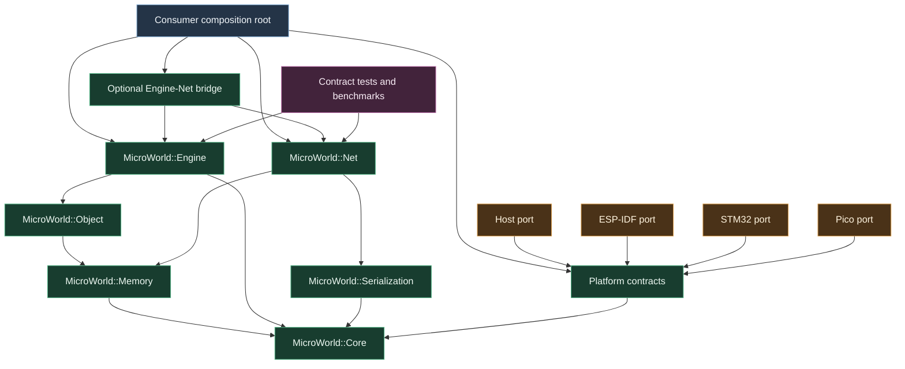
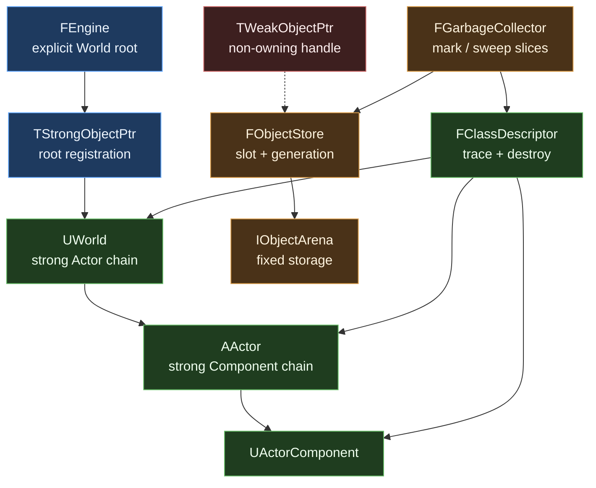
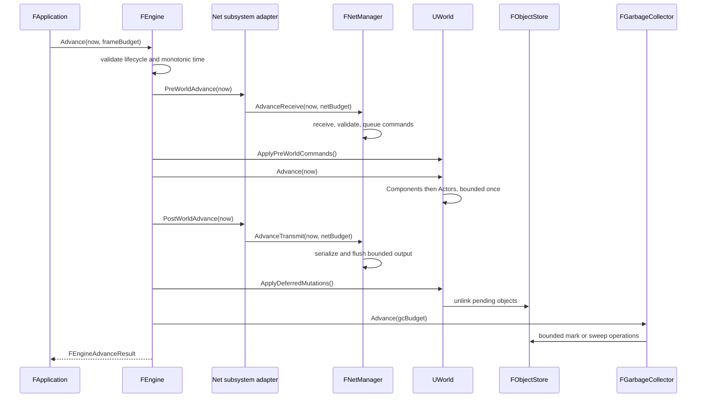
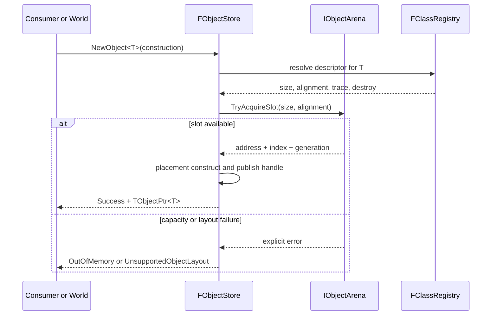

# MicroWorld C++ Change Plan: UE-Shaped MCU Mini Engine Roadmap

| Field | Value |
|---|---|
| **Created** | 2026-07-19 |
| **Status** | In Progress (Gates A-C accepted for roadmap progression; Phase 3 Object implementation and technical Gate D evidence complete; owner Gate D acceptance pending; Memory remains experimental pending target-margin evidence) |
| **Change Type** | Redesign |
| **Author** | Codex with project owner |
| **Target Module** | `lib/microworld` and future adjacent module/port packages |
| **Priority** | High |
| **Estimated Scope** | XL (multi-release, likely multiple months) |
| **P4 CL / Branch** | Git checkpoint `e1e7b75`; not pushed |

---

## 0 · TL;DR

**What the user sees:** MicroWorld 0.1.0 already gives embedded applications a
small UE-inspired lifecycle, World/Actor/Component hierarchy, and independently
scheduled ticks. It does not yet provide the managed object model, garbage
collection, smart-pointer family, dynamic Actor lifecycle, network manager and
drivers, cross-platform adapters, or project experience needed to feel like a
small engine to a UE5 C++ developer.

**Why it happens:** Version 0.1 intentionally proved only the smallest
deterministic kernel needed by the remote-controller curriculum. Its
consumer-owned, allocation-free runtime is a sound foundation, but extending it
as one monolithic library would force managed-object and networking costs into
small applications and would mix platform SDKs with portable engine policy.

**What the plan does:** Evolve MicroWorld through measured, independently
releasable modules. Core remains deterministic; Memory adds explicit resources
and UE-style smart pointers; Object adds stable handles and optional bounded GC;
Engine adds managed `UObject`/`AActor`/`UActorComponent` behavior; Net adds
`FNetManager` over `INetDriver`; adjacent ports connect host, ESP32, STM32, and
RP2040-class platforms. Every module has bounded work, explicit failure,
resource evidence, compatibility notes, and a decision gate before the next
release.

---

## 1 · 🎯 Objective & Motivation

### 1.1 Problem Statement

Turn MicroWorld from a released lifecycle/tick kernel into a coherent,
lightweight mini engine for developers who already understand UE5 C++. Preserve
transferable UE concepts—composition roots, Worlds, Actors, Components,
subsystems, ticks, managed objects, smart pointers, drivers, serialization, and
network management—without importing desktop engine assumptions, hidden
allocation, unbounded work, or vendor SDK dependencies into portable code.

The design must remain deliberately revisable before 1.0. Unknown hardware
budgets, real application needs, and port behavior are decision gates, not facts
to invent in advance.

### 1.2 Success Criteria

- [ ] Existing MicroWorld 0.1 public behavior and all 31 host tests remain
  available throughout migration, or a breaking candidate release provides a
  tested compatibility layer and migration guide.
- [ ] Portable production modules contain no ESP-IDF, FreeRTOS, STM32 HAL,
  Pico SDK, Arduino, E32, product-policy, or board-specific dependency.
- [ ] Build targets expose independent `Core`, `Memory`, `Object`, `Engine`,
  `Serialization`, and `Net` modules; applications link only selected modules.
- [ ] Runtime ownership and connectivity are orthogonal: Core or Managed
  applications may both opt into Net without making GC mandatory.
- [ ] Core lifecycle and tick paths remain bounded, single-pass, and free of
  steady-state allocation.
- [ ] All dynamic memory comes through a caller-selected `IMemoryResource`;
  allocation failure is explicit and no module silently falls back to another
  heap.
- [ ] `TUniquePtr`, `TSharedPtr`, and `TWeakPtr` have documented allocator,
  destruction, reference-counting, thread-mode, and out-of-memory semantics.
- [ ] `UObject`, `AActor`, `UActorComponent`, and `UWorld` names are introduced
  only with real managed-object identity, tracing, lifecycle, and World
  semantics.
- [ ] `TObjectPtr`, `TWeakObjectPtr`, and `TStrongObjectPtr` use generation-
  checked stable identities so reclaimed slots cannot be mistaken for old
  objects.
- [ ] The default managed store is fixed-capacity, non-moving, non-recursive,
  and supplied by the application; object size/alignment or capacity failures
  return typed results.
- [ ] Incremental GC performs no more than its caller-provided mark/sweep work
  budget, never runs in an ISR, never reads a hidden clock, and exposes its
  phase, progress, reclaimed count, and failure counters.
- [ ] An unreachable reference cycle is collectable, an explicit root keeps an
  object alive, and weak references expire without dereferencing reclaimed
  storage.
- [ ] Actor/Component spawn and destruction use bounded queues and mutation
  barriers; lifecycle hooks and tick iteration never observe container
  mutation in progress.
- [ ] Externally owned engine subsystems keep hardware, watchdog, interrupt,
  transport, and safety lifetimes deterministic and outside GC.
- [ ] `FTimerManager`, delegates, and event dispatch execute bounded work and do
  not generate catch-up bursts after a delayed frame.
- [ ] Serialization is explicit about byte order, widths, version, length
  bounds, and errors; ABI-dependent C++ object transmission is impossible
  through the public API.
- [ ] `FNetManager` owns bounded network scheduling, peers/sessions, packet
  validation, queues, handlers, and counters while `INetDriver` owns only
  non-blocking transport operations.
- [ ] Network receive work is bounded by packets and bytes per `Advance`;
  malformed, oversized, unknown, stale, duplicated, or failed-authentication
  input cannot reach registered message handlers.
- [ ] Host loopback and deterministic fake drivers validate the Net contract
  before a real transport is selected.
- [ ] Automatic replication remains an optional preview until a real
  application proves its authority, identity, bandwidth, and compatibility
  requirements; memory addresses are never wire identities.
- [ ] Shared platform contracts are introduced only for behavior implemented by
  at least two ports or required by an accepted engine module.
- [ ] Core and selected profile consumers compile with C++17, exceptions
  disabled, and RTTI disabled on every supported toolchain.
- [ ] The existing ESP32-S3 N16R8 compile probe remains green after every
  release; exact STM32 and RP2040/RP2350 reference boards and toolchains are
  selected before claiming those ports.
- [ ] Each reference target records compiler/SDK versions, build flags, flash,
  static RAM, object arena, stack high-water mark, heap delta, and bounded
  runtime costs for every supported profile.
- [ ] No unexplained resource or hot-path regression greater than 10% outside
  the recorded noise envelope is accepted within the same target/profile.
- [ ] Documentation includes a UE5-to-MicroWorld concept map, explicit semantic
  differences, ownership guide, profile-selection guide, porting guide,
  migration guide, examples, and known limitations.
- [ ] A 1.0 release is attempted only after two independent applications and at
  least two MCU families consume the same candidate API without application-
  specific patches to portable modules.

### 1.3 Out of Scope

- UE5 source, ABI, module, editor, or asset compatibility.
- `UCLASS`, `UPROPERTY`, Blueprint, editor panels, hot reload, or generated
  reflection code in the first managed release.
- Rendering, physics, audio, navigation, animation, asset cooking/streaming,
  GAS, Mass/ECS, or a general task graph.
- A universal HAL designed in advance. GPIO, UART, SPI, I2C, display, and input
  abstractions enter shared contracts only after real cross-platform use proves
  their common semantics.
- Unrestricted dynamic allocation, conservative stack scanning, moving GC,
  background collector threads, or collector execution from an ISR.
- Guaranteed real-time scheduling, preemptive task ownership, or transparent
  thread safety.
- Full UE replication, RPCs, client prediction, rollback, relevancy graphs, or
  seamless travel in the first Net release.
- A selected cryptographic primitive, key provisioning scheme, or security
  claim without a threat model and concrete transport/application.
- E32 framing, valve commands, fail-closed policy, debounce, hardware pin
  choices, or any remote-controller product behavior.
- Uploading firmware, transmitting radio, running target hardware, or changing
  irreversible device settings without explicit authorization.
- Moving MicroWorld to another repository before multiple independent
  consumers prove that the distribution overhead is worthwhile.

---

## 2 · 🔍 Context & Current State Analysis

### 2.1 Affected Systems Map

| System / Class | Role in Change | Ownership |
|---|---|---|
| `FApplication` | Existing deterministic composition-root guard | MicroWorld Core |
| `FLifecycleGuard` | Existing forward-only lifecycle state | MicroWorld Core |
| `FTickFunction` / `FTickable` | Existing independent bounded scheduling | MicroWorld Core |
| `TWorld<N>` / `TActor<N>` | Existing static, non-owning runtime | MicroWorld Core compatibility |
| `FActorComponent` | Existing static Component boundary | MicroWorld Core compatibility |
| `FNetwork` | Existing policy-free tickable subsystem; not the future Net manager | MicroWorld Core compatibility |
| Memory resources and smart pointers | New explicit dynamic-ownership layer | MicroWorld Memory |
| Object store, handles, descriptors, GC | New optional managed-object layer | MicroWorld Object |
| `FEngine`, `UWorld`, `AActor`, `UActorComponent` | New managed runtime and mutation barriers | MicroWorld Engine |
| Byte archives | New explicit serialization foundation | MicroWorld Serialization |
| `FNetManager` / `INetDriver` | New manager/transport split | MicroWorld Net |
| Host/ESP32/STM32/Pico adapters | New SDK-facing implementations | Adjacent port packages |
| Host tests, compile probes, benchmarks | Behavioral and resource evidence | MicroWorld validation |
| Remote-controller firmware/tutorial | Future pinned consumer; never framework owner | Application |

### 2.2 Existing Code Audit

```text
lib/microworld/
├── CMakeLists.txt
├── library.json
├── VERSION                         # 0.1.0
├── README.md / CHANGELOG.md
├── include/MicroWorld/
│   ├── Application.h
│   ├── Actor.h
│   ├── ActorComponent.h
│   ├── Lifecycle.h
│   ├── Network.h
│   ├── TickFunction.h
│   ├── Tickable.h
│   ├── Time.h
│   ├── Version.h
│   └── World.h
├── src/                            # lifecycle/tick implementations
├── tests/                          # 31 public-behavior tests
├── tests/consumer/                 # native and ESP32-S3 probes
├── benchmarks/                     # host + ESP32 fixed workloads
├── docs/                           # style, porting, performance
├── examples/HostLifecycle/
└── tools/                          # documentation/folder checks
```

- Current architecture pattern: consumer-owned values; bounded non-owning
  World/Actor/Component registration; forward-only lifecycle; one caller-
  supplied monotonic millisecond domain; independent virtual tick hooks.
- Current allocation behavior: no framework allocation in lifecycle or tick
  paths.
- Current platform boundary: portable C++17 library; no SDK headers.
- Current tests: 31 host behavior cases covering scheduling, lifecycle,
  registration, ownership, capacity, application ordering, and policy-free
  network ticking.
- Current measured host object sizes: `FTickFunction` 32 bytes,
  `FActorComponent` 56 bytes, benchmark `TActor<4>` 104 bytes,
  `TWorld<8>` 88 bytes, and `FNetwork` 48 bytes on the recorded MSVC build.
- Current ESP32 evidence: exact-version basic and benchmark consumers compile
  for ESP32-S3 N16R8. Runtime cycles, heap, and stack evidence is not recorded
  because no upload/run authorization was given.
- Current limitation: `FNetwork` schedules an application-defined hook; it
  provides no driver, packets, sessions, validation, queues, or replication.
- Current compatibility policy: source compatibility before 1.0 is not
  promised, but version and exact-consumer probes make changes observable.

### 2.3 UE5-Specific Constraints Checklist

This is not UE5 code; the table identifies which UE concepts MicroWorld adapts
and where it deliberately differs.

| Constraint | Relevant? | Notes |
|---|---|---|
| Reflection system | Yes, limited | Explicit class/reference descriptors; no UE code generation initially |
| Garbage Collection | Yes, optional | Fixed arena, explicit roots, generation handles, bounded incremental slices |
| Blueprint exposure | No | C++17 library with no editor |
| Replication / Multiplayer | Yes, limited | Net manager/driver split and optional descriptor-driven snapshot preview |
| Gameplay Ability System | No | Outside the first-engine scope |
| Enhanced Input System | No | Input extension waits for a concrete cross-platform application |
| World Subsystems | Yes | Deterministic externally owned engine subsystems |
| Async / Latent actions | Deferred | Single-threaded cooperative runtime first |
| Soft/Hard object references | Yes, adapted | Strong/weak generational handles; no asset loading |
| Data Assets / Data Tables | Deferred | Explicit serialization precedes any data-asset model |
| Plugins / Module boundaries | Yes | Separately linkable portable modules plus adjacent port packages |
| Editor tooling / Details panel | No | Documentation, templates, and host simulation instead |

### 2.4 Risks & Constraints

- A familiar API can falsely imply UE behavior. Every borrowed name needs a
  semantic-differences contract and tests.
- A custom GC and custom shared pointer are memory-safety-critical systems. They
  require the smallest viable semantics, sanitizers, adversarial tests, and
  separate release gates.
- Managed objects and deterministic hardware lifetimes can be confused. The API
  must make root ownership, shared ownership, and non-owning observation visibly
  different.
- Fixed object slots simplify correctness but may waste RAM. The first
  implementation must measure before adding size classes or a complex
  allocator.
- GC work can violate update deadlines. Work is operation-budgeted rather than
  time-budgeted so tests are deterministic and no hidden clock is sampled.
- Deferred mutation changes intuitive spawn/destroy timing. Exact barriers must
  be documented and observable.
- A generic HAL often becomes the least-common-denominator of vendor APIs.
  Shared contracts must grow from evidence, not a speculative peripheral list.
- PlatformIO and standalone CMake do not offer identical module packaging.
  Module boundaries must be proven by linker maps, not inferred from source
  folders.
- `TSharedPtr` thread safety could pull atomics and RTOS assumptions into small
  targets. Single-threaded mode is the portable baseline; a thread-safe mode is
  gated on a real concurrent consumer.
- Network reliability, authentication, and replication are distinct concerns.
  One convenience layer must not silently claim all three.
- Wire compatibility can outlive source compatibility. Protocol versioning and
  golden vectors begin with the first serialized packet.
- The current remote controller is safety-critical. It must not become the test
  excuse for generic engine features or place valve output under GC ownership.
- The first STM32 and Pico reference hardware is unresolved; support cannot be
  claimed from host or ESP32 evidence.
- Multiple modules, ports, examples, and guides can create maintenance load
  before a second consumer exists. Releases must stop when evidence does not
  justify the next abstraction.

---

## 3 · 🤔 Options Considered

| # | Approach | Pros | Cons | Complexity | Verdict |
|---|---|---|---|---|---|
| 1 | Layered UE-shaped, MCU-native runtime | Familiar mental model, optional costs, measurable modules, portable dependency direction | Requires explicit differences from UE5 and disciplined boundaries | High | Selected |
| 2 | Literal miniature UE5 clone | Most recognizable names and conceptual breadth | Desktop assumptions, misleading compatibility, excessive resource and maintenance cost | Very High | Rejected |
| 3 | Keep v0.1 and add unrelated helper libraries | Lowest risk to current package and minimal core | No coherent engine experience; ownership/network/runtime concepts drift apart | Medium | Rejected |
| 4 | One monolithic configurable engine | Simple package name and build dependency | Feature-flag interactions, unavoidable compile cost, weak resource attribution | High | Rejected |

---

## 4 · ✅ Selected Approach

**Option:** Layered UE-shaped, MCU-native runtime | **Complexity:** High

Keep the proven v0.1 deterministic runtime intact while new capabilities mature
behind separately linkable module contracts. Runtime ownership has two tiers—
Core and Managed—while networking is an independent overlay usable by either.
The accepted trade-off is more explicit composition and packaging in exchange
for honest semantics, bounded resource use, and flexibility across very
different microcontrollers.

### Key Design Decisions

| Decision | Rationale |
|---|---|
| Preserve v0.1 behavior during incubation | Keeps a working deterministic release and protects the tutorial |
| Core versus Managed are ownership tiers | Makes GC opt-in without making it second-class |
| Net is an overlay, not a third ownership tier | Allows networked deterministic applications without UObject/GC |
| One-way dependency chain | `Core ← Memory ← Object ← Engine`; `Core/Memory ← Serialization/Net`; ports depend inward |
| Caller owns memory resources | Capacity, diagnostics, and failure remain application decisions |
| Reuse conforming C++17 primitives where possible | Avoid custom ownership code unless explicit OOM/resource/no-exception semantics require it |
| Fixed-slot object arena first | Simplest safe non-moving implementation; optimize layout only with target evidence |
| Stable index + generation handles | Prevents reclaimed-slot ABA and supports weak references without RTTI |
| Explicit roots and iterative tracing | No conservative scanning, recursion, or hidden platform behavior |
| Operation-count GC budget | Deterministic tests and bounded work independent of clock speed |
| No emergency hidden full collection | Allocation failure stays observable; the application selects a safe collection point |
| Parent owns children strongly; child observes parent weakly | Avoids World/Actor/Component ownership cycles |
| Deferred structural mutation | Tick, delegate, handler, and GC traversals never see container mutation |
| Externally owned subsystems | Hardware and safety services retain deterministic destruction outside GC |
| Phase-specific Engine errors | Engine reports the failed phase; application policy decides retry, shutdown, or reset |
| Single-threaded baseline | Matches the current execution model and avoids speculative atomics/mutexes |
| Explicit byte archives | Prevents ABI-dependent packets and centralizes bounds/endian validation |
| NetManager validates before dispatch | Transport bytes cannot bypass framing/session/security policy |
| Replication is preview-gated | Avoids designing authority and bandwidth policy without a real consumer |
| Shared platform contracts need evidence | Prevents a speculative universal HAL |
| No global mutable registry or platform singleton | Composition roots make ownership, initialization, and tests explicit |
| No non-trivial global constructors | Preserves embedded boot ordering and valve safety constraints |
| All v0.x boundaries are revisable with evidence | The first engine version should learn without pretending certainty |
| 1.0 requires multiple consumers and MCU families | Avoids freezing an application-specific API |

### Assumptions & Prerequisites

- **Assumes:** C++17 remains the minimum language level through 1.0 planning.
- **Assumes:** Exceptions and RTTI remain optional and are disabled in all
  portable compile probes.
- **Assumes:** The current caller-supplied monotonic time contract remains the
  canonical scheduling source.
- **Requires:** Exact reference board, SDK/toolchain, and accepted budgets before
  claiming STM32 or RP2040/RP2350 support.
- **Requires:** A host deterministic port and fake drivers before target
  adapters.
- **Requires:** Explicit owner approval before firmware upload or target
  execution.
- **Requires:** A decision record for any module boundary, ownership semantic,
  wire-format, or resource policy that changes after approval.
- **Constraint:** Product safety, authentication keys, and irreversible hardware
  settings remain outside generic engine implementation.
- **Constraint:** New folders inherit the repository requirement for scoped
  `AGENTS.md`, intent-focused API documentation, strict warnings, and
  `clang-format --style=file:clang-format`.

### Candidate Release Train

Version labels are planning candidates, not promises. A milestone may be split,
renumbered, or stopped when evidence changes the design.

| Candidate | Scope | Exit gate |
|---|---|---|
| 0.1.x | Freeze current baseline and decisions | Clean-source host/ESP32 compile and benchmark records |
| 0.2 | Core build boundary and adjacent-package contract | Core-only map excludes experimental module code |
| 0.3 | Memory resources, bounded utilities, smart pointers, delegates | Ownership/OOM tests and target resource evidence |
| 0.4 | Object identity, descriptors, store, object pointers, incremental GC | Cycle/root/weak/budget/destruction tests and measured arena cost |
| 0.5 | Managed World/Actor/Component, engine loop, subsystems, timers | Mutation-order tests and host managed example |
| 0.6 | Byte archives, NetManager/NetDriver, host loopback | Golden vectors, malformed-input tests, bounded loopback soak |
| 0.7 | First maintained ESP32/STM32/Pico port matrix | Exact-toolchain compile and authorized runtime evidence |
| 0.8 | Developer templates, host simulation, UE mapping, migration | A new sample application needs no framework patch |
| 0.9 | API/resource hardening | Two applications and two MCU families pass candidate suite |
| 1.0 | Stable documented source contract | Release checklist, migrations, evidence, and known limitations complete |

---

## 5 · 🏗️ Architecture

### 5.1 Component Diagram

Portable module and port dependency direction:



Managed-object ownership and GC tracing:



### 5.2 Sequence Diagram

One Managed update with Net attached as an externally owned subsystem:



Object allocation and failure remain explicit:



**Alternative / Error Paths:**

- Backward time returns `NonMonotonicTime`; no subsystem, World, mutation, or GC
  work is dispatched.
- A Net driver may return no packet, transport failure, or packet data. Manager
  budgets and counters handle each without blocking World progress.
- Invalid packets are rejected before message handlers; queue saturation returns
  an observable result and increments a bounded counter.
- A spawn requested during Actor/Component tick remains queued until the
  documented mutation barrier; it cannot join the active iteration.
- Destroy marks an object pending and prevents future public work after the
  barrier; actual storage reclamation occurs only through the store/collector.
- GC budget exhaustion preserves phase/worklist state for the next update.
- Allocation failure never invokes a hidden full collection. The application
  may schedule incremental work or explicitly request full collection at a
  safe point.

### 5.3 Components Summary

| Component | Responsibility |
|---|---|
| `IMemoryResource` | Explicit aligned allocation/deallocation boundary and usage diagnostics |
| `TFixedArena` / optional `FHeapMemoryResource` | Portable fixed baseline and explicitly enabled host/capable-target policy |
| `TUniquePtr` | Exclusive deterministic ownership through one memory resource |
| `TSharedPtr` / `TWeakPtr` | Reference-counted non-UObject ownership with explicit thread mode |
| `FObjectHandle` | Stable slot index and generation, never a wire identity |
| `TObjectPtr` / `TWeakObjectPtr` / `TStrongObjectPtr` | Traced, observing, and rooted managed references |
| `FClassDescriptor` / `FClassRegistry` | Explicit no-RTTI type identity, construction metadata, trace, and destruction |
| `FObjectStore` | Object slot lifecycle, handle resolution, construction, pending destruction, and reclamation |
| `FGarbageCollector` | Iterative explicit-root mark/sweep state machine with operation budgets |
| `FEngine` | Managed update order, subsystem phases, mutation barriers, and GC scheduling |
| `UWorld` | Strong ownership of registered Actors and deterministic World dispatch |
| `AActor` | Managed entity, weak World reference, strong Component ownership, and primary tick |
| `UActorComponent` | Managed reusable behavior, weak Actor owner, lifecycle, and independent tick |
| `FTimerManager` | Bounded timer handles/callback dispatch without catch-up bursts |
| `IEngineSubsystem` | Externally owned deterministic subsystem phase interface |
| `FByteWriter` / `FByteReader` | Bounds-checked explicit endian serialization |
| `INetDriver` | Non-blocking transport lifecycle, receive, and send boundary |
| `FNetManager` | Packet validation, sessions, queues, handlers, budgets, and diagnostics |
| `TNetEngineSubsystemAdapter` | Optional bridge that schedules a standalone NetManager in Engine phases |
| `FReplicationDescriptor` | Optional explicit snapshot fields and Net object identity; preview only |
| Platform contracts | Narrow clock/log/diagnostic/entropy/critical-section services proven by ports |

### 5.4 Interfaces

- `IMemoryResource::TryAllocate(size, alignment)` — returns an aligned block or
  typed failure; it never throws or falls back.
- `MakeUnique<T>(resource, args...)` — constructs through the selected resource
  and returns a pointer result that distinguishes OOM from construction policy.
- `FObjectStore::NewObject<T>(args...)` — validates descriptor layout, reserves a
  slot, constructs, and returns a generation-checked managed reference.
- `FObjectStore::Resolve(handle)` — query-only validation; stale generations
  return null without changing store state.
- `TStrongObjectPtr<T>` — registers/unregisters an explicit root through RAII;
  unavailable in ISR paths.
- `FGarbageCollector::Advance(budget)` — performs at most the requested
  operations and reports phase/progress/reclamation.
- `FEngine::Advance(now, budgets)` — validates time, runs subsystem phases,
  World dispatch, mutation barriers, and a GC slice in fixed documented order.
- `UWorld::SpawnActor<T>(request)` — queues bounded creation; result identifies
  accepted, full, invalid type, or lifecycle-locked requests.
- `UWorld::DestroyActor(handle)` — queues idempotent destruction and never
  mutates the active tick traversal.
- `INetDriver::TryReceive(buffer)` — performs one non-blocking receive attempt
  into caller-owned bounded storage.
- `INetDriver::TrySend(peer, bytes)` — attempts one bounded send and returns
  explicit backpressure/failure.
- `FNetManager::AdvanceReceive` / `AdvanceTransmit` — enforce receive and
  transmit budgets in a Core composition root or through the optional
  Engine-Net subsystem adapter.
- `FByteWriter` / `FByteReader` — serialize only explicit primitive/byte spans;
  no generic packed-struct or raw-object API exists.

### 5.5 Dependency and Lifetime Rules

```text
Application owns:
  platform adapters
  memory resources and object arena
  deterministic engine subsystems
  FObjectStore and FGarbageCollector
  FEngine and optional FNetManager

Managed store owns storage for:
  UObject / UWorld / AActor / UActorComponent instances

Managed strong references own reachability:
  engine root -> UWorld -> Actors -> Components

Managed weak references observe:
  Actor -> World
  Component -> Actor
  non-owning application lookups

Never GC-owned:
  ISR state, GPIO/UART/SPI drivers, watchdog control, NetDriver implementation,
  cryptographic key stores, fail-closed policies, and physical output drivers
```

### 5.6 Release and Decision Gates

- **Gate A — Baseline:** current exact source tests, maps, versions, and host
  measurements are reproducible from a clean commit.
- **Gate B — Modules:** Core-only binary proves Object/Engine/Net code is absent
  from the map; package strategy works in CMake and PlatformIO consumers.
- **Gate C — Memory:** ownership/OOM semantics pass with zero hidden allocation;
  target measurements justify retained pointer/container designs.
- **Gate D — Objects:** roots, cycles, generations, destruction, and work budgets
  pass under sanitizers before `UObject` is public.
- **Gate E — Engine:** mutation barriers and lifecycle order pass before dynamic
  Actor APIs are released; frame-failure and cleanup semantics have an accepted
  decision record.
- **Gate F — Net:** malformed-input, session, budget, backpressure, and soak
  tests pass before a target driver.
- **Gate G — Port:** an exact reference board/toolchain records compile and
  authorized runtime evidence before its support status changes from
  experimental.
- **Gate H — 1.0:** two applications and two MCU families use the candidate
  release without portable-module patches.

---

## 6 · 📝 Implementation Steps

The declarations below define contracts and dependency direction, not complete
implementations. Exact names may change during a milestone only through its
decision gate and plan update.

### Step 1: Add explicit memory-resource contracts
**File:** `lib/microworld-memory/include/MicroWorld/Memory/MemoryResource.h` | new

```cpp
namespace MicroWorld
{
enum class EMemoryResult : std::uint8_t
{
	Success,
	OutOfMemory,
	UnsupportedAlignment,
	InvalidBlock,
};

struct FMemoryBlock
{
	void* Address{nullptr};
	std::size_t SizeBytes{0};
};

class IMemoryResource
{
public:
	virtual ~IMemoryResource() = default;
	virtual EMemoryResult TryAllocate(
		std::size_t SizeBytes,
		std::size_t AlignmentBytes,
		FMemoryBlock& OutBlock) noexcept = 0;
	virtual EMemoryResult Deallocate(FMemoryBlock Block) noexcept = 0;
	virtual std::size_t CapacityBytes() const noexcept = 0;
	virtual std::size_t UsedBytes() const noexcept = 0;
};
}
```

#### Implementer Context
> - Keep the interface independent of platform heaps and exceptions.
> - `TryAllocate` may return a result because allocation is both a resource
>   command and a boundary failure; do not hide failure behind `new`.
> - Add `TFixedArena<Bytes, Alignment>` first. Add a heap-backed implementation
>   only in host/explicitly enabled port code.
> - Validate power-of-two alignment, integer overflow, double-free behavior,
>   and usage counters through public tests.

### Step 2: Add allocator-aware unique ownership
**File:** `lib/microworld-memory/include/MicroWorld/Memory/UniquePtr.h` | new

```cpp
namespace MicroWorld
{
template<typename T>
class TUniquePtr final
{
public:
	TUniquePtr() noexcept = default;
	TUniquePtr(const TUniquePtr&) = delete;
	TUniquePtr& operator=(const TUniquePtr&) = delete;
	TUniquePtr(TUniquePtr&& Other) noexcept;
	TUniquePtr& operator=(TUniquePtr&& Other) noexcept;
	~TUniquePtr() noexcept;

	T* Get() const noexcept;
	void Reset() noexcept;

private:
	friend struct FUniquePointerFactory;
	T* Value{nullptr};
	IMemoryResource* Resource{nullptr};
	FMemoryBlock Allocation{};
};

template<typename T>
struct TUniquePointerResult
{
	EMemoryResult Result{EMemoryResult::OutOfMemory};
	TUniquePtr<T> Pointer{};
};
}
```

#### Implementer Context
> - Placement-construct only after successful allocation and destroy exactly
>   once before returning the original block to its resource.
> - First compare a thin `std::unique_ptr` plus resource-aware deleter against a
>   custom class. Reuse the standard primitive if it meets size, no-exception,
>   move, and explicit-allocation-result contracts.
> - Do not provide an implicit raw-pointer constructor or cross-resource reset.
> - Move construction/assignment is the only ownership-transfer operation.
>   A raw `Release()` would strand the injected resource and exact block, so it
>   is intentionally absent until a real consumer justifies a safe adoption
>   contract.
> - `MakeUnique<T>(Resource, Args...)` is the only normal factory and must be
>   tested with constructor/destructor counters and OOM.
> - Keep this independent from managed-object GC; `UObject` allocation through
>   `TUniquePtr` is forbidden by a compile-time trait once Object exists.

### Step 3: Add shared and weak non-UObject ownership
**File:** `lib/microworld-memory/include/MicroWorld/Memory/SharedPtr.h` | new

```cpp
namespace MicroWorld
{
enum class ESharedPointerMode : std::uint8_t
{
	SingleThreaded,
};

template<typename T, ESharedPointerMode Mode = ESharedPointerMode::SingleThreaded>
class TSharedPtr;

template<typename T, ESharedPointerMode Mode = ESharedPointerMode::SingleThreaded>
class TWeakPtr;

template<typename T, ESharedPointerMode Mode>
struct TSharedPointerResult
{
	EMemoryResult Result{EMemoryResult::OutOfMemory};
	TSharedPtr<T, Mode> Pointer{};
};
}
```

#### Implementer Context
> - Implement `SingleThreaded` first with one resource-owned allocation for
>   object plus control block where alignment permits.
> - Record why `std::allocate_shared` does or does not satisfy exceptions-off,
>   explicit OOM, resource attribution, size, and toolchain requirements before
>   retaining custom reference-counting code.
> - Keep strong and weak counters overflow-safe; reject or diagnose an
>   unrepresentable increment rather than wrap.
> - Add a `ThreadSafe` enumerator and specialization only after an accepted
>   concurrent consumer, atomic/toolchain probe, and target benchmark exist; do
>   not advertise an unavailable mode.
> - No reference-count operation is ISR-safe in the portable contract.
> - Add positive/negative tests for destruction, copy/move, weak expiry, alias
>   reset, OOM, and counter boundaries.

### Step 4: Add fixed-capacity delegates
**File:** `lib/microworld-memory/include/MicroWorld/Delegates/Delegate.h` | new

```cpp
namespace MicroWorld
{
struct FDelegateHandle
{
	std::uint16_t Index{0};
	std::uint16_t Generation{0};
};

template<typename Signature, std::size_t InlineCallableBytes>
class TDelegate;

template<typename Signature, std::size_t MaxBindings, std::size_t InlineCallableBytes>
class TMulticastDelegate
{
public:
	ERuntimeResult Add(TDelegate<Signature, InlineCallableBytes> Binding, FDelegateHandle& OutHandle) noexcept;
	ERuntimeResult Remove(FDelegateHandle Handle) noexcept;
	ERuntimeResult Broadcast(/* signature arguments */) noexcept;
	std::size_t BindingCount() const noexcept;
};
}
```

#### Implementer Context
> - Store only callables that fit the declared inline capacity; never allocate
>   or silently heap-spill.
> - Define mutation during broadcast as staged or rejected; do not alter active
>   iteration.
> - Generation-check handles so a removed slot cannot remove a later binding.
> - Avoid `std::function` because its allocation behavior is implementation-
>   dependent.

### Step 5: Define stable managed-object identity
**File:** `lib/microworld-object/include/MicroWorld/Object/ObjectHandle.h` | new

```cpp
namespace MicroWorld
{
using ObjectIndex = std::uint32_t;
using ObjectGeneration = std::uint32_t;

enum class EObjectResult : std::uint8_t
{
	Success,
	CapacityExceeded,
	UnsupportedObjectLayout,
	UnknownClass,
	RootCapacityExceeded,
	StaleHandle,
	AlreadyPendingDestroy,
	LifecycleLocked,
};

struct FObjectHandle
{
	ObjectIndex Index{std::numeric_limits<ObjectIndex>::max()};
	ObjectGeneration Generation{0};

	bool IsValid() const noexcept;
	friend bool operator==(FObjectHandle Left, FObjectHandle Right) noexcept;
};

struct FObjectId
{
	std::uint32_t Value{0};
};
}
```

#### Implementer Context
> - `FObjectHandle` is local process identity and must never be serialized as a
>   Net identity.
> - Reserve one unambiguous invalid representation and define generation wrap
>   policy before implementation.
> - Start with 32-bit fields for portability and measure size before narrowing.
> - `FObjectId` is a local diagnostic/type-safe identifier only; Net uses its
>   own session-qualified type.

### Step 6: Define traced, weak, and rooted object pointers
**File:** `lib/microworld-object/include/MicroWorld/Object/ObjectPtr.h` | new

```cpp
namespace MicroWorld
{
class FObjectStore;

template<typename T>
class TObjectPtr
{
public:
	T* Get() const noexcept;
	FObjectHandle Handle() const noexcept;
	explicit operator bool() const noexcept;

private:
	friend class FObjectStore;
	FObjectStore* Store{nullptr};
	FObjectHandle Object{};
};

template<typename T>
class TWeakObjectPtr
{
public:
	T* Get() const noexcept;
	bool IsExpired() const noexcept;
};

template<typename T>
class TStrongObjectPtr final
{
public:
	TStrongObjectPtr() noexcept = default;
	~TStrongObjectPtr() noexcept;
	TStrongObjectPtr(const TStrongObjectPtr&) = delete;
	TStrongObjectPtr(TStrongObjectPtr&& Other) noexcept;
	T* Get() const noexcept;

private:
	friend class FObjectStore;
	TStrongObjectPtr(FObjectStore& Store, FObjectHandle Object) noexcept;
};

template<typename T>
struct TStrongObjectPointerResult
{
	EObjectResult Result{EObjectResult::RootCapacityExceeded};
	TStrongObjectPtr<T> Pointer;
};
}
```

#### Implementer Context
> - `TObjectPtr` participates in reference tracing only when stored in a
>   descriptor-visible managed object; a local variable is not an implicit root.
> - `FObjectStore::MakeStrongObjectPtr` registers the root and returns
>   `TStrongObjectPointerResult`; root-capacity failure must never hide in a
>   constructor.
> - `TWeakObjectPtr` and `TObjectPtr::Get` resolve index plus generation on every
>   access; never trust a cached pointer after a mutation barrier.
> - Derived/base conversions use descriptor ancestry, not C++ RTTI.

### Step 7: Add explicit no-RTTI class descriptors
**File:** `lib/microworld-object/include/MicroWorld/Object/ClassDescriptor.h` | new

```cpp
namespace MicroWorld
{
class UObject;
class FReferenceCollector;

using FTypeId = std::uint32_t;
using FTraceObjectReferences = void (*)(UObject&, FReferenceCollector&) noexcept;
using FDestroyManagedObject = void (*)(UObject&) noexcept;

struct FClassDescriptor
{
	FTypeId TypeId{0};
	const char* DiagnosticName{nullptr};
	const FClassDescriptor* Parent{nullptr};
	std::size_t SizeBytes{0};
	std::size_t AlignmentBytes{0};
	FTraceObjectReferences TraceReferences{nullptr};
	FDestroyManagedObject Destroy{nullptr};
};

template<std::size_t MaxClasses>
class TClassRegistry final
{
public:
	ERuntimeResult Register(const FClassDescriptor& Descriptor) noexcept;
	const FClassDescriptor* Find(FTypeId TypeId) const noexcept;
};
}
```

#### Implementer Context
> - Registration occurs explicitly in the composition root; no non-trivial
>   global constructors or linker-section magic.
> - Reject zero/duplicate IDs, invalid layout, missing destroy callback, and
>   inconsistent parent chains atomically.
> - Diagnostic names are not stable wire IDs and may be compiled out in a
>   constrained profile.
> - Begin with template-generated callbacks and explicit reference visitation.
>   Do not add a code generator until repeated real classes prove its value.

### Step 8: Introduce the managed base object
**File:** `lib/microworld-object/include/MicroWorld/Object/Object.h` | new

```cpp
namespace MicroWorld
{
class UObject
{
public:
	UObject(const UObject&) = delete;
	UObject& operator=(const UObject&) = delete;
	UObject(UObject&&) = delete;
	UObject& operator=(UObject&&) = delete;

	FObjectHandle GetObjectHandle() const noexcept;
	const FClassDescriptor& GetClassDescriptor() const noexcept;
	bool IsPendingDestroy() const noexcept;

protected:
	UObject() noexcept = default;
	virtual ~UObject() = default;
	virtual void VisitReferences(FReferenceCollector& Collector) noexcept {}
	virtual void BeginDestroy() noexcept {}

private:
	friend class FObjectStore;
	FObjectStore* Store{nullptr};
	FObjectHandle Handle{};
	const FClassDescriptor* Descriptor{nullptr};
	bool bPendingDestroy{false};
};
}
```

#### Implementer Context
> - The `U` prefix becomes valid only when store construction, identity,
>   tracing, and deferred destruction all work.
> - Consumers never call `delete`; only the descriptor/store invokes the exact
>   derived destructor.
> - `BeginDestroy` runs once at the mutation barrier and must not allocate or
>   resurrect the object.
> - Keep the first tracing API manual and explicit. Field-level reflection and
>   serialization descriptors are separate concerns.

### Step 9: Add fixed-capacity object storage and construction
**File:** `lib/microworld-object/include/MicroWorld/Object/ObjectStore.h` | new

```cpp
namespace MicroWorld
{
template<typename T>
struct TObjectCreationResult
{
	EObjectResult Result{EObjectResult::CapacityExceeded};
	TObjectPtr<T> Object{};
};

class FObjectStore final
{
public:
	FObjectStore(FObjectStoreStorage Storage, IObjectArena& Arena, FClassRegistryView Classes) noexcept;

	template<typename T, typename... TArguments>
	TObjectCreationResult<T> NewObject(TArguments&&... Arguments) noexcept;

	UObject* Resolve(FObjectHandle Handle) const noexcept;
	EObjectResult MarkPendingDestroy(FObjectHandle Handle) noexcept;
	FObjectMutationResult ApplyPendingDestroy(std::uint32_t MaxObjects) noexcept;
	EObjectResult AddRoot(FObjectHandle Handle) noexcept;
	EObjectResult RemoveRoot(FObjectHandle Handle) noexcept;
	template<typename T>
	TStrongObjectPointerResult<T> MakeStrongObjectPtr(TObjectPtr<T> Object) noexcept;
	FObjectStoreStats Stats() const noexcept;
};
}
```

#### Implementer Context
> - Supply slot metadata, roots, and any queues through caller-owned storage;
>   the store must not allocate its own bookkeeping.
> - The reference implementation starts with fixed equal-size slots. Record
>   internal fragmentation before considering multiple size classes.
> - Publish the handle only after successful placement construction and
>   metadata initialization; roll back atomically on every failure.
> - Allocation failure does not invoke GC. Expose occupancy so the engine can
>   schedule collection before exhaustion.
> - Pending destruction is applied through a bounded explicit barrier before
>   sweep; it invokes `BeginDestroy` once, releases outgoing references, and
>   prevents resurrection.

### Step 10: Add the bounded incremental collector
**File:** `lib/microworld-object/include/MicroWorld/Object/GarbageCollector.h` | new

```cpp
namespace MicroWorld
{
enum class EGarbageCollectionPhase : std::uint8_t
{
	Idle,
	SeedRoots,
	Mark,
	Sweep,
};

struct FGarbageCollectionBudget
{
	std::uint32_t MaxRootOperations{0};
	std::uint32_t MaxMarkOperations{0};
	std::uint32_t MaxSweepOperations{0};
};

struct FGarbageCollectionResult
{
	ERuntimeResult Result{ERuntimeResult::Success};
	EGarbageCollectionPhase Phase{EGarbageCollectionPhase::Idle};
	std::uint32_t OperationsPerformed{0};
	std::uint32_t ObjectsReclaimed{0};
	bool bCycleComplete{false};
};

class FGarbageCollector final
{
public:
	FGarbageCollector(FObjectStore& Store, FGarbageCollectorStorage Storage) noexcept;
	ERuntimeResult RequestCollection() noexcept;
	FGarbageCollectionResult Advance(FGarbageCollectionBudget Budget) noexcept;
	FGarbageCollectionResult CollectFull() noexcept;
};
}
```

#### Implementer Context
> - Use an iterative worklist sized for the maximum object count; recursion is
>   forbidden.
> - Count operations by visited root, traced object/reference, and swept slot;
>   specify the exact accounting in tests.
> - The collector never reads time, blocks on a mutex, invokes platform code, or
>   runs from an ISR.
> - A full collection is explicit and may be rejected while World dispatch or
>   Net handlers are active.
> - Pending-destroy objects do not become reachable again; define and test how
>   their outgoing references are released.

### Step 11: Add deterministic engine-subsystem phases
**File:** `lib/microworld-engine/include/MicroWorld/Engine/EngineSubsystem.h` | new

```cpp
namespace MicroWorld
{
class IEngineSubsystem
{
public:
	virtual ~IEngineSubsystem() = default;
	virtual ERuntimeResult BeginPlay(TimePointMilliseconds NowMilliseconds) noexcept = 0;
	virtual ERuntimeResult PreWorldAdvance(TimePointMilliseconds NowMilliseconds) noexcept = 0;
	virtual ERuntimeResult PostWorldAdvance(TimePointMilliseconds NowMilliseconds) noexcept = 0;
	virtual ERuntimeResult EndPlay() noexcept = 0;
};
}
```

#### Implementer Context
> - Subsystems are externally owned and pointer-stable; Engine stores a bounded
>   non-owning registration list.
> - Begin uses registration order, End uses reverse order, and failed Begin
>   rolls back already-started subsystems.
> - Hardware and Net adapters may implement this contract, but Engine contains
>   no platform or product policy.
> - Do not add dependency lookup or automatic registration in this milestone.

### Step 12: Introduce managed Actor behavior
**File:** `lib/microworld-engine/include/MicroWorld/Engine/Actor.h` | new

```cpp
namespace MicroWorld
{
class AActor : public UObject, public FTickable
{
public:
	TWeakObjectPtr<UWorld> GetWorld() const noexcept;

	template<typename T, typename... TArguments>
	TObjectCreationResult<T> CreateComponent(TArguments&&... Arguments) noexcept;

	ERuntimeResult Destroy() noexcept;

protected:
	explicit AActor(FTickConfiguration TickConfiguration = {}) noexcept;
	virtual void BeginPlay() {}
	virtual void Tick(const FTickContext& Context) = 0;
	virtual void EndPlay() {}

private:
	friend class UWorld;
	TWeakObjectPtr<UWorld> World{};
	TObjectPtr<UActorComponent> FirstComponent{};
	TObjectPtr<UActorComponent> LastComponent{};
	std::size_t ComponentCount{0};
	FLifecycleGuard Lifecycle{};
};
}
```

#### Implementer Context
> - World strongly owns Actor reachability; Actor observes World weakly.
> - Actor strongly owns Components through a bounded intrusive handle chain;
>   Components observe Actor weakly to avoid a cycle.
> - Creation may allocate the Component immediately but attachment and
>   `BeginPlay` occur only at a mutation barrier.
> - Preserve current Component-before-Actor tick order unless an approved
>   behavior change updates tests and migration docs.

### Step 13: Introduce managed Actor Components
**File:** `lib/microworld-engine/include/MicroWorld/Engine/ActorComponent.h` | new

```cpp
namespace MicroWorld
{
class UActorComponent : public UObject, public FTickable
{
public:
	TWeakObjectPtr<AActor> GetOwner() const noexcept;
	ERuntimeResult Destroy() noexcept;

protected:
	explicit UActorComponent(FTickConfiguration TickConfiguration = {}) noexcept;
	virtual void BeginPlay() {}
	virtual void TickComponent(const FTickContext& Context) {}
	virtual void EndPlay() {}

private:
	friend class AActor;
	TWeakObjectPtr<AActor> Owner{};
	TObjectPtr<UActorComponent> NextOwnedComponent{};
	FLifecycleGuard Lifecycle{};
};
}
```

#### Implementer Context
> - Keep managed Component behavior observably aligned with current
>   `FActorComponent` where semantics overlap.
> - Unlink only at the Actor mutation barrier; destruction during a tick is a
>   request, not immediate storage reuse.
> - Pending-destroy Components do not tick again after the barrier.
> - Do not provide RTTI-based `FindComponentByClass`; an explicit descriptor
>   query may be added after class ancestry tests exist.

### Step 14: Add the managed World and mutation queues
**File:** `lib/microworld-engine/include/MicroWorld/Engine/World.h` | new

```cpp
namespace MicroWorld
{
class UWorld final : public UObject
{
public:
	template<typename T, typename... TArguments>
	TObjectCreationResult<T> SpawnActor(TArguments&&... Arguments) noexcept;

	ERuntimeResult DestroyActor(FObjectHandle Actor) noexcept;
	ERuntimeResult BeginPlay(TimePointMilliseconds NowMilliseconds) noexcept;
	ERuntimeResult Advance(TimePointMilliseconds NowMilliseconds) noexcept;
	ERuntimeResult ApplyDeferredMutations() noexcept;
	ERuntimeResult EndPlay() noexcept;

private:
	TObjectPtr<AActor> FirstActor{};
	TObjectPtr<AActor> LastActor{};
	std::size_t ActorCount{0};
	FWorldMutationQueue Mutations;
	FLifecycleGuard Lifecycle{};
	TimePointMilliseconds LastUpdateMilliseconds{0};
};
}
```

#### Implementer Context
> - The object store bounds total objects; World configuration separately
>   bounds Actors and pending mutations.
> - Spawn constructs through the store and queues attachment. Queue failure must
>   roll back the unregistered object atomically.
> - Active dispatch never changes the Actor/Component chains.
> - EndPlay visits Actors and Components in documented reverse order, marks
>   managed descendants pending, and remains idempotent after success.

### Step 15: Add bounded timers
**File:** `lib/microworld-engine/include/MicroWorld/Engine/TimerManager.h` | new

```cpp
namespace MicroWorld
{
struct FTimerHandle
{
	std::uint16_t Index{0};
	std::uint16_t Generation{0};
};

struct FTimerConfiguration
{
	DurationMilliseconds DelayMilliseconds{0};
	DurationMilliseconds IntervalMilliseconds{0};
	bool bLooping{false};
};

template<std::size_t MaxTimers, std::size_t InlineCallableBytes>
class TTimerManager final
{
public:
	ERuntimeResult SetTimer(
		FTimerConfiguration Configuration,
		TDelegate<void(), InlineCallableBytes> Callback,
		FTimerHandle& OutHandle) noexcept;
	ERuntimeResult ClearTimer(FTimerHandle Handle) noexcept;
	ERuntimeResult Advance(TimePointMilliseconds NowMilliseconds, std::uint32_t MaxCallbacks) noexcept;
};
}
```

#### Implementer Context
> - Late looping timers execute at most once per `Advance` and reschedule from
>   actual execution time, matching the no-catch-up tick policy.
> - Timer mutation during callback is staged or generation-safe.
> - Keep callbacks allocation-free through fixed delegates.
> - Define zero-delay behavior and monotonic-time rejection with positive and
>   negative test pairs.

### Step 16: Add the managed engine loop
**File:** `lib/microworld-engine/include/MicroWorld/Engine/Engine.h` | new

```cpp
namespace MicroWorld
{
struct FEngineAdvanceBudget
{
	std::uint32_t MaxPreWorldSubsystemWork{0};
	std::uint32_t MaxPostWorldSubsystemWork{0};
	FGarbageCollectionBudget GarbageCollection{};
};

enum class EEngineAdvancePhase : std::uint8_t
{
	Validation,
	PreWorld,
	World,
	PostWorld,
	MutationBarrier,
	GarbageCollection,
	Complete,
};

struct FEngineAdvanceResult
{
	ERuntimeResult Result{ERuntimeResult::Success};
	EEngineAdvancePhase Phase{EEngineAdvancePhase::Validation};
	FObjectStoreStats Objects{};
	FGarbageCollectionResult GarbageCollection{};
};

template<std::size_t MaxSubsystems>
class TEngine final
{
public:
	TEngine(FObjectStore& Objects, FGarbageCollector& Collector, TStrongObjectPtr<UWorld> World) noexcept;
	ERuntimeResult AddSubsystem(IEngineSubsystem& Subsystem) noexcept;
	ERuntimeResult BeginPlay(TimePointMilliseconds NowMilliseconds) noexcept;
	FEngineAdvanceResult Advance(TimePointMilliseconds NowMilliseconds, FEngineAdvanceBudget Budget) noexcept;
	ERuntimeResult EndPlay() noexcept;
};
}
```

#### Implementer Context
> - Preserve one canonical time and a fixed phase order: PreWorld subsystems,
>   pre-World commands, World, PostWorld subsystems, deferred mutations, GC.
> - A phase failure stops later normal work but still preserves a documented
>   safe cleanup path; define terminal versus retryable errors explicitly.
> - Return the failed phase. The application, not Engine, owns the policy to
>   retry, end, reset a transport, or enter a product-safe state.
> - Engine owns no concrete subsystem, port, or product object.
> - Core applications may continue using `FApplication` without linking Engine.

### Step 17: Add explicit bounded byte archives
**File:** `lib/microworld-serialization/include/MicroWorld/Serialization/ByteArchive.h` | new

```cpp
namespace MicroWorld
{
enum class EArchiveResult : std::uint8_t
{
	Success,
	OutOfBounds,
	InvalidValue,
	UnsupportedVersion,
};

class FByteWriter final
{
public:
	explicit FByteWriter(TMutableSpan<std::uint8_t> Buffer) noexcept;
	EArchiveResult WriteU8(std::uint8_t Value) noexcept;
	EArchiveResult WriteU16BigEndian(std::uint16_t Value) noexcept;
	EArchiveResult WriteU32BigEndian(std::uint32_t Value) noexcept;
	EArchiveResult WriteBytes(TSpan<const std::uint8_t> Bytes) noexcept;
	TSpan<const std::uint8_t> WrittenBytes() const noexcept;
};

class FByteReader final
{
public:
	explicit FByteReader(TSpan<const std::uint8_t> Buffer) noexcept;
	EArchiveResult ReadU8(std::uint8_t& OutValue) noexcept;
	EArchiveResult ReadU16BigEndian(std::uint16_t& OutValue) noexcept;
	EArchiveResult ReadU32BigEndian(std::uint32_t& OutValue) noexcept;
	EArchiveResult ReadBytes(std::size_t Count, TSpan<const std::uint8_t>& OutBytes) noexcept;
};
}
```

#### Implementer Context
> - Do not add raw struct, object-memory, host-endian, unchecked pointer, or
>   unbounded string serialization.
> - A failed read/write leaves cursor behavior explicitly documented and tested.
> - Add golden vectors for zero, maximum, truncated, oversized, and mixed-field
>   cases.
> - Reuse this boundary for Net framing and future persistence, but do not add
>   persistence policy.

### Step 18: Define the transport-only NetDriver contract
**File:** `lib/microworld-net/include/MicroWorld/Net/NetDriver.h` | new

```cpp
namespace MicroWorld
{
struct FNetPeerId
{
	std::uint32_t Value{0};
};

enum class ENetDriverResult : std::uint8_t
{
	Success,
	NoData,
	WouldBlock,
	BufferTooSmall,
	TransportFailure,
	InvalidLifecycle,
};

struct FNetReceiveResult
{
	ENetDriverResult Result{ENetDriverResult::NoData};
	FNetPeerId Peer{};
	std::size_t BytesReceived{0};
};

class INetDriver
{
public:
	virtual ~INetDriver() = default;
	virtual ENetDriverResult Start() noexcept = 0;
	virtual FNetReceiveResult TryReceive(TMutableSpan<std::uint8_t> Buffer) noexcept = 0;
	virtual ENetDriverResult TrySend(FNetPeerId Peer, TSpan<const std::uint8_t> Packet) noexcept = 0;
	virtual ENetDriverResult Stop() noexcept = 0;
};
}
```

#### Implementer Context
> - One call performs at most one bounded non-blocking transport operation.
> - Driver owns UART/socket/radio details; it does not parse MicroWorld messages,
>   manage sessions, retry product commands, or mutate World state.
> - Host loopback and deterministic fakes implement this first.
> - Concrete E32 behavior remains a product/application adapter until a generic
>   byte-stream driver is justified across applications.

### Step 19: Add bounded NetManager policy
**File:** `lib/microworld-net/include/MicroWorld/Net/NetManager.h` | new

```cpp
namespace MicroWorld
{
struct FNetAdvanceBudget
{
	std::uint16_t MaxReceivePackets{0};
	std::uint32_t MaxReceiveBytes{0};
	std::uint16_t MaxTransmitPackets{0};
	std::uint32_t MaxTransmitBytes{0};
};

struct FNetManagerStats
{
	std::uint32_t AcceptedPackets{0};
	std::uint32_t MalformedPackets{0};
	std::uint32_t StalePackets{0};
	std::uint32_t DuplicatePackets{0};
	std::uint32_t AuthenticationFailures{0};
	std::uint32_t QueueOverflows{0};
	std::uint32_t DriverFailures{0};
};

template<std::size_t MaxPeers, std::size_t MaxHandlers, std::size_t MaxPacketBytes>
class TNetManager final
{
public:
	TNetManager(INetDriver& Driver, INetPacketPolicy& PacketPolicy) noexcept;
	ERuntimeResult RegisterHandler(FNetMessageType Type, FNetMessageHandler Handler) noexcept;
	ERuntimeResult QueueMessage(FNetPeerId Peer, FNetMessageView Message) noexcept;
	ERuntimeResult BeginPlay(TimePointMilliseconds NowMilliseconds) noexcept;
	ERuntimeResult AdvanceReceive(
		TimePointMilliseconds NowMilliseconds,
		FNetAdvanceBudget Budget) noexcept;
	ERuntimeResult AdvanceTransmit(
		TimePointMilliseconds NowMilliseconds,
		FNetAdvanceBudget Budget) noexcept;
	ERuntimeResult EndPlay() noexcept;
	FNetManagerStats Stats() const noexcept;
};
}
```

#### Implementer Context
> - Manager owns framing/session/sequence validation and bounded queues;
>   `INetPacketPolicy` supplies explicit CRC/authentication/replay decisions
>   without selecting cryptography prematurely.
> - Parse minimum framing to bound reads, then validate version, peer, session,
>   type, length, integrity/authentication, sequence, and ranges before handler
>   dispatch.
> - Handlers queue domain commands; they do not mutate active World traversal.
> - Use saturating counters and expose the accepted/rejected reason.
> - Define packet budgets in operations and bytes; no while-loop drains an
>   unbounded driver.
> - Net must not include or inherit Engine types. A Core application calls these
>   phases directly; the optional integration adapter schedules them in Engine.

### Step 19A: Add the optional Engine-Net scheduling bridge
**File:** `lib/microworld-integration/include/MicroWorld/Integration/NetEngineSubsystem.h` | new

```cpp
namespace MicroWorld
{
template<typename TNetManager>
class TNetEngineSubsystemAdapter final : public IEngineSubsystem
{
public:
	TNetEngineSubsystemAdapter(
		TNetManager& Manager,
		FNetAdvanceBudget ReceiveBudget,
		FNetAdvanceBudget TransmitBudget) noexcept;

	ERuntimeResult BeginPlay(TimePointMilliseconds NowMilliseconds) noexcept override;
	ERuntimeResult PreWorldAdvance(TimePointMilliseconds NowMilliseconds) noexcept override;
	ERuntimeResult PostWorldAdvance(TimePointMilliseconds NowMilliseconds) noexcept override;
	ERuntimeResult EndPlay() noexcept override;

private:
	TNetManager& Manager;
	FNetAdvanceBudget ReceiveBudget{};
	FNetAdvanceBudget TransmitBudget{};
};
}
```

#### Implementer Context
> - Build this in a small integration target that depends on both Engine and
>   Net; neither base module depends on the other.
> - The adapter owns no Manager/Driver storage and adds no protocol policy.
> - Core+Net consumers do not link this target and schedule Manager phases
>   explicitly.
> - Test the direct Core schedule and the Engine adapter against the same
>   loopback behavior.

### Step 20: Gate minimal replication behind descriptors
**File:** `lib/microworld-net/include/MicroWorld/Net/Replication.h` | new, experimental

```cpp
namespace MicroWorld
{
struct FNetObjectId
{
	std::uint32_t Value{0};
};

struct FReplicationFieldDescriptor
{
	std::uint16_t FieldId{0};
	EReplicationFieldType Type{EReplicationFieldType::UnsignedInteger};
	FSerializeReplicationField Serialize{nullptr};
	FApplyReplicationField Apply{nullptr};
};

struct FReplicationDescriptor
{
	std::uint16_t TypeId{0};
	TSpan<const FReplicationFieldDescriptor> Fields{};
};
}
```

#### Implementer Context
> - Keep this target experimental until one real application defines authority,
>   object creation/destruction, update cadence, and bandwidth requirements.
> - Net IDs are session-qualified and never derived from `FObjectHandle` or
>   memory addresses.
> - Begin with explicit snapshots and change masks; no RPCs, prediction,
>   rollback, or implicit property scanning.
> - A failure to justify the preview removes it from the 1.0 scope without
>   blocking NetManager/NetDriver.

### Step 21: Add narrow platform-service contracts
**File:** `lib/microworld-platform/include/MicroWorld/Platform/PlatformServices.h` | new

```cpp
namespace MicroWorld
{
class IMonotonicClock
{
public:
	virtual ~IMonotonicClock() = default;
	virtual TimePointMilliseconds NowMilliseconds() const noexcept = 0;
};

class ILogSink
{
public:
	virtual ~ILogSink() = default;
	virtual void Write(const FLogRecord& Record) noexcept = 0;
};

class IEntropySource
{
public:
	virtual ~IEntropySource() = default;
	virtual ERuntimeResult Fill(TMutableSpan<std::uint8_t> Bytes) noexcept = 0;
};

struct FPlatformServices
{
	IMonotonicClock* Clock{nullptr};
	ILogSink* Log{nullptr};
	IEntropySource* Entropy{nullptr};
};
}
```

#### Implementer Context
> - Applications inject services; no global `GEngine`-style platform singleton.
> - Engine scheduling still receives time explicitly. The clock helps the
>   outermost composition root, not internal hidden sampling.
> - Add memory/critical-section services only when a module and two ports prove
>   common semantics.
> - Peripheral abstractions remain in port/application packages until cross-
>   platform evidence supports promotion.

### Step 22: Create behavior-focused managed-runtime tests
**File:** `lib/microworld/tests/ManagedRuntimeTests.cpp` | new

```cpp
MW_TEST_CASE(GarbageCollectorCollectsUnreachableReferenceCycleWithinBudgets)
{
	// Arrange: fixed store, two mutually referencing objects, and no roots.
	// Act: request collection and advance with one operation per call.
	// Assert: no call exceeds its budget and both handles eventually expire.
}

MW_TEST_CASE(SpawnDuringTickJoinsWorldOnlyAtMutationBarrier)
{
	// Arrange: one Actor that requests another Actor during its tick.
	// Act: advance the Engine once, then advance again.
	// Assert: the new Actor does not tick in the requesting frame and begins
	// exactly once before its first eligible later tick.
}
```

#### Implementer Context
> - Split final tests by owning behavior (`MemoryTests`, `ObjectStoreTests`,
>   `GarbageCollectorTests`, `ManagedWorldTests`, `NetManagerTests`) once
>   implementation starts; this file shows the required public-behavior style.
> - Pair every success with OOM/capacity/stale/lifecycle/budget failure.
> - Use deterministic caller-supplied time and fake drivers; no sleep or shared
>   mutable fixture state.
> - Assert direct postconditions and operation counts, not private arrays or
>   helper calls.

### Implementation Summary

Effort ranges are comparative engineering effort, not calendar commitments.

| Phase | Deliverable | Primary files/modules | Effort | Depends On | Status |
|---|---|---|---|---|---|
| 0 | Baseline, concept map, ADRs, budgets | docs, results, version metadata | M | Approved concept | ☑ |
| 1 | Build/module boundaries | CMake, Core manifest, adjacent-package contract | L | Phase 0 | ☑ |
| 2 | Memory and utilities | `Memory`, `Containers`, `Delegates`, diagnostics | XL | Phase 1 | ☑ |
| 3 | Managed identity and GC | `Object` | XL | Phase 2 | ☐ |
| 4 | Engine/World/Actor/Timers | `Engine` | XL | Phase 3 | ☐ |
| 5 | Serialization and Net | `Serialization`, `Net` | XL | Phases 2, 4 | ☐ |
| 6 | Maintained ports | adjacent host/ESP-IDF/STM32/Pico packages | XL | Phase 1 onward | ☐ |
| 7 | Templates/examples/migration | docs, examples, consumer fixtures | L | Phases 2–6 | ☐ |
| 8 | Hardening and 1.0 candidate | tests, fuzzing, benchmarks, API review | XL | Two real consumers | ☐ |

### File Change Map

The logical modules are packaged in adjacent roots. PlatformIO 6.1 builds every
source admitted by a selected library's single manifest, so profiles compose
packages rather than altering one package with feature macros or generated
filters. Future roots are created only when their implementation phase begins.

```text
lib/
├── microworld/
│   ├── ~ AGENTS.md
│   ├── ~ CMakeLists.txt
│   ├── ~ library.json
│   ├── ~ VERSION / CHANGELOG.md / README.md
│   ├── include/MicroWorld/            # released Core headers
│   ├── src/                           # released Core sources
│   ├── tests/                         # Core behavior + consumer probes
│   ├── benchmarks/                    # Core dispatch evidence
│   ├── docs/
│   │   ├── existing style/porting/performance docs
│   │   ├── + Architecture.md
│   │   ├── + UE5ConceptMap.md
│   │   ├── + Ownership.md
│   │   ├── + Profiles.md
│   │   ├── + ModulePackaging.md
│   │   ├── + ResourceBudgets.md
│   │   ├── + Networking.md
│   │   ├── + Migration-0.1.md
│   │   └── + decisions/
│   ├── examples/HostLifecycle/
│   └── tools/
│       ├── existing checks
│       ├── + CheckDependencyBoundaries.py
│       └── + CheckProfileMap.py
├── + microworld-memory/
│   ├── CMakeLists.txt / library.json / AGENTS.md
│   ├── include/MicroWorld/{Memory,Containers,Delegates}/
│   ├── src/
│   ├── tests/
│   └── benchmarks/
├── + microworld-object/
│   ├── CMakeLists.txt / library.json / AGENTS.md
│   ├── include/MicroWorld/Object/
│   ├── src/
│   ├── tests/
│   └── benchmarks/
├── + microworld-engine/
│   ├── CMakeLists.txt / library.json / AGENTS.md
│   ├── include/MicroWorld/Engine/
│   ├── src/
│   ├── tests/
│   └── examples/HostManagedWorld/
├── + microworld-serialization/
│   ├── CMakeLists.txt / library.json / AGENTS.md
│   ├── include/MicroWorld/Serialization/
│   ├── src/
│   └── tests/
├── + microworld-net/
│   ├── CMakeLists.txt / library.json / AGENTS.md
│   ├── include/MicroWorld/Net/
│   ├── src/
│   ├── tests/                         # includes fuzz/
│   ├── benchmarks/
│   └── examples/HostLoopback/
├── + microworld-integration/
│   ├── CMakeLists.txt / library.json / AGENTS.md
│   └── include/MicroWorld/Integration/
├── + microworld-platform/
│   ├── CMakeLists.txt / library.json / AGENTS.md
│   └── include/MicroWorld/Platform/
└── + microworld-ports/
    ├── + AGENTS.md
    ├── + host/
    ├── + espidf/
    ├── + stm32/                    # after exact target decision
    └── + pico/                     # after exact target decision
```

Legend: `+` new · `~` modified · unmarked entries retained

### Module / Package Dependencies

| Module / Package | May depend on | Must not depend on |
|---|---|---|
| Core | Conservative C++17 subset | Memory, Object, Engine, Net, SDKs |
| Memory | Core | Object, Engine, Net, SDKs |
| Object | Core, Memory | Engine, Net, SDKs |
| Engine | Core, Memory, Object | Net, port SDKs, product code |
| Serialization | Core, bounded containers | Object/Engine unless an adapter target says so |
| Net | Core, Memory, Serialization | Engine, SDKs, product messages |
| Engine-Net integration | Engine, Net | SDKs, product messages, ownership of either subsystem |
| Platform contracts | Core types | Vendor SDKs |
| Port packages | Platform contracts, optional Net interfaces, vendor SDK | Portable-module implementation internals |
| Consumer application | Any selected public targets and ports | Mutating MicroWorld internals |

---

## 7 · 🧪 Test Strategy

### Existing Tests (Validation)

| Test Suite / Filter | File | Purpose |
|---|---|---|
| TickFunction behavior | `tests/TickFunctionTests.cpp` | Preserve first tick, intervals, no catch-up, deltas, saturation, and time rejection |
| Static World behavior | `tests/WorldTests.cpp` | Preserve registration, ownership, lifecycle, ordering, capacity, and independent ticks |
| Application/Network boundaries | `tests/ApplicationNetworkTests.cpp` | Preserve composition ordering, failure rollback, and policy-free `FNetwork` |
| No exceptions/RTTI probe | `tests/consumer/src/NativeMain.cpp` | Preserve the conservative portable compile contract |
| PlatformIO native consumer | `tests/consumer` | Preserve package resolution on the host where GNU `g++` is available |
| ESP32-S3 basic consumer | `tests/consumer/src/Esp32Main.cpp` | Preserve exact-version ESP-IDF compilation |
| Existing dispatch benchmark | `benchmarks/DispatchBenchmark.cpp` | Detect lifecycle/tick semantic or cost regressions |
| Documentation and folder tools | `tools/*.py` | Preserve API contracts and scoped directory guidance |

### New Tests (Creation)

Final names may follow the existing `MW_TEST_CASE` harness conventions; each
row describes one independently observable behavior.

| Test Name | Code Under Test | Scenario | Expected Behavior | Type |
|---|---|---|---|---|
| `FixedArenaAcceptsAlignedAllocationWithinCapacity` | `TFixedArena` | Valid size/alignment | Aligned block returned; used bytes observable | Unit |
| `FixedArenaRejectsOverflowAndInvalidDeallocation` | `TFixedArena` | Overflow, bad alignment, foreign/double free | Typed failure; counters/storage unchanged | Unit |
| `UniquePtrDestroysExactlyOnce` | `TUniquePtr` | Move/reset/destruction | One destructor and one matching deallocation | Unit |
| `UniqueFactoryReportsOutOfMemory` | `MakeUnique` | Arena full | OOM result and no constructor call | Unit |
| `SharedPtrKeepsValueUntilLastStrongOwner` | `TSharedPtr` | Copy/reset strong owners | Destruction only after final strong reset | Unit |
| `WeakPtrExpiresWithoutResurrectingValue` | `TWeakPtr` | Last strong owner removed | Weak query reports expired; no stale access | Unit |
| `SharedCounterCannotWrap` | shared control block | Counter at representable boundary | Explicit failure/diagnostic; no wrap | Unit |
| `DelegateRejectsCallableAboveInlineCapacity` | `TDelegate` | Oversized capture | Typed failure and no allocation | Compile/Unit |
| `MulticastMutationDoesNotChangeActiveBroadcast` | multicast delegate | Add/remove from callback | Current order stable; staged change visible later | Unit |
| `ReusedDelegateSlotRejectsOldHandle` | delegate generation | Remove, reuse, remove old handle | New binding remains registered | Unit |
| `ObjectStoreRejectsUnsupportedLayoutAtomically` | `FObjectStore` | Object larger/aligned beyond slot | Typed failure; no occupied slot/generation change | Unit |
| `ObjectStorePublishesOnlyConstructedObjects` | `NewObject` | Successful construction | Handle resolves only after construction completes | Unit |
| `ReclaimedSlotInvalidatesOldHandle` | object generations | Collect then reuse slot | Old strong/weak lookup cannot resolve new object | Unit |
| `ExplicitRootKeepsObjectAlive` | roots + GC | Object reachable only from root | Collection completes without reclamation | Unit |
| `RemovingRootAllowsCollection` | roots + GC | Root removed | Object reclaimed in later collection | Unit |
| `CollectorFindsUnreachableCycle` | GC tracing | Two objects reference each other without roots | Both reclaimed | Unit |
| `CollectorPreservesRootedReferenceGraph` | GC tracing | Root → child → grandchild | Entire reachable graph survives | Unit |
| `CollectorNeverExceedsSliceBudget` | incremental GC | One operation allowed per call | Each result reports ≤ configured work | Unit |
| `CollectorResumesEveryPhaseAcrossSlices` | incremental GC | Root, mark, and sweep split across calls | Final state/reclaimed count equals full collection | Unit |
| `FullCollectionRejectedDuringDispatch` | GC/Engine guard | Full collection requested from tick | Explicit locked result; World remains valid | Unit |
| `PendingDestroyCannotBeResurrected` | ObjectStore/GC | Pending object referenced again | It remains pending and is reclaimed safely | Unit |
| `ManagedLifecycleDestroysDerivedTypeExactlyOnce` | descriptors/store | Actor with Component destroyed/end | Hooks/destructors each run once in documented order | Unit |
| `SpawnDuringTickAttachesAtBarrier` | `UWorld` | Actor requests spawn during tick | New Actor does not join active iteration | Unit |
| `DestroyDuringTickStopsAfterBarrier` | `UWorld` | Actor destroys itself | Current hook completes; no later-frame tick | Unit |
| `ComponentTicksBeforeManagedActor` | managed dispatch | Both due | Component observation precedes Actor | Unit |
| `SubsystemBeginFailureRollsBackStartedSubsystems` | `TEngine` | Later subsystem begin fails | Earlier subsystems end once in reverse order | Unit |
| `EngineRejectsBackwardTimeBeforeAllPhases` | `TEngine` | Decreasing time | No subsystem, World, mutation, or GC work | Unit |
| `EngineRunsGcAfterDeferredMutation` | `TEngine` | Actor becomes unreachable this frame | PostWorld observes pending state; GC follows barrier | Unit |
| `LoopingTimerDoesNotCatchUp` | `TTimerManager` | Advance skips multiple intervals | One callback; next due from actual execution | Unit |
| `ClearedTimerHandleCannotClearReusedSlot` | timer generation | Clear, reuse, clear stale | New timer remains active | Unit |
| `ByteArchiveMatchesGoldenEndianVector` | byte reader/writer | Known mixed-width values | Exact approved bytes and round trip | Unit |
| `ByteReaderRejectsEveryTruncationPoint` | `FByteReader` | Golden vector truncated at each byte | Bounds error; no out-of-range access | Parameterized |
| `ByteWriterNeverPartiallyOverrunsBuffer` | `FByteWriter` | Insufficient final field capacity | Typed failure; guard bytes unchanged | Unit |
| `NetLoopbackDeliversValidatedMessageOnce` | NetManager + loopback | Valid packet/session/sequence | One handler call with expected payload | Integration |
| `MalformedPacketsNeverReachHandler` | Net parser | Corrupt magic/version/type/length/integrity | Reject counter increments; handler untouched | Parameterized |
| `DuplicateAndStalePacketsDoNotReexecute` | Net session window | Repeat/reorder packets | Rejection counter increments; no handler call | Unit |
| `AuthenticationFailureCannotReachHandler` | packet policy | Policy rejects otherwise valid packet | Authentication counter increments only | Unit |
| `ReceiveBudgetLeavesRemainingPacketsQueued` | NetManager | Driver has more packets than budget | Exactly budgeted work; remainder later | Unit |
| `TransmitBackpressurePreservesBoundedQueue` | NetManager | Driver reports `WouldBlock` | Bounded retry policy; overflow explicit | Unit |
| `QueueOverflowDoesNotOverwriteAcceptedMessage` | Net queue | Capacity plus one | New message rejected; existing order unchanged | Unit |
| `UnknownPeerOrSessionCannotRefreshState` | NetManager | Valid-looking wrong identity | Rejected without session mutation | Unit |
| `NetObjectIdNeverSerializesObjectHandle` | replication adapter | Object snapshot | Wire vector uses session Net ID only | Golden/Compile |
| `RandomBytesCannotEscapePacketBounds` | Net parser | Deterministic fuzz corpus | No crash, OOB, handler bypass, or unbounded loop | Fuzz/Sanitizer |
| `EachPortPassesSharedServiceContract` | port implementations | Clock/log/entropy contract suite | Same observable semantics per supported port | Contract |
| `CoreProfileDoesNotLinkManagedSymbols` | profile map tool | Core-only consumer | Object/Engine/GC symbols absent | Link-map |
| `NetOverlayCompilesWithoutManagedRuntime` | Core + Net consumer | Deterministic connected app | No Object/Engine dependency required | Compile |
| `ManagedProfileCompilesWithoutNet` | Managed consumer | Object/Engine only | No Net/driver dependency linked | Compile |

### Test Quality Gates

- [ ] Every test exercises only public or explicitly test-contract APIs.
- [ ] Every state-changing Act has a direct observable postcondition.
- [ ] Positive and negative pairs cover allocation, ownership, lifecycle,
  tracing, mutation, serialization, and network validation.
- [ ] Boundaries cover zero, one, capacity minus one, capacity, capacity plus
  one, invalid handle, maximum integer, and generation reuse.
- [ ] Tests use fresh fixed storage and no shared mutable state.
- [ ] Time, driver input, entropy, and work budgets are deterministic; no test
  sleeps or depends on wall-clock scheduling.
- [ ] GC and parser tests run under available AddressSanitizer,
  UndefinedBehaviorSanitizer, and compiler warning gates on host.
- [ ] Every managed class that stores a traced object reference has rooted and
  unrooted reference-graph tests proving its visitation contract.
- [ ] Fuzz seeds and failures are retained as small regression corpus files,
  without secrets or unbounded generated artifacts.
- [ ] Compile tests verify public headers independently and with exceptions/RTTI
  disabled.
- [ ] Benchmarks validate expected object/tick/packet counts so a faster
  semantic regression cannot pass.
- [ ] Platform runtime tests are reported separately from compile evidence and
  never run without authorization.

### Performance and Resource Budget

Absolute target budgets are intentionally unresolved until Phase 0 selects
reference hardware and records baselines. An unresolved absolute budget blocks
a “supported” label but does not block host contract development.

| Metric | Required Threshold | How to Measure |
|---|---|---|
| Core steady-state allocation | 0 | Allocation probe and code review across Begin/Advance/End |
| Hidden module allocation | 0 | All allocations attributed to injected resources |
| Arena capacity | Exact caller-provided bytes | Resource stats and guard regions |
| Unsupported object layout | Explicit failure | Max-size/alignment boundary tests |
| GC work per slice | ≤ configured operations | Result counters for root/mark/sweep |
| GC stack behavior | Non-recursive and fixed | Static review plus maximum graph tests |
| Engine object dispatch | At most once/object/update | Behavior counters |
| Timer catch-up | At most configured callbacks; default one/timer/update | Timer tests |
| Net receive/send work | ≤ packet and byte budgets | Driver/manager counters |
| Queue growth | Fixed declared capacity | Capacity tests and object sizes |
| Core-only linked features | No Object/Engine/Net symbols | Linker map scan |
| Steady-state heap delta | 0 for fixed-resource profiles | Target heap before/after workloads |
| Task/thread stack | Accepted margin per profile/target | Target high-water mark |
| Flash/static RAM | Recorded per module/profile | Linker map and build report |
| Hot-path regression | No unexplained >10% beyond noise | Same-target/profile benchmark |
| Failure-path work | Bounded by declared capacities | Maximum invalid input workloads |

---

## 8 · ⚠️ Pitfalls

- **Calling GC optional can sound like GC is incomplete.** It is a full Managed
  feature; optional linkage only prevents its cost in deterministic builds.
- **Borrowed UE names can promise too much.** Publish differences beside each
  major type and reject exact UE macros or APIs whose semantics are absent.
- **A local `TObjectPtr` is not automatically a root.** Require
  `TStrongObjectPtr` for external lifetime and make root-capacity failure
  observable.
- **Child-to-parent strong references leak whole Worlds.** World owns Actors and
  Actor owns Components strongly; reverse links are weak.
- **Generation wrap can recreate an old identity.** Define wrap exhaustion or a
  tested wide-generation policy before releasing handles.
- **Fixed slots can waste more RAM than the collector saves.** Measure class
  distributions; only then evaluate size classes or segregated pools.
- **A sophisticated allocator can consume the whole project.** Start with equal
  slots and a replaceable arena contract; do not implement TLSF/compaction
  without a failing target budget.
- **Manual reference visitation can omit a field.** Keep examples small,
  require descriptor/reference tests, and consider generation tooling only
  after repeated defects justify it.
- **Destructor and `BeginDestroy` can perform unsafe work.** They run only at
  mutation barriers, once, outside ISR context, and should not allocate or
  resurrect.
- **Immediate construction plus deferred attachment has two states.** Expose
  “constructed/pending registration” clearly and roll back atomically if the
  queue is full or BeginPlay fails.
- **Error handling can leave half an engine frame.** Classify terminal versus
  retryable phase errors and guarantee bounded cleanup; never continue blindly
  into later phases.
- **Shared-pointer atomics can become accidental RTOS policy.** Ship only
  single-threaded mode until a measured concurrent consumer exists.
- **Delegates can hide allocations through lambdas.** Enforce inline callable
  capacity at compile/runtime boundary and report oversized captures.
- **A platform-services bundle can become a service locator.** It is injected
  only at composition boundaries; portable domain objects receive narrow
  dependencies.
- **A “universal UART” or GPIO interface may erase required vendor behavior.**
  Promote peripheral contracts only after two ports and one consumer agree on
  semantics.
- **NetDriver can absorb protocol policy.** It moves bounded bytes only;
  sessions, validation, retries, authentication decisions, and handlers remain
  above it.
- **CRC can be mistaken for authentication.** Packet policy reports integrity
  and authentication separately; docs never call CRC secure.
- **Replication can dominate the roadmap.** Keep it experimental and removable
  from 1.0 if no real application proves authority and bandwidth needs.
- **Host success can be reported as MCU support.** Compile, target execution,
  heap/stack/cycle measurements, and installed behavior remain separate claims.
- **The remote controller can bias generic APIs.** Its valve policy, E32 timing,
  authentication, and safety lockouts remain consumer code and acceptance tests.
- **A multi-release roadmap can become speculative scaffolding.** Complete and
  measure one gate before creating later module package roots or abstractions.
- **Central coordinators can become God classes.** Keep `FObjectStore` focused
  on object-slot lifecycle and `FNetManager` focused on orchestration; class
  registry, arena, collector, byte codec, packet policy, and driver remain
  focused collaborators. Run an architecture review at each release gate and
  split only when responsibilities or dependency direction actually drift.

---

## 9 · 🔄 Rollback Plan

- [ ] Implement each candidate release in commits that do not mix unrelated
  tutorial or product changes.
- [ ] Keep the 0.1 public target and exact-version probes until the Managed
  replacement and migration guide are accepted.
- [ ] A failed Memory/Object/Engine/Net milestone can be removed by reverting
  only that module and its dependent experimental targets; inward modules remain
  usable.
- [ ] Experimental public headers carry a maturity marker and are excluded from
  the 1.0 contract until their gate passes.
- [ ] No persisted engine data format is declared stable before a migration and
  version policy exists.
- [ ] No target firmware update or irreversible device setting is part of this
  plan, so source rollback requires no device-data reversal.
- [ ] Port adapters remain adjacent packages; a broken vendor SDK update can be
  pinned/reverted without changing portable engine code.
- [ ] Replication preview can be dropped without removing NetManager,
  NetDriver, or byte archives.

---

## 10 · ✅ Verification

### Baseline and Module Gates

- [ ] Reproduce all 31 current host tests from a clean exact source state.
- [ ] Rebuild the current host example and dispatch benchmark with zero
  warnings.
- [ ] Rebuild ESP32-S3 basic and benchmark consumers without upload.
- [ ] Record actual compiler, CMake, PlatformIO, platform, SDK, and toolchain
  versions.
- [ ] Confirm current public headers remain self-contained.
- [ ] Confirm module dependency checker rejects outward/backward dependencies.
- [ ] Confirm Core-only link map excludes Object, Engine, Serialization, and Net
  symbols.
- [ ] Confirm Core+Net compiles without Object/Engine.
- [ ] Confirm Managed compiles without Net.
- [ ] Confirm every profile compiles with exceptions and RTTI disabled.

### Memory and Managed-Object Gates

- [ ] Memory-resource, unique/shared/weak pointer, delegate, and container tests
  pass under strict warnings.
- [ ] Available host sanitizers report no invalid access, use-after-free,
  alignment, or undefined behavior.
- [ ] Object layout/capacity/OOM failures are atomic and directly tested.
- [ ] Rooted graphs survive, unrooted cycles collect, and weak handles expire.
- [ ] Reused slots reject old generations.
- [ ] Incremental and full collection produce the same final reachability.
- [ ] No incremental call exceeds its configured operation budget.
- [ ] GC is non-recursive and uses caller-owned fixed bookkeeping.
- [ ] Pending destruction invokes lifecycle/destructor exactly once.
- [ ] Fixed-slot fragmentation and metadata bytes/object are recorded on host
  and each authorized reference target.

### Engine Gates

- [ ] Managed Component/Actor/World lifecycle ordering matches the documented
  contract.
- [ ] Spawn, component attachment, and destruction never mutate active
  iteration.
- [ ] Backward time prevents all phase work.
- [ ] Subsystem begin failure rolls back in reverse order.
- [ ] Subsystems, World, mutations, and GC execute in the documented order.
- [ ] Timer zero, late, loop, clear, capacity, and stale-handle behavior passes.
- [ ] Host ManagedWorld example runs entirely through public APIs.
- [ ] Existing static runtime behavior remains available and documented.

### Serialization and Network Gates

- [ ] Byte archive golden vectors pass on every host compiler.
- [ ] Every truncated golden vector is rejected without cursor overrun.
- [ ] Parser fuzz corpus passes under sanitizers with bounded work.
- [ ] Loopback delivers valid messages once and rejects all invalid classes
  before handlers.
- [ ] Receive/transmit packet and byte budgets are never exceeded.
- [ ] Queue overflow/backpressure is explicit and preserves accepted ordering.
- [ ] Session/sequence/peer mismatch cannot execute a handler or refresh state.
- [ ] Integrity and authentication failures have distinct results/counters.
- [ ] No packet serializes C++ object layout, raw pointer, or `FObjectHandle`.
- [ ] Network golden vectors carry an explicit protocol version.
- [ ] Replication remains excluded from stable targets until its separate gate
  is accepted.

### Port and Release Gates

- [ ] Host port passes the shared platform contract suite.
- [ ] Existing ESP32-S3 N16R8 profile consumers compile after every milestone.
- [ ] Owner selects exact STM32 and RP2040/RP2350 boards, SDKs, and toolchains.
- [ ] Each claimed port compiles Core, selected Managed, and selected Net
  profiles appropriate to its accepted budget.
- [ ] Authorized runtime evidence records flash, static RAM, arena, stack,
  allocation delta, and bounded-work timing separately from compile evidence.
- [ ] No unexplained same-target/profile regression exceeds 10%.
- [ ] UE5 concept map and semantic differences match the released headers.
- [ ] Ownership/profile/porting/network/migration documentation matches tests
  and measured behavior.
- [ ] All changed C/C++ files pass
  `clang-format --style=file:clang-format --dry-run --Werror`.
- [ ] Class documentation and folder `AGENTS.md` coverage checks pass.
- [ ] A post-implementation architecture review finds no backward dependency,
  God-class, hidden ownership, or platform-coupling blocker in the released
  modules.
- [ ] Package versions, manifests, changelog, consumer assertions, and protocol
  versions agree.
- [ ] Two independent applications and two MCU families consume the 1.0
  candidate without portable-module patches.

---

## 11 · 🤖 Task Breakdown (for Implementation LLM)

Tasks are grouped by release gate but remain atomic. Do not create later-phase
files before their prerequisite gate is approved.

| # | Task | File | Action | Ref | Done When |
|---:|---|---|---|---|---|
| 1 | Record approved mini-engine decisions | `.claude/concepts/microworld-mini-engine-roadmap.md` | Update | §4 | Decisions log matches owner approval |
| 2 | Update package architecture guidance | `lib/microworld/AGENTS.md` | Modify | §4–5 | New modules/profiles and dependency direction documented |
| 3 | Write UE5 semantic mapping | `lib/microworld/docs/UE5ConceptMap.md` | Create | §1, §4 | Borrowed names and differences are explicit |
| 4 | Define provisional profile budgets | `lib/microworld/docs/ResourceBudgets.md` | Create | §7 | Every metric has owner/status/evidence field |
| 5 | Record module-boundary ADR | `lib/microworld/docs/decisions/0001-modular-runtime.md` | Create | §4 | Core/Managed and Net-overlay rationale recorded |
| 6 | Record managed-memory ADR | `lib/microworld/docs/decisions/0002-managed-memory.md` | Create | §5 | roots/handles/fixed slots/GC budget recorded |
| 6A | Compare standard and custom pointer foundations | `lib/microworld/docs/decisions/0002a-smart-pointer-foundation.md` | Create | Steps 2–3 | smallest design meeting OOM/resource/no-exception contracts selected |
| 7 | Reproduce and record clean host baseline | `lib/microworld/benchmarks/Results/Host.md` | Update | Gate A | Exact source/toolchain and results recorded |
| 8 | Reproduce compile-only ESP baseline | `lib/microworld/benchmarks/Results/Esp32S3N16R8.md` | Update | Gate A | Exact clean compile/map evidence recorded |
| 9 | Establish the Core CMake target | `lib/microworld/CMakeLists.txt` | Modify | §5 | `MicroWorld::Core` configures while released `microworld` compatibility remains |
| 10 | Validate adjacent-package manifest strategy | `lib/microworld/library.json` | Modify | §5 | Core packs as an archive; later profiles compose separate manifests |
| 11 | Add dependency-boundary checker | `lib/microworld/tools/CheckDependencyBoundaries.py` | Create | §5 | Backward/vendor dependencies fail the check |
| 12 | Add profile map checker | `lib/microworld/tools/CheckProfileMap.py` | Create | Gate B | Forbidden module symbols fail a Core map |
| 13 | Add Core compile consumers | `lib/microworld/tests/consumer` | Modify | Gate B | Core is selectable through CMake and PlatformIO; later profile consumers wait for their packages |
| 14 | Declare memory-resource API | `lib/microworld-memory/include/MicroWorld/Memory/MemoryResource.h` | Create | Step 1 | Contract compiles independently |
| 15 | Implement fixed arena | `lib/microworld-memory/include/MicroWorld/Memory/FixedArena.h` | Create | Step 1 | Aligned bounded allocation behavior compiles |
| 16 | Implement memory resources | `lib/microworld-memory/src/MemoryResource.cpp` | Create | Step 1 | Validation/counters compile with no SDK dependency |
| 17 | Add unique ownership | `lib/microworld-memory/include/MicroWorld/Memory/UniquePtr.h` | Create | Step 2 | Move/reset/OOM contract compiles |
| 18 | Add shared/weak ownership | `lib/microworld-memory/include/MicroWorld/Memory/SharedPtr.h` | Create | Step 3 | Single-threaded reference contract compiles |
| 19 | Add bounded span/vector utilities | `lib/microworld-memory/include/MicroWorld/Containers/StaticVector.h` | Create | §5 | Capacity errors and iteration compile |
| 20 | Add non-owning span utility | `lib/microworld-memory/include/MicroWorld/Containers/Span.h` | Create | §5 | Const/mutable bounded views compile |
| 21 | Add fixed delegates | `lib/microworld-memory/include/MicroWorld/Delegates/Delegate.h` | Create | Step 4 | Inline-capacity and handles compile |
| 22 | Add memory behavior tests | `lib/microworld-memory/tests/MemoryTests.cpp` | Create | Steps 1–3 | Positive/negative/OOM tests pass |
| 23 | Add delegate behavior tests | `lib/microworld-memory/tests/DelegateTests.cpp` | Create | Step 4 | Mutation/generation/capacity tests pass |
| 24 | Benchmark retained utilities | `lib/microworld-memory/benchmarks/MemoryBenchmark.cpp` | Create | Gate C | size/allocation/operation evidence recorded |
| 25 | Declare object handles | `lib/microworld-object/include/MicroWorld/Object/ObjectHandle.h` | Create | Step 5 | invalid/equality/generation contract compiles |
| 26 | Declare object pointer family | `lib/microworld-object/include/MicroWorld/Object/ObjectPtr.h` | Create | Step 6 | traced/weak/root types compile |
| 27 | Declare class descriptors | `lib/microworld-object/include/MicroWorld/Object/ClassDescriptor.h` | Create | Step 7 | no-RTTI registry contract compiles |
| 28 | Declare UObject | `lib/microworld-object/include/MicroWorld/Object/Object.h` | Create | Step 8 | managed base contract compiles |
| 29 | Declare object store | `lib/microworld-object/include/MicroWorld/Object/ObjectStore.h` | Create | Step 9 | construction/resolve/root API compiles |
| 30 | Implement object store | `lib/microworld-object/src/ObjectStore.cpp` | Create | Step 9 | atomic slot lifecycle compiles |
| 31 | Declare collector | `lib/microworld-object/include/MicroWorld/Object/GarbageCollector.h` | Create | Step 10 | phase/budget API compiles |
| 32 | Implement collector | `lib/microworld-object/src/GarbageCollector.cpp` | Create | Step 10 | iterative root/mark/sweep compiles |
| 33 | Test store and handles | `lib/microworld-object/tests/ObjectStoreTests.cpp` | Create | Steps 5–9 | capacity/layout/generation/root tests pass |
| 34 | Test collector behavior | `lib/microworld-object/tests/GarbageCollectorTests.cpp` | Create | Step 10 | roots/cycles/budgets/destruction tests pass |
| 35 | Benchmark collector profiles | `lib/microworld-object/benchmarks/GarbageCollectorBenchmark.cpp` | Create | Gate D | object graph/arena/slice evidence recorded |
| 35A | Define Engine frame-failure semantics | `lib/microworld/docs/decisions/0003-engine-frame-failures.md` | Create | Gate E | failed-phase reporting, cleanup, retry, and terminal rules accepted |
| 36 | Declare subsystem phases | `lib/microworld-engine/include/MicroWorld/Engine/EngineSubsystem.h` | Create | Step 11 | deterministic phase interface compiles |
| 37 | Declare managed Actor | `lib/microworld-engine/include/MicroWorld/Engine/Actor.h` | Create | Step 12 | weak World/strong Component contract compiles |
| 38 | Declare managed Component | `lib/microworld-engine/include/MicroWorld/Engine/ActorComponent.h` | Create | Step 13 | weak owner/lifecycle contract compiles |
| 39 | Declare managed World | `lib/microworld-engine/include/MicroWorld/Engine/World.h` | Create | Step 14 | spawn/destroy/mutation API compiles |
| 40 | Implement managed dispatch | `lib/microworld-engine/src/World.cpp` | Create | Steps 12–14 | lifecycle/tick/barrier order compiles |
| 41 | Declare bounded timers | `lib/microworld-engine/include/MicroWorld/Engine/TimerManager.h` | Create | Step 15 | generation/cadence API compiles |
| 42 | Declare engine loop | `lib/microworld-engine/include/MicroWorld/Engine/Engine.h` | Create | Step 16 | composition and budget API compiles |
| 43 | Implement engine loop | `lib/microworld-engine/src/Engine.cpp` | Create | Step 16 | phase/error/GC order compiles |
| 44 | Test managed runtime | `lib/microworld-engine/tests/ManagedWorldTests.cpp` | Create | Steps 11–16 | order/mutation/failure tests pass |
| 45 | Test timers | `lib/microworld-engine/tests/TimerManagerTests.cpp` | Create | Step 15 | cadence/capacity/stale tests pass |
| 46 | Add host Managed example | `lib/microworld-engine/examples/HostManagedWorld/Main.cpp` | Create | Gate E | public API example produces documented trace |
| 47 | Declare byte archives | `lib/microworld-serialization/include/MicroWorld/Serialization/ByteArchive.h` | Create | Step 17 | explicit endian/bounds API compiles |
| 48 | Implement byte archives | `lib/microworld-serialization/src/ByteArchive.cpp` | Create | Step 17 | golden/truncation behavior compiles |
| 49 | Test byte archives | `lib/microworld-serialization/tests/ByteArchiveTests.cpp` | Create | Step 17 | golden/bounds tests pass |
| 50 | Declare Net types/driver | `lib/microworld-net/include/MicroWorld/Net/NetDriver.h` | Create | Step 18 | transport-only contract compiles |
| 51 | Declare NetManager | `lib/microworld-net/include/MicroWorld/Net/NetManager.h` | Create | Step 19 | budgets/handlers/stats API compiles |
| 52 | Implement NetManager | `lib/microworld-net/src/NetManager.cpp` | Create | Step 19 | validation/queue/session paths compile |
| 52A | Add optional Engine-Net adapter | `lib/microworld-integration/include/MicroWorld/Integration/NetEngineSubsystem.h` | Create | Step 19A | bridge target depends on Engine+Net while Net remains Engine-free |
| 53 | Add host loopback driver | `lib/microworld-ports/host/HostLoopbackNetDriver.cpp` | Create | Step 18 | deterministic non-blocking loopback compiles |
| 54 | Test NetManager | `lib/microworld-net/tests/NetManagerTests.cpp` | Create | Steps 17–19A | direct Core scheduling and optional Engine bridge tests pass |
| 55 | Add parser fuzz target | `lib/microworld-net/tests/fuzz/NetPacketFuzz.cpp` | Create | Gate F | corpus runs with bounded parser work |
| 56 | Benchmark network work | `lib/microworld-net/benchmarks/NetManagerBenchmark.cpp` | Create | Gate F | valid/invalid/max-queue evidence recorded |
| 57 | Add host loopback example | `lib/microworld-net/examples/HostLoopback/Main.cpp` | Create | Gate F | two endpoints exchange validated messages |
| 58 | Prototype replication descriptors | `lib/microworld-net/include/MicroWorld/Net/Replication.h` | Create | Step 20 | experimental target compiles separately |
| 59 | Decide replication promotion | `lib/microworld/docs/decisions/0004-replication-scope.md` | Create | Gate F | promote, revise, or remove with evidence |
| 60 | Declare platform services | `lib/microworld-platform/include/MicroWorld/Platform/PlatformServices.h` | Create | Step 21 | narrow injected contracts compile |
| 61 | Add host port package | `lib/microworld-ports/host/CMakeLists.txt` | Create | Gate G | shared contract suite passes on host |
| 62 | Add ESP-IDF port package | `lib/microworld-ports/espidf/CMakeLists.txt` | Create | Gate G | selected profiles compile for existing ESP32 |
| 63 | Select exact STM32 target | `lib/microworld/docs/Porting.md` | Update | Gate G | board/SDK/toolchain/budgets recorded |
| 64 | Add STM32 port package | `lib/microworld-ports/stm32/CMakeLists.txt` | Create | Gate G | exact selected target compiles |
| 65 | Select exact Pico target | `lib/microworld/docs/Porting.md` | Update | Gate G | board/SDK/toolchain/budgets recorded |
| 66 | Add Pico port package | `lib/microworld-ports/pico/CMakeLists.txt` | Create | Gate G | exact selected target compiles |
| 67 | Add shared port contract tests | `lib/microworld-ports/tests/PlatformContractTests.cpp` | Create | Step 21 | all maintained ports use same behavior suite |
| 68 | Write ownership/profile guide | `lib/microworld/docs/Ownership.md` | Create | §5 | GC/shared/unique/weak/ISR rules match APIs |
| 69 | Write architecture guide | `lib/microworld/docs/Architecture.md` | Create | §5 | dependency/lifecycle diagrams match release |
| 70 | Write networking guide | `lib/microworld/docs/Networking.md` | Create | §5, §7 | driver/manager/security/replication limits explicit |
| 71 | Write 0.1 migration guide | `lib/microworld/docs/Migration-0.1.md` | Create | §4 | static and managed choices are actionable |
| 72 | Add starter project templates | `lib/microworld/examples/templates/` | Create | Gate H | new sample starts without framework patch |
| 73 | Run full cross-profile verification | — | Verify | §10 | every applicable binary gate is green |
| 74 | Update release metadata | `lib/microworld/CHANGELOG.md` | Modify | Gate H | versions, maturity, evidence, limitations agree |

### Execution Rules

> - **Gate before breadth.** Finish, measure, review, and obtain approval for one
>   candidate release before creating later-phase production folders.
> - **One task at a time.** Read the referenced contract and closest
>   `AGENTS.md`, then complete its direct verification.
> - **Read before write.** Preserve current 0.1 behavior and unrelated user
>   changes.
> - **Compile per contract pair.** A header/source pair and its narrow tests must
>   compile before dependent work.
> - **Stop on semantic ambiguity.** Ownership, collector barriers, failure
>   recovery, wire format, authentication, reference-board selection, and
>   resource budgets require explicit decisions.
> - **No hidden allocation.** Any use of `new`, allocator fallback,
>   `std::function`, or growing container in portable production code blocks the
>   task until justified and measured.
> - **No platform claims from compilation alone.** Record compile and runtime
>   evidence separately.
> - **No hardware side effects.** Build/probe work never uploads, transmits,
>   erases, or changes hardware configuration without explicit authorization.
> - **No scope creep.** Rendering, editor/reflection generation, full
>   replication, task graphs, and generic peripheral HAL work require a new
>   approved concept.
> - **Update the plan.** If evidence changes a boundary, revise this file and
>   append Plan History before implementation continues.

---

## 12 - Plan History

| # | Date | Reviewer | Changes Made |
|---|---|---|---|
| 1 | 2026-07-19 | Project owner | Expanded MicroWorld from a lifecycle/tick kernel into a lightweight UE-shaped microcontroller engine |
| 2 | 2026-07-19 | Codex | Proposed modular Core/Managed/Connected concept with bounded optional GC |
| 3 | 2026-07-19 | Project owner | Approved optional GC rationale and required flexibility because early engine requirements are still being discovered |
| 4 | 2026-07-19 | Codex | Refined Connected into a Net overlay usable with Core or Managed ownership and wrote the multi-release implementation plan |
| 5 | 2026-07-19 | Sceptic-critic pass | Removed Net-to-Engine coupling, added a separate bridge, required standard-vs-custom pointer evidence, made root failure explicit, deferred thread-safe pointers, and added Engine frame-failure gating |
| 6 | 2026-07-19 | Architecture review | Verdict SOUND for roadmap use; added release-gate checks against God classes and dependency drift |
| 7 | 2026-07-19 | Project owner | Approved the reviewed roadmap and authorized continuation to implementation-path selection |
| 8 | 2026-07-19 | Phase 0 verification | Gate A passed from exact committed production sources: host build/tests/static checks/benchmark and both ESP32 compile-only consumers reproduced; PlatformIO Native was blocked at this checkpoint by missing GNU `g++` and was resolved by history entry 12 |
| 9 | 2026-07-19 | Phase 1 verification | Established `MicroWorld::Core` with 0.1 target compatibility, selected adjacent PlatformIO manifests from official 6.1 behavior, added negative-tested dependency/map gates, passed standalone CMake plus ESP32 consumers, and recorded Gate B evidence; the checkpoint's missing-`g++` limitation was resolved by history entry 12 |
| 10 | 2026-07-19 | Project owner | Removed raw `TUniquePtr::Release`; move is the only Phase 2 ownership transfer because a raw pointer cannot retain the injected resource and exact allocation block |
| 11 | 2026-07-19 | Phase 2 verification | Implemented the adjacent Memory candidate with explicit resources, fallible unique/shared ownership, fixed containers, and bounded delegates; passed 27 host cases, benchmarks, dependency/profile checks, standalone no-exceptions/no-RTTI consumption, and ESP32-S3 compile evidence; a narrow ASan lifetime regression passed, while installed Windows ASan/UBSan runtimes left full-suite sanitizer evidence environment-limited; Gate C promotion and target margin remain owner decisions |
| 12 | 2026-07-19 | Host toolchain verification | Installed WinLibs GCC 16.1.0 through WinGet for the current user, added `mingw64/bin` to the user `PATH`, and passed the PlatformIO Native Core consumer build and runtime probe with exit code zero |
| 13 | 2026-07-19 | Project owner | Accepted Gate C for roadmap progression after paired Clang++ 20.1.8 ASan/UBSan Memory evidence passed 27/27; Memory remains experimental pending target-margin evidence |
| 14 | 2026-07-19 | Phase 3 verification | Completed the Object package, generational handles, descriptor registry, roots, bounded incremental GC, consumers, tests, benchmarks, and profile gates; MSVC, strict GCC, and paired Clang ASan/UBSan passed 25/25; ESP32-S3 compile/link and package/map checks passed without upload; technical Gate D evidence is complete and owner acceptance remains pending |
