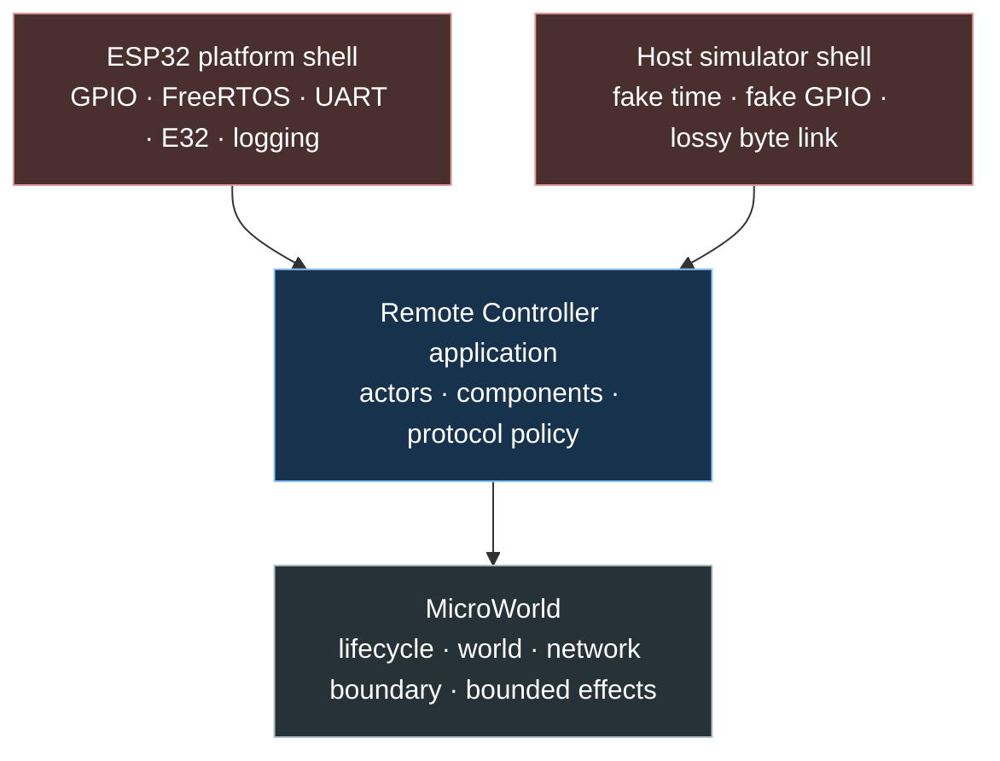

# MicroWorld Remote Controller Hourly Curriculum Plan

> **Superseded on 2026-07-18.** This combined plan mixed framework
> implementation with ESP32 teaching. Use
> [`microworld-framework.md`](microworld-framework.md) for the standalone
> framework session and
> [`esp32-remote-controller-tutorial.md`](esp32-remote-controller-tutorial.md)
> for the curriculum documentation session. This file remains as design history.

## 1. Summary

Replace the rejected roadmap-style learning guide with a cumulative,
code-centered curriculum of 36 focused tutorials. Most tutorials fit one hour.
Hardware evidence gates may require repeated bench sessions; the guide never
turns a safety measurement or soak test into a race against the clock.

The curriculum teaches ESP32 development by building:

1. **MicroWorld** — a small portable C++17 architecture using familiar
   application/world/network/actor/component roles;
2. **Remote Controller** — the portable button-to-valve application built on
   MicroWorld;
3. **ESP32 platform shell** — GPIO, time, FreeRTOS, UART, E32, logging, and
   output-effect execution;
4. **Host simulation** — two unchanged application instances connected through
   a deterministic lossy network.

This change rewrites documentation only. Tutorial code is cumulative and must
be mechanically verified while the curriculum is authored, but the repository's
production source is not advanced through all 36 tutorial checkpoints by this
documentation task.

Approved concept:
`.claude/concepts/portable-remote-controller-hourly-curriculum.md`.

## 2. Problem Analysis

### Requirements

- Split learning into explicit one-hour tutorials.
- Give every tutorial theory, design reasoning, exact file paths, incremental
  C++ code, commands, verification, an intentional failure, reflection
  questions, and objective completion criteria.
- Make every hour move measurably toward the final remote valve controller.
- Separate high-level application behavior from microcontroller details.
- Reuse the high-level application on any sufficiently capable C++17
  microcontroller by replacing platform adapters.
- Use UE5-inspired concepts:
  - application;
  - world;
  - network;
  - actor;
  - actor components;
  - `BeginPlay`, `Tick`, and `EndPlay`.
- Name the portable engine **MicroWorld** and use the `microworld` namespace.
- Keep the engine small and explicit.
- Preserve all previously accepted valve, radio, protocol, and hardware safety
  gates.

### Constraints

- Current source is only the ESP-IDF external-LED exercise.
- Exact carrier board, final GPIOs, E32 model/settings, valve, and driver remain
  unresolved.
- The guide cannot supply guessed hardware values merely to make examples look
  complete.
- The core must not include ESP-IDF, FreeRTOS, Arduino, GPIO, UART, E32, or
  platform logging headers.
- Embedded targets may have no exceptions, RTTI, heap, or complete standard
  library.
- One-hour instructional scope must remain credible. Hardware gates may pause
  and repeat until their evidence is complete.
- Existing user changes and build configuration remain untouched by the
  documentation rewrite.
- Plan structure follows `~/.codex/templates/Plan_Template.md`.
- Tutorial 4 must establish and retain three verified PlatformIO environments:
  `native`, `controller`, and `valve`.
- Tutorials 1–3 must build the repository's starting ESP32 environment.
  Tutorial 4 creates `native`, `controller`, and `valve`; every checkpoint from
  4 onward must run relevant native tests and build both ESP32 roles. A hardware
  placeholder may block a physical observation, but it must not leave the
  documented source snapshot uncompilable.

### Risks

- Building an engine before a concrete need creates ceremonial abstractions.
- Mimicking UE5 literally would introduce reflection/GC/dynamic-object concepts
  inappropriate for this controller.
- A generic component registry or event bus could hide control flow.
- A generic network layer could become more complex than the radio protocol.
- Code fragments across 36 tutorials may drift and stop compiling cumulatively.
- A bounded generic effects list could drop a safety-critical valve-OFF request.
- A platform output failure could be hidden if the portable application never
  receives execution feedback.
- Introducing authentication after framing or first RF transmission would make
  an unsafe wire contract the de facto design.
- "Any microcontroller" may be interpreted as C-only or extremely constrained
  devices.
- A nominal one-hour hardware tutorial may pressure unsafe shortcuts.
- PlatformIO's native and ESP-IDF library-discovery behavior must be proven
  before the guide relies on the source layout.
- Too much theory can crowd out the implementation; too little recreates the
  rejected roadmap.

## 3. Goals and Non-Goals

### Goals

- Teach one coherent codebase rather than isolated snippets.
- Introduce each MicroWorld abstraction only when a controller feature needs it.
- Keep ownership and update order visible in ordinary C++.
- Make portable application ticks deterministic from plain input to explicit
  outputs. Safety-critical output is mandatory and separate from bounded
  best-effort effects.
- Compile and test portable code on the host before binding it to ESP32.
- Use the same controller/valve actors, components, protocol, and reliability
  code in host simulation and ESP32 firmware.
- Explain alternatives and trade-offs without implementing speculative
  infrastructure.
- Make tutorial prerequisites, outputs, commands, and completion criteria
  explicit.
- Prove checkpoints 1–3 with the starting build, and checkpoints 4–36 with
  native tests plus controller and valve builds, not only selected milestones.

### Non-Goals

- Build a general-purpose game engine.
- Implement UObject, reflection, garbage collection, transforms, rendering,
  dynamic spawning, string lookup, tags, a global event bus, a service locator,
  or a heap-based ECS.
- Promise portability to non-C++ or severely resource-constrained MCUs.
- Freeze GPIO, E32, radio, valve, security, or production timing decisions.
- Merge all tutorial code into the repository's production source during this
  documentation turn. Authoring fixtures or temporary workspaces are permitted
  and required for verification.
- Upload firmware, transmit, configure radios, energize a valve, or connect
  water.
- Make soil sensing, MQTT, battery operation, or deep sleep part of the core
  curriculum.

## 4. Options and Decision

### Option A: Design MicroWorld completely before the application | Complexity: High

**Approach:** Define generic application, world, actor, component, event,
network, registry, and scheduler APIs first; build the remote controller on top.

**Pros:**

- Looks engine-like from the beginning.
- Maximum theoretical reuse.

**Cons:**

- Requirements are guessed before use.
- Early tutorials teach abstractions with no observable product behavior.
- Likely to create registries, inheritance, and dispatch machinery that the
  controller never needs.
- Harder for a learner to understand causality.

### Option B: Grow MicroWorld through vertical controller slices | Complexity: Medium

**Approach:** Begin with concrete portable behavior. Extract the smallest
application/world/actor/component abstraction when the next tutorial has two
real consumers or a clear ownership problem.

**Pros:**

- Every abstraction has an immediate reason and test.
- Each hour produces visible behavior.
- KISS/YAGNI remain enforceable.
- The learner sees how architecture is discovered.
- Easier to verify code continuity.

**Cons:**

- Some earlier files are intentionally refactored as concepts emerge.
- The engine API is not all visible in tutorial 1.

**Decision:** Option B. MicroWorld is a name and dependency boundary from the
start, but its APIs grow only through concrete controller/valve requirements.

## 5. Architecture and Curriculum Design

### Dependency direction



Build dependencies point downward. MicroWorld and the remote-controller
application do not include platform headers.

### Runtime tick

```mermaid
sequenceDiagram
    participant Shell as Platform shell
    participant App as Application
    participant Net as Network
    participant World as World
    participant Actor as Actor + components

    Shell->>Shell: Force valve OFF before BeginPlay
    Shell->>App: Tick(input + previous output feedback)
    App->>Net: Consume and authenticate received bytes
    Net-->>World: Valid typed network events
    App->>World: Tick(context + local/network events)
    World->>Actor: Tick in explicit order
    Actor-->>World: Desired state + status
    World-->>App: Domain result
    App->>Net: Encode authenticated outbound data
    App-->>Shell: Required valve output + optional effects
    Shell->>Shell: Apply required valve output first
    Shell->>Shell: Apply bounded transmit/indicator/log effects
    Shell-->>App: Report output execution on next tick
```

No actor or component calls GPIO/UART directly. The shell does not decide valve
safety or protocol eligibility. The shell does own the final electrical
fail-safe: it forces OFF before application startup, executes the required valve
output before best-effort effects, and reports whether the request reached the
output adapter.

The valve tick has a fixed fail-closed phase order:

1. Collect plain observations and the previous valve-output execution result.
2. Decode, authenticate, validate, and classify received bytes.
3. Convert accepted local/network input into domain events.
4. Tick the concrete world, actor, and components in visible call order.
5. Compute the required valve state; every valve tick produces one.
6. Execute that required output first.
7. Execute bounded transmissions, indicators, and diagnostics afterward.
8. Feed execution feedback into the next tick and telemetry.

An ON request rejected by the output adapter immediately enters
`EmergencyForceSafe()` and an observable lockout. An OFF request rejected by the
adapter enters the same platform emergency path, suppresses optional work, and
uses reset/watchdog recovery while the reviewed external safe-state circuitry
remains independent. No full queue can suppress an OFF request.

### Minimal structural contracts

MicroWorld concepts are architectural roles, not a mandatory inheritance tree.
The first implementation uses ordinary concrete classes, explicit members, and
direct calls. `BeginPlay`, `Tick`, and `EndPlay` are a naming convention that
makes lifecycle order familiar; they do not require a virtual base, registry,
reflection, or heap allocation.

MicroWorld initially supplies only reusable value types and transport
infrastructure that have more than one concrete consumer:

```cpp
namespace microworld {

using Milliseconds = std::uint32_t;

struct TickContext {
    Milliseconds now_ms;
};

struct ByteView {
    const std::uint8_t* data;
    std::size_t size;
};

}  // namespace microworld
```

Concrete actors own concrete components explicitly:

```cpp
namespace remote_controller {

class ControllerActor final {
public:
    void BeginPlay();
    ControllerResult Tick(
        const microworld::TickContext& context,
        const ControllerEvents& events);
    void EndPlay();

private:
    ButtonIntentComponent button_intent_;
    LinkHealthComponent link_health_;
};

class ValveActor final {
public:
    void BeginPlay();
    ValveActorResult Tick(
        const microworld::TickContext& context,
        const ValveEvents& events);
    void EndPlay();

private:
    ValveSafetyComponent valve_safety_;
};

}  // namespace remote_controller
```

Role-specific `ControllerWorld` and `ValveWorld` own their fixed actors and route
local/network events to them. They are concrete because no shared world
algorithm has yet justified an interface. Each actor explicitly calls its
component members, so ownership, lifecycle, and update order remain readable.
An interface may be introduced later only when two implementations need runtime
substitution and a test demonstrates the benefit.

### Application boundary

The two application roots use role-specific contracts. Controller output is
bounded because a stale transmit or indicator effect can follow a documented
drop policy. Valve output is a dedicated mandatory field because dropping it
would violate the safety model:

```cpp
namespace remote_controller {

struct ControllerApplicationInput {
    microworld::Milliseconds now_ms;
    bool controller_button_level;
    std::array<std::uint8_t, kMaximumReceivedBytes> received_bytes;
    std::size_t received_size;
};

struct ValveOutputRequest {
    DesiredValveState state;
    std::uint32_t generation;
};

enum class AdapterExecutionStatus : std::uint8_t {
    accepted,
    failed,
    unknown,
};

struct ValveAdapterExecutionFeedback {
    DesiredValveState requested_state;
    std::uint32_t generation;
    AdapterExecutionStatus status;
};

struct ValveApplicationInput {
    microworld::Milliseconds now_ms;
    ValveAdapterExecutionFeedback previous_output;
    std::array<std::uint8_t, kMaximumReceivedBytes> received_bytes;
    std::size_t received_size;
};

struct ValveApplicationEffects {
    ValveOutputRequest required_valve_output;
    BoundedTransmitBatch transmissions;
    BoundedDiagnosticBatch diagnostics;
};

}  // namespace remote_controller
```

The exact fields evolve in tutorials. The stable invariants are:

- input contains plain observations and output execution feedback;
- a valve application tick always returns exactly one required output request;
- the shell applies that request before any best-effort work;
- bounded optional queues have explicit overflow policies and telemetry;
- telemetry reports requested state and adapter-execution status separately;
- adapter success means the GPIO/driver API accepted the request, not that
  voltage/current changed or the physical valve moved;
- physical state is unknown unless reviewed electrical/position feedback exists.

Adapter failure has an explicit shell-level emergency contract:

1. A failed ON request immediately invokes `EmergencyForceSafe()` and latches
   an application output-fault lockout.
2. A failed OFF request skips every optional effect, invokes
   `EmergencyForceSafe()`, records the fault through the smallest available
   channel, and enters reset/watchdog recovery rather than continuing normally.
3. For the initial LED and any de-energize-to-close driver,
   `EmergencyForceSafe()` directly disables the output and then returns the pin
   to high impedance so the reviewed external pull-down owns OFF during reset.
4. A latching valve requires a separately reviewed emergency mechanism and
   feedback strategy in tutorial 35. If safe state cannot be demonstrated, that
   driver cannot pass the production gate.
5. Host tests inject ON/OFF adapter failures and assert call order, lockout,
   suppression of optional work, generation matching, and recovery behavior.

### Planned tutorial-created source tree

```text
lib/
├── microworld/
│   ├── include/microworld/
│   │   ├── byte_view.h
│   │   ├── fixed_queue.h
│   │   ├── network.h
│   │   ├── tick_context.h
│   │   └── time.h
│   └── src/
└── remote_controller/
    ├── include/remote_controller/
    │   ├── applications/
    │   │   ├── controller_application.h
    │   │   └── valve_application.h
    │   ├── worlds/
    │   │   ├── controller_world.h
    │   │   └── valve_world.h
    │   ├── actors/
    │   │   ├── controller_actor.h
    │   │   └── valve_actor.h
    │   ├── components/
    │   ├── protocol/
    │   └── reliability/
    └── src/
src/
├── main.cpp
├── composition/
│   ├── controller_composition.cpp
│   └── valve_composition.cpp
└── platform/esp32/
test/
├── test_microworld/
├── test_controller/
├── test_valve/
├── test_protocol/
└── test_integration/
```

Tutorial 4 must prove the chosen layout in all three PlatformIO environments
before later modules depend on it:

- `native` compiles and runs host tests for both portable roles;
- `controller` compiles the ESP32 shell with controller composition only;
- `valve` compiles the ESP32 shell with valve composition only.

Role selection uses explicit build definitions and explicit source registration,
not a recursive source glob that accidentally links both composition roots. The
guide shows the complete `platformio.ini`, `src/CMakeLists.txt`, minimal
composition files, and test files required by the verified layout.

### Curriculum document structure

```text
docs/learning-guide/
├── README.md
├── architecture.md
├── verification.md
├── module-01-build-and-mental-model.md
├── module-02-microworld-foundation.md
├── module-03-time-and-controller-input.md
├── module-04-valve-safety-policy.md
├── module-05-wire-protocol.md
├── module-06-reliable-application-link.md
├── module-07-esp32-runtime-adapters.md
├── module-08-e32-and-firmware-composition.md
└── module-09-production-gates.md
```

### Mandatory tutorial template

Every tutorial contains these headings in this order:

1. Result
2. Starting point
3. Theory
4. Reasoning and alternatives
5. Plan and prediction
6. Implementation
7. Build and verification
8. Failure exercise
9. Explain and record
10. Done when

Each tutorial names its approximate time budget:

- 10 minutes theory/reasoning;
- 35 minutes implementation;
- 10 minutes verification/failure;
- 5 minutes explanation/logging.

Hardware gates override the time budget.

For tutorials 29, 30, 33, 35, and 36, the one-hour block teaches and prepares
the experiment. The `Done when` gate may take repeated sessions for measurement,
fault injection, range work, soak time, or electrical review. The learner
records evidence instead of rounding incomplete work down to an hour.

### Thirty-six tutorial contracts

| # | Tutorial | Code/result by the end of the hour |
| ---: | --- | --- |
| 1 | Reproduce the build | Record tool versions; build current LED firmware; explain artifacts |
| 2 | From reset to `app_main` | Add bounded boot diagnostics and explain the first application action |
| 3 | Product behavior as failure stories | Add portable domain enums and a behavior table before architecture |
| 4 | Prove the portable library boundary | Add `native`, `controller`, and `valve`; compile one core type and both composition roots |
| 5 | Button and valve components begin safely | Add `TickContext`, a logical button-intent component, and a valve-state component that begins CLOSED |
| 6 | Controller and valve actors own components | Add concrete actors with direct member calls; test press/release intent and closed startup |
| 7 | Worlds route real controller/valve events | Add concrete worlds; route logical input to intent and accepted intent to simulated state |
| 8 | Applications tick through fake shells | Run press-to-simulated-OPEN and release-to-CLOSED through both portable applications; no physical output |
| 9 | Rollover-safe time | Add portable one-shot `Deadline`; boundary and wraparound tests |
| 10 | Observe real button bounce | Add ESP32 digital-input adapter after GPIO gate; record raw transitions |
| 11 | Debounce in a component | Add pure `ButtonIntentComponent`; synthetic/recorded bounce tests |
| 12 | Controller actor intent | Add boot arming, press/release intent, and bounded effects |
| 13 | Valve actor and safety states | Add `ValveSafetyComponent` with closed/open transitions |
| 14 | Hard maximum-open rule | Arm only on closed-to-open; repeated OPEN cannot extend deadline |
| 15 | Link/error lockouts | Add fail-closed trips and CLOSED-then-fresh-OPEN recovery |
| 16 | Execute required valve output with an LED | Add ESP32 output adapter, mandatory-first execution, feedback, and failure tests |
| 17 | Threat model and authenticator contract | Define attackers, assets, replay policy, key boundary, and a deterministic test authenticator |
| 18 | Bounded byte writer and authenticated envelope | Add portable field serialization and freeze lengths/coverage only after the security contract |
| 19 | CRC, authentication coverage, and vectors | Add corruption check, authentication tag, constant-time comparison, and golden vectors |
| 20 | Framing, decoder, validation, and Network | Handle hostile streams; authenticate before emitting typed events |
| 21 | Sessions and sequences | Add duplicate, stale, reordered, reboot-session, and wrap tests |
| 22 | ACK, timeout, retry, backoff | Add bounded sender state machine with injected jitter source |
| 23 | Heartbeat, status, and link health | Add desired-state repair and honest applied-output freshness |
| 24 | Two applications over a hostile lossy link | Run both applications unchanged against corruption, loss, duplication, delay, replay, and forgery |
| 25 | ESP32 imperative shell | Bind time/input/effects in one clear `app_main` loop |
| 26 | FreeRTOS ownership experiment | Measure blocking; use a bounded queue only where UART ownership needs it |
| 27 | UART loopback transport | Add ESP-IDF UART adapter; bounded RX/TX and error counters |
| 28 | Reset/watchdog diagnostics | Add reset reason, application watchdog distinction, and health effects |
| 29 | Production authentication and E32 gate | Implement/vector-test the real authenticator and replay rejection; record module, regional basis, and recoverable key provisioning |
| 30 | First authenticated E32 exchange | Carry authenticated portable Network bytes over E32 with valve disconnected |
| 31 | Controller firmware composition | Compose controller world, actor/components, network, and ESP32 shell |
| 32 | Valve firmware composition | Compose valve world with LED output and all radio failure tests |
| 33 | Radio fault/range evidence gate | Add fault hooks and counters; repeat sessions until range/latency/recovery evidence is recorded |
| 34 | Security hardening and recovery | Test production authenticator, forged/replayed traffic, key loss/replacement, and optional secure-boot policy |
| 35 | Reviewed valve driver evidence gate | Integrate only after schematic review and repeated electrical/failure measurements |
| 36 | End-to-end release evidence gate | Complete safety, soak, range, reset, security, and real-load evidence across the required sessions |

No tutorial may depend on code first introduced in a later tutorial.

## 6. Implementation Steps

### Step 1: Replace the guide entry point and architecture chapter

**Files:**

- Delete `docs/esp32-lora-remote-controller-learning-guide.md`.
- Add `docs/learning-guide/README.md`.
- Add `docs/learning-guide/architecture.md`.

The index explains prerequisites, pacing, tutorial template, module navigation,
current repository state, safety notation, and cumulative-code policy.

The architecture chapter teaches the three layers and minimal contracts:

```cpp
namespace microworld {
struct TickContext;
struct ByteView;
class Network;
}

namespace remote_controller {
class ControllerApplication;
class ValveApplication;
class ControllerWorld;
class ValveWorld;
class ControllerActor;
class ValveActor;
}

namespace platform::esp32 {
class GpioInput;
class GpioOutput;
class UartTransport;
}
```

#### Implementer Context

> Explain MicroWorld as an ownership/lifecycle vocabulary, not an engine feature
> wishlist. Show dependency and runtime diagrams. State the portability contract
> precisely: C++17-capable targets with new platform shells. Explain why domain
> inputs/outputs are preferable to hidden hardware calls. State explicitly that
> the named roles are concrete first; shared base classes require demonstrated
> runtime substitution, not aesthetics.

### Step 2: Write Module 1 — build and mental model

**File:** `docs/learning-guide/module-01-build-and-mental-model.md`

Tutorials 1–4 must lead from the current source to the first core type compiled
under native and both ESP32 roles:

```cpp
namespace remote_controller {
enum class DesiredValveState : std::uint8_t {
    closed,
    open,
};
}
```

Teach PlatformIO/ESP-IDF/CMake artifacts, startup, `app_main`, reset reasons,
safe-first-action reasoning, product failure stories, dependency direction, and
the verified native/controller/valve library layout.

#### Implementer Context

> Use current file contents and exact commands. Tutorial 4 is a build-system
> proof, not architecture ceremony. Provide complete `native`, `controller`, and
> `valve` configurations, explicit source registration, role compile
> definitions, composition stubs, and one native test. Run all three checks. Do
> not introduce Actor/World before the library boundary itself works.

### Step 3: Write Module 2 — MicroWorld foundation

**File:** `docs/learning-guide/module-02-microworld-foundation.md`

Tutorials 5–8 introduce lifecycle types only through executable examples:

```cpp
class ButtonIntentComponent final {
public:
    void BeginPlay();
    void SampleLogicalLevel(bool pressed);
    DesiredValveState DesiredState() const;
    void EndPlay();
};

class ValveStateComponent final {
public:
    void BeginPlay();  // Always establishes CLOSED.
    void HandleIntent(DesiredValveState desired_state);
    DesiredValveState RequiredOutput() const;
    void EndPlay();    // Returns to CLOSED.
};
```

The module ends with controller and valve applications ticking through fake
platform shells: logical press reaches simulated OPEN and release returns
CLOSED. No physical output is permitted yet. It explicitly compares:

- explicit component ownership versus registry lookup;
- direct concrete lifecycle calls versus premature runtime polymorphism;
- role-specific outputs versus callbacks into hardware;
- mandatory safety output versus bounded best-effort effects.

#### Implementer Context

> Each abstraction needs a failing test or duplicate code that motivates it.
> Keep applications, worlds, actors, and components fixed and concrete. Avoid
> lifecycle base classes, component registration APIs, and dynamic allocation.
> Show complete headers/source/tests created this module. Every example must be
> controller or valve behavior that remains in the evolving product; do not use
> counters or throwaway test actors to rehearse architecture.

### Step 4: Write Module 3 — time and controller input

**File:** `docs/learning-guide/module-03-time-and-controller-input.md`

Tutorials 9–12 build portable timing, observe real bounce through an ESP32 input
adapter, then move the recorded behavior into a pure component:

```cpp
class ButtonIntentComponent final {
public:
    void Sample(bool raw_pressed, microworld::Milliseconds now_ms);
    bool HasFreshPress() const;
    DesiredValveState DesiredState() const;
};
```

The controller refuses OPEN until a released input arms it after boot.

#### Implementer Context

> Hardware values remain explicit placeholders until the tutorial's board/GPIO
> gate is completed. Use raw observations to justify the debounce window. Keep
> ESP32 sampling out of the component. Test wraparound and held-at-boot behavior.

### Step 5: Write Module 4 — valve safety policy

**File:** `docs/learning-guide/module-04-valve-safety-policy.md`

Tutorials 13–16 create and test the valve actor/component before executing
effects through an ESP32 LED adapter:

```cpp
enum class ValveSafetyState : std::uint8_t {
    closed,
    open,
    maximum_open_lockout,
    link_loss_lockout,
    protocol_error_lockout,
};

class ValveSafetyComponent final {
public:
    void HandleIntent(const ValveIntent& intent);
    void HandleLinkExpired();
    void Tick(const microworld::TickContext& context);
    DesiredValveState RequiredOutput() const;
};
```

#### Implementer Context

> Preserve all fail-closed invariants. Repeated OPEN must not move the original
> deadline. Lockout recovery is CLOSED then a later fresh OPEN edge. The LED is
> explicitly a simulated electrical output, not a valve. The valve application
> must always return its required output, the fake/ESP32 shell must execute it
> before optional effects, and tests must feed adapter-execution success/failure
> back into the next tick. Test the `EmergencyForceSafe()` call order for failed
> ON and OFF requests; physical driver behavior remains a tutorial 35 gate.

### Step 6: Write Module 5 — authenticated wire protocol and Network

**File:** `docs/learning-guide/module-05-wire-protocol.md`

Tutorial 17 defines the threat model, replay rules, secret boundary, and
authenticator contract before any envelope is frozen. Tutorials 18–20 implement
bounded serialization, the authenticated envelope, CRC, tag coverage, framing,
hostile-stream decoding, validation, and then the smallest Network
infrastructure:

```cpp
class Network {
public:
    void Receive(const std::uint8_t* bytes, std::size_t size);
    void Tick(microworld::Milliseconds now_ms);
    bool TryPopEvent(NetworkEvent& event);
    bool TryPopTransmit(EncodedFrame& frame);
};
```

#### Implementer Context

> Never serialize an ABI-dependent object. Include exact golden vectors and
> validation order. Explain why CRC detects accidental corruption while
> authentication rejects unauthorised modification. Use a deterministic
> non-secret authenticator only in tests/simulation; real RF remains gated on a
> reviewed production algorithm and local key provisioning. Network is reusable
> packet infrastructure, not an ESP UART wrapper and not the owner of
> application-specific heartbeat policy.

### Step 7: Write Module 6 — reliable application link

**File:** `docs/learning-guide/module-06-reliable-application-link.md`

Tutorials 21–24 add sessions, sequences, ACK matching, retry/backoff,
heartbeats/status, and the two-world host simulator:

```cpp
ControllerApplication controller;
ValveApplication valve;
LossyByteLink link(seed);

simulation.Step(controller, valve, link, now_ms);
```

#### Implementer Context

> The simulator must deterministically inject corruption, loss, duplication,
> delay, reorder, replay, forgery, and reboot sessions. Show that desired-state
> heartbeat repairs a lost edge but cannot clear a valve lockout. No ESP32
> includes are permitted.

### Step 8: Write Module 7 — ESP32 runtime adapters

**File:** `docs/learning-guide/module-07-esp32-runtime-adapters.md`

Tutorials 25–28 bind portable applications to ESP-IDF:

```cpp
extern "C" void app_main() {
    Esp32Platform platform;
    remote_controller::ControllerApplication application;

    application.BeginPlay();
    while (true) {
        const ControllerApplicationInput input = platform.CollectInput();
        const ControllerApplicationEffects effects = application.Tick(input);
        platform.ExecuteBestEffort(effects);
    }
}
```

#### Implementer Context

> The illustrative loop must be bounded and yield through the platform runtime.
> Teach FreeRTOS task/queue ownership with measured blocking, not as mandatory
> architecture. Show the separate valve loop forcing OFF before BeginPlay,
> executing the mandatory valve request before optional work, and feeding the
> execution result into the next input. Keep reset reason, task watchdog, and
> application safety timers conceptually separate.

### Step 9: Write Module 8 — E32 and firmware composition

**File:** `docs/learning-guide/module-08-e32-and-firmware-composition.md`

Tutorial 29 resolves hardware/legal configuration, implements the production
authenticator behind the tutorial-17 boundary, verifies official algorithm test
vectors and replay rejection, and completes recoverable local key provisioning.
Tutorials 30–32 carry those already authenticated Network bytes over E32 and
compose controller/valve firmware:

```cpp
struct E32Configuration {
    std::uint32_t uart_baud;
    std::uint32_t frequency_hz;
    std::uint8_t transmit_power;
    std::uint8_t air_data_rate;
};
```

#### Implementer Context

> Do not invent values. The tutorial requires the exact module datasheet and
> regional basis, implemented production authentication, passing algorithm
> vectors, passing forged/replayed-frame tests, and provisioned non-repository
> keys on both roles before transmit code is enabled. If any item is incomplete,
> tutorial 30 remains disabled. Valve composition remains LED only. Make clear
> which files are reused unchanged from host simulation.

### Step 10: Write Module 9 — production gates

**File:** `docs/learning-guide/module-09-production-gates.md`

Tutorials 33–36 complete repeated radio evidence, production security and key
recovery tests, reviewed driver integration, and multi-session release evidence:

```cpp
struct SecurityEvidence {
    bool production_authenticator_verified;
    bool forged_frame_rejected;
    bool replayed_frame_rejected;
    bool key_replacement_rehearsed;
};
```

#### Implementer Context

> Explain why this injected security boundary is justified while GPIO/UART
> interfaces were kept outside the core. The threat model and contract already
> exist from tutorial 17; this module validates the real implementation and
> operational recovery. Do not prescribe irreversible eFuse actions without
> provisioning/recovery. Real valve code follows schematic and measurement
> approval, not precedes it. Tutorial 33/35/36 `Done when` gates may require
> repeated sessions.

### Step 11: Rewrite contributor and navigation documents

**Files:**

- `AGENTS.md`
- `README.md`
- `LEARNING_LOG.md`
- `docs/learning-guide/verification.md`
- `.claude/concepts/portable-remote-controller-hourly-curriculum.md`

Add MicroWorld dependency rules, tutorial authoring requirements, namespace and
layer ownership, portability checks, cumulative-code expectations, and the
approved naming decision.

```cpp
// Forbidden in lib/microworld and lib/remote_controller:
#include "driver/gpio.h"
#include "driver/uart.h"
#include "freertos/FreeRTOS.h"
```

#### Implementer Context

> README remains short. AGENTS is authoritative about architecture and tutorial
> quality. LEARNING_LOG gains tutorial number, prediction, code/test commit,
> failure exercise, and explanation fields. The verification matrix records
> every tutorial's native tests, controller build, valve build, inspection
> status, and hardware evidence. Remove links to the rejected guide.

### Step 12: Validate curriculum continuity and structure

Verify every module against its predecessor, the architecture chapter, current
repository facts, and the reference controller behavior.

```cpp
static_assert(std::is_trivially_copyable_v<microworld::TickContext>);
// Representative compile checks are documentation fixtures, not production
// source changes.
```

#### Implementer Context

> Check links, headings, fences, tables, duplicate tutorial numbers, required
> tutorial sections, code namespace consistency, and forbidden platform includes
> in portable snippets. Apply every tutorial's cumulative files to an isolated
> authoring workspace, run native tests, build both ESP32 roles, and record the
> exact result in `verification.md`. Physical-only observations remain pending
> with their precise evidence gate; normal code checkpoints cannot be
> inspected-only.

## 7. Test Strategy

### Documentation structure

- Exactly 36 tutorials exist, numbered 1–36 with no gaps or duplicates.
- Each tutorial contains all ten mandatory headings in order.
- Every tutorial names its starting files, resulting files, commands, and
  objective `Done when`.
- Index links resolve to all modules and architecture.
- Code fences and tables are structurally valid.

### Curriculum progression

- Tutorial N uses only files/types introduced by tutorials 1..N.
- Every hour adds a buildable/testable behavior or an explicit hardware decision
  artifact needed by the next hour.
- Every hardware tutorial has a stop gate and non-hardware fallback/simulation
  where appropriate.
- No tutorial requires real valve power before tutorial 35.
- No radio transmission occurs before tutorial 29 has recorded the exact module
  and regional basis, implemented/vector-verified production authentication,
  passed forged/replayed-frame tests, and provisioned recoverable local keys.
- Tutorials 29, 30, 33, 35, and 36 distinguish the one-hour instructional block
  from a potentially repeated evidence gate.

### Architecture enforcement

- Portable snippets use only C++17 standard headers supported by the selected
  toolchains.
- `lib/microworld` snippets contain no remote-controller domain or platform
  includes.
- `lib/remote_controller` snippets may include MicroWorld but no ESP-IDF,
  FreeRTOS, GPIO, UART, E32, or Arduino headers.
- ESP32 composition depends inward on both portable libraries.
- Actors own components explicitly; no registry/service-locator/global bus is
  introduced.
- Application/World/Actor/Component are concrete roles first; no lifecycle base
  class exists without a demonstrated substitution need.
- Optional effects are bounded, while required valve output has a dedicated
  non-droppable field and apply feedback.
- No steady-state heap allocation is required.

### Behavioral traceability

- Momentary hold-to-open/release-to-close.
- Boot requires released input before opening is armed.
- Edge plus desired-state heartbeat.
- Requested state, adapter-execution status, electrical behavior, and physical
  valve position are distinguished; the guide claims only what is measured.
- The platform forces OFF before `BeginPlay`, executes the required valve output
  first, and reports adapter call success/failure back to the application.
- Optional queue overflow cannot suppress valve OFF.
- Failed ON/OFF adapter calls follow the tested `EmergencyForceSafe()` order;
  latching-valve safety remains blocked until tutorial 35 proves its mechanism.
- Maximum-open deadline cannot be refreshed by repeated OPEN.
- Link/error/max lockouts fail closed.
- Recovery requires CLOSED then a later fresh OPEN edge.
- CRC, validation, session, sequence, ACK, retry, duplication, stale input,
  replay, authentication, and radio recovery are each taught and tested.

### Code verification

- Validate shell commands against current PlatformIO behavior and official
  documentation.
- Materialize every tutorial checkpoint in an isolated authoring workspace.
- At checkpoints 1–3 run the documented starting ESP32 build.
- At checkpoints 4–36 run relevant native tests, `pio run -e controller`, and
  `pio run -e valve`.
- Record exact commands/results in `docs/learning-guide/verification.md`; keep
  authoring fixtures outside the delivered production source.
- Do not claim ESP32/E32/valve code compiled or ran if only inspected.
- Keep unresolved hardware values behind disabled, buildable gates. Record
  physical observations separately as pending/passed evidence.

### Mechanical checks

- `git diff --check`.
- Relative-link check.
- Heading hierarchy, code-fence balance, and table-column consistency.
- Search for rejected guide links and old field-node/base-station core scope.
- Search portable code blocks for forbidden includes and platform types.

## 8. Pitfalls and Mitigations

| Pitfall | Consequence | Mitigation |
| --- | --- | --- |
| MicroWorld becomes a miniature UE | Learner writes infrastructure instead of controller behavior | Add an engine type only when the current vertical slice needs it |
| Actor/component registry hides ownership | Debugging requires runtime lookup | Concrete actors own concrete members and call them explicitly |
| Network is confused with UART | Portable protocol becomes ESP-specific | Network consumes/produces bytes; shell owns UART/E32 |
| Generic effects drop a valve-OFF request | A full queue can violate fail-closed behavior | Give required valve output a dedicated field; execute it first and return feedback |
| Virtual interfaces spread everywhere | Boilerplate and indirect control flow | Start with concrete roles and direct calls; add an interface only for proven runtime substitution |
| Static polymorphism becomes template-heavy | Poor learning clarity and error messages | Prefer ordinary concrete classes |
| "Any MCU" overpromises | Guide cannot work on C-only/tiny devices | State C++17/resource portability contract |
| Tutorial code drifts | Later lessons cannot be followed | Build checkpoints 1–3 with the starting environment and 4–36 with native/controller/valve; maintain a verification matrix |
| One-hour label rushes hardware | Unsafe wiring/transmission | Separate the one-hour lesson from repeatable evidence gates |
| Native layout fails under an ESP32 role | Portable library works only in one target | Tutorial 4 proves native, controller, and valve environments before architecture grows |
| Full code repeated in every tutorial | Guide becomes inconsistent and enormous | Show complete new files and precise edits to existing files; link back to canonical contracts |
| Code snippets are too fragmentary | Learner cannot reproduce results | Every implementation identifies all required includes, files, and commands |
| Security arrives after framing or RF | An unauthenticated contract becomes deployed behavior | Define auth/replay before framing; require real keys and authenticator before first transmit |

## 9. Compatibility and Rollout

- The existing monolithic guide is deleted and replaced by modular curriculum
  files.
- README, AGENTS, and LEARNING_LOG links change in the same documentation
  change.
- Existing firmware/build configuration remains unchanged.
- The existing external LED source remains the starting point for tutorials
  1–2.
- The prior concept/plan files remain as design history; the new approved
  concept/plan supersede their curriculum structure.
- MicroWorld is initially internal. If published independently later, naming,
  packaging, semantic versioning, and collision/trademark review are separate
  decisions.

## 10. Acceptance Criteria

- A learner can open the index and follow tutorials 1–36 in order.
- Each tutorial is designed for one focused hour and contains theory, reasoning,
  code, commands, verification, failure exercise, reflection, and `Done when`.
- Tutorial code is cumulative and names exact files.
- MicroWorld, remote-controller application, and ESP32 platform shell are
  visibly separate in diagrams, namespaces, folders, includes, and examples.
- Application, World, Network, Actor, Actor Component, `BeginPlay`, `Tick`, and
  `EndPlay` are taught as concrete ownership/lifecycle concepts.
- MicroWorld does not require virtual Actor/Component base classes or a registry.
- MicroWorld has no ESP32 or remote-controller dependency.
- Remote-controller application has no ESP-IDF/FreeRTOS/GPIO/UART/E32 dependency.
- A host simulator runs two application/world instances through a lossy link.
- ESP32 composition uses the same portable code rather than reimplementing
  behavior.
- No generic engine machinery outside current product needs is introduced.
- Valve OFF cannot be lost to an optional-effect queue; execution feedback and
  platform failure handling are explicit.
- Authentication/replay design precedes the wire envelope and real production
  authentication/key provisioning precede first RF transmission.
- Hardware and production safety gates remain explicit.
- Documentation structural and semantic checks pass.
- Checkpoints 1–3 have the starting build recorded; checkpoints 4–36 have
  native/controller/valve verification recorded.
- Verification separately distinguishes compiled, simulated, inspected, and
  hardware-measured evidence.

## 11. Task Breakdown

1. **Record MicroWorld approval**
   - File:
     `.claude/concepts/portable-remote-controller-hourly-curriculum.md`.
   - Done when: name, namespace, lifecycle, 36 tutorials, and minimal-engine
     constraints are recorded as approved.
2. **Write curriculum index**
   - File: `docs/learning-guide/README.md`.
   - Done when: prerequisites, pacing, tutorial template, module table, safety
     notation, and all links are present.
3. **Write architecture chapter**
   - File: `docs/learning-guide/architecture.md`.
   - Done when: dependency/runtime diagrams, contracts, folder layout,
     portability rules, and anti-goals are explained with code.
4. **Write Module 1**
   - File: `docs/learning-guide/module-01-build-and-mental-model.md`.
   - Done when: tutorials 1–4 meet the mandatory template and prove native,
     controller, and valve builds.
5. **Write Module 2**
   - File: `docs/learning-guide/module-02-microworld-foundation.md`.
   - Done when: tutorials 5–8 grow lifecycle/actor/world/application through
     tested examples.
6. **Write Module 3**
   - File: `docs/learning-guide/module-03-time-and-controller-input.md`.
   - Done when: tutorials 9–12 cover time, real bounce, debounce, and intent.
7. **Write Module 4**
   - File: `docs/learning-guide/module-04-valve-safety-policy.md`.
   - Done when: tutorials 13–16 prove safety policy, mandatory-first LED output,
     apply feedback, and fail-closed output-error behavior.
8. **Write Module 5**
   - File: `docs/learning-guide/module-05-wire-protocol.md`.
   - Done when: tutorials 17–20 define security first, then implement the
     authenticated envelope through Network.
9. **Write Module 6**
   - File: `docs/learning-guide/module-06-reliable-application-link.md`.
   - Done when: tutorials 21–24 culminate in two-app hostile/lossy simulation.
10. **Write Module 7**
    - File: `docs/learning-guide/module-07-esp32-runtime-adapters.md`.
    - Done when: tutorials 25–28 bind shell, FreeRTOS, UART, and diagnostics.
11. **Write Module 8**
    - File: `docs/learning-guide/module-08-e32-and-firmware-composition.md`.
    - Done when: tutorials 29–32 pass hardware/legal/auth/key gates, perform the
      first authenticated RF exchange, and compose both LED-safe roles.
12. **Write Module 9**
    - File: `docs/learning-guide/module-09-production-gates.md`.
    - Done when: tutorials 33–36 define repeatable RF, security/recovery,
      electrical, and release evidence gates.
13. **Rewrite contributor contract**
    - File: `AGENTS.md`.
    - Done when: MicroWorld layers, tutorial template, dependency prohibitions,
      cumulative code, testing, and existing safety rules are authoritative.
14. **Update orientation and log**
    - Files: `README.md`, `LEARNING_LOG.md`,
      `docs/learning-guide/verification.md`.
    - Done when: modular guide links and per-tutorial evidence fields are
      correct.
15. **Delete rejected guide**
    - File: `docs/esp32-lora-remote-controller-learning-guide.md`.
    - Done when: no non-history links reference it.
16. **Run structure and semantic checks**
    - Files: all rewritten Markdown.
    - Done when: tutorial count/template, links, headings, fences, tables,
      dependency boundaries, safety traceability, and stale-scope checks pass.
17. **Validate all cumulative code checkpoints**
    - Inputs: tutorial code at checkpoints 1–36.
    - Done when: checkpoints 1–3 have a passing starting ESP32 build and
      checkpoints 4–36 have relevant passing native tests plus passing
      controller and valve builds recorded in `verification.md`; physical
      evidence is separately marked pending/passed with its exact gate.
