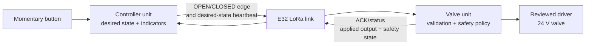

# ESP32-S3 + E32 LoRa Remote Valve Controller — Learning Guide

This guide uses one real product as the thread through a comprehensive study of
ESP32 programming: two ESP32-S3 devices that remotely control a water-pipe
solenoid valve over an E32 LoRa link.

The finished system is inspired by
`C:\Users\Public\Arduino\RadioRemoteController`, but it is not a line-by-line
port. The reference uses Arduino Uno/Nano boards and nRF24L01 radios. This
project uses ESP32-S3, native ESP-IDF, C++, PlatformIO, and E32 LoRa. It also
adds explicit protocol, security, and verification work needed before calling a
radio-controlled water valve production-ready.

> **Current status:** the controller and valve firmwares do not exist yet.
> `src/main.cpp` is the first learning experiment: an external LED blink using
> ESP-IDF. No radio link, button, driver circuit, or valve has been validated by
> this repository.

## How to use this guide

The stages are milestones, not calendar days. A stage is complete only when you
can explain the result and have recorded evidence. Taking longer is normal.

For every experiment:

1. **Predict** what will happen before building, flashing, or connecting power.
2. **Change one thing** so the cause of any difference stays visible.
3. **Observe** logs, timing, voltage, current, or test results.
4. **Explain** why the result matched or differed from the prediction.
5. **Record** the evidence in [`LEARNING_LOG.md`](../LEARNING_LOG.md).

Do not copy a result from this guide into the log as if you measured it.
Assumptions, calculations, and observations must remain distinguishable.

### Stop conditions

Stop and resolve the uncertainty before continuing if:

- the exact board or module cannot be identified;
- a proposed pin is not verified against the board schematic and module
  datasheet;
- a voltage, current, polarity, antenna, or ground connection is uncertain;
- an E32 transmit setting has not been checked against the exact module and
  local radio rules;
- a test could energize the real valve before the driver review and bench gate;
- a result is surprising and you cannot yet explain it.

The pause is part of the engineering work, not a failure to progress.

## 1. Product contract

### The two units

- The **controller unit** sits near a momentary wall button. Holding the button
  expresses OPEN intent. Releasing it expresses CLOSED intent. It shows whether
  the radio link is healthy and what electrical output state the valve unit
  last reported.
- The **valve unit** sits near the 24 V valve. It validates radio messages,
  applies the safety policy, drives a reviewed external switching circuit, and
  reports its applied output and safety state.

Both units are continuously available in the core design. Battery operation and
deep sleep are optional later projects, not assumptions baked into this
protocol.

### Required behavior

1. Both units start with CLOSED intent.
2. The valve output is forced OFF as the valve firmware's first hardware action.
   An external pull-down keeps it OFF before firmware can run.
3. A fresh, debounced button press requests OPEN.
4. Releasing the button requests CLOSED.
5. There is no remote `toggle` command. OPEN and CLOSED are explicit,
   idempotent states.
6. The controller sends an immediate edge message and periodically repeats its
   desired state. Repetition repairs a lost press or release without turning the
   command into a toggle.
7. The valve unit reports the state it applied to its driver plus any safety
   lockout. The controller never substitutes its own desired state for this
   report.
8. Sustained link loss while open forces the electrical output OFF.
9. A hard continuous-open limit cannot be extended by repeated OPEN messages.
10. Invalid, malformed, stale, duplicated, or unauthenticated messages cannot
    open the valve.
11. Reset, watchdog recovery, radio reinitialization, and error paths converge
    to output OFF.
12. After a fail-closed trip, an old OPEN heartbeat cannot reopen the output.
    Recovery requires a valid CLOSED intent followed by a later fresh OPEN
    edge.

The exact heartbeat cadence, link-loss timeout, continuous-open limit, retry
count, and backoff are not decided by this guide. They must be calculated and
approved from the chosen radio settings, installation, valve, and risk.

### Feedback means applied output, not physical position

The reference controller returns one byte saying whether its firmware energizes
the solenoid output. That is useful, but it does not prove that:

- the transistor actually switched;
- the coil has current;
- the valve moved;
- water is flowing.

This project calls that value **applied output state**. Claiming actual valve
position or flow requires an appropriate sensor and a separate validation path.

### Reference behavior and deliberate hardening

| Concern | Reference controller | This project |
| --- | --- | --- |
| Button behavior | Hold = OPEN, release = CLOSED | Preserved |
| Lost edge repair | A 1 Hz ping repeats desired state | Preserved as a concept; cadence must be measured |
| Feedback | nRF24 ACK payload reports energized output | Explicit status reports applied output and safety state |
| Maximum-open rule | Five-minute timer starts only on a real open transition | Preserve non-extension; choose the final limit later |
| Link loss while open | Closes after five seconds, then may reopen from an OPEN ping when the link returns | Hardened: stay locked OFF until CLOSED intent and a later fresh OPEN edge |
| Malformed message | Enters a fail-closed error lockout | Preserved and extended to full envelope validation |
| Radio recovery | Reinitializes the nRF24 after sustained silence | E32 recovery remains transport-only and can never open the output |
| Corruption, loss, duplication | Largely handled by nRF24 hardware | Explicit framing, CRC, ACK, retry, sequence, and stale-message policy |
| Authentication | Channel and pipe address only | Threat model and authenticated commands required before deployment |

### Safety states

The future pure valve policy should make safety states visible instead of
representing them as unrelated booleans:

| State | Electrical output | OPEN heartbeat | Recovery |
| --- | --- | --- | --- |
| `closed` | OFF | May open only if the policy is armed and the message is current | Fresh OPEN edge |
| `open` | ON | Keeps intent synchronized but does not reset the max-open deadline | CLOSED intent or a safety trip |
| `maximum_open_lockout` | OFF | Ignored | Valid CLOSED intent, then a later fresh OPEN edge |
| `link_loss_lockout` | OFF | Ignored | Valid CLOSED intent, then a later fresh OPEN edge |
| `protocol_error_lockout` | OFF | Ignored | Valid recovery sequence defined by the final protocol |

At boot, the policy is not armed for opening until it has observed a safe
released/CLOSED condition. A button held during controller startup or an OPEN
heartbeat received after valve-unit reset must not act like a fresh press.

## 2. Accepted platform and unresolved hardware

### Accepted platform

The checked-in project establishes:

- ESP32-S3-WROOM-1-N16R8;
- 16 MiB Quad-SPI flash;
- 8 MiB Octal-SPI PSRAM;
- native ESP-IDF, not Arduino compatibility;
- PlatformIO build orchestration;
- `esp32-s3-devkitc-1` as the current PlatformIO board definition with explicit
  N16R8 overrides;
- QIO flash at 80 MHz and Octal PSRAM at 80 MHz;
- 115200 baud serial monitor;
- E32 LoRa as the radio family;
- MIT license.

The 16 MiB partition table is already configured:

| Partition | Size | Current meaning |
| --- | ---: | --- |
| `nvs` | 64 KiB | Reserved for small persistent settings |
| `otadata` | 8 KiB | OTA slot-selection metadata |
| `ota_0` | 4 MiB | First application slot |
| `ota_1` | 4 MiB | Second application slot |
| `storage` | 7.625 MiB | Reserved FATFS storage |
| `coredump` | 256 KiB | Crash diagnostics retained in flash |

Reserved does not mean implemented. The application does not yet initialize NVS,
FATFS, OTA, or a core-dump reporting workflow.

### Unresolved decisions

Do not silently fill in any of these:

- exact ESP32 development or carrier board and its schematic;
- final pins for button, LEDs, E32 UART, E32 mode/AUX signals, and valve driver;
- exact E32 model, frequency band, transmit power, UART mode, air data rate,
  addressing mode, supply, and antenna;
- regional radio rules at the installation;
- conventional or latching valve and its real voltage/current/thermal behavior;
- driver transistor, gate/base network, flyback device, fuse, supply, grounding,
  and isolation topology;
- production heartbeat, timeout, retry, and maximum-open values;
- final wire format, framing, authentication, pairing, and key provisioning;
- final source layout and method for building the two firmware roles;
- enclosure, environmental rating, cable entry, and condensation protection.

### Why the reference wiring cannot be copied

The reference project's own artifacts disagree:

- its sketch and Markdown use nRF24 CE/CSN on D9/D8 and the valve drive on D3;
- its schematic shows CE/CSN on D7/D8 and the valve drive on D2;
- its wiring guide specifies a TIP142 Darlington transistor;
- its schematic shows an IRLZ44N MOSFET;
- its README says the system has not been validated on real hardware.

Those files explain intent, not trustworthy ESP32 wiring.

## 3. Electrical and radio rules that apply to every stage

- ESP32 GPIO is logic, not a valve power source. Never connect the 24 V supply
  or the solenoid directly to a GPIO.
- A valve driver needs a hardware-defined OFF state during reset and boot. For a
  MOSFET this usually includes a gate pull-down; other topologies need their own
  reviewed equivalent.
- A flyback path is mandatory for an inductive coil. Its part, voltage/current
  rating, polarity, and effect on release time must come from the chosen valve
  and driver design.
- "Gate threshold" does not prove a MOSFET is fully on. Use a device whose
  conduction is specified at the actual ESP32 drive voltage, then measure
  voltage drop and temperature under the real load.
- Decide common-ground versus isolation from a complete schematic. Do not join
  power systems by habit.
- Use current limiting and a fuse appropriate to the bench circuit.
- Never transmit from the E32 without the correct antenna attached.
- Verify E32 supply voltage, logic levels, peak current, and local decoupling
  from the exact module datasheet.
- Check current regional rules before selecting frequency, power, bandwidth,
  air data rate, and duty cycle.
- Treat the first real-valve test as an electrical experiment. Water connection
  and unattended operation are later gates.

## 4. Learning roadmap

### Stage 0 — Understand the product before writing it

#### Outcome

You can describe the controller, valve unit, message flow, and every way the
output must become OFF.

#### Learn

- Desired state versus applied output.
- Edge event versus persistent intent.
- Why an explicit OPEN command is idempotent and a toggle is not.
- Why hardware safety and firmware safety are separate layers.
- Why a reference project can define behavior without being a trustworthy
  schematic.

#### Experiments

1. Read the product contract above and the reference README.
2. Draw the message sequence for press, held button, release, and status reply.
3. Draw failure sequences for:
   - press edge lost;
   - release edge lost;
   - controller power loss while open;
   - valve-unit reset while open;
   - malformed packet;
   - max-open deadline;
   - radio recovery while the last desired state was OPEN.
4. For each sequence, write the safe output and the user action required next.
5. List every unresolved hardware fact from the label, schematic, or datasheet
   you still need.

#### Gate

Do not continue until you can explain why heartbeats repair loss without
extending the maximum-open timer, and why an OPEN heartbeat after a safety trip
is not a fresh user action.

### Stage 1 — Make the toolchain reproducible

#### Outcome

You can build the current project and explain which tools and configuration
produced the firmware.

#### Learn

- PlatformIO environment, platform package, board definition, and framework.
- CMake component registration under ESP-IDF.
- Compiler, linker, ELF file, binary images, and partition table.
- Build versus flash versus monitor.
- Generated `sdkconfig` versus durable `sdkconfig.defaults`.
- Why an unpinned platform version is a reproducibility decision to revisit.

#### Experiments

1. Run `pio --version` and record it.
2. Run `pio project config --lint` and inspect the computed configuration.
3. Run `pio pkg list` and record the installed Espressif platform, ESP-IDF, and
   toolchain versions. Use documentation matching those versions.
4. Run `pio run`.
5. Run `pio run -v` and find one compiler command, the linker command, the
   partition-table generation step, and the final image-size report.
6. Locate the ELF, map, bootloader, partition, and application binaries under
   `.pio/build/` without editing generated files.
7. Explain every non-comment line of `platformio.ini`,
   `sdkconfig.defaults`, and `partitions.csv`.
8. Use `git status` and `git diff` before and after an intentional documentation
   edit so generated build files never enter source control.

#### Evidence

Record tool versions, build result, image sizes, and one sentence explaining
each output artifact. Building does not authorize flashing.

#### Gate

You can point to the exact installed framework version and explain why "latest
ESP-IDF documentation" may not match the project you just built.

### Stage 2 — Replace the Arduino mental model with the ESP32-S3 model

#### Outcome

You understand what happens before `app_main()`, what runs it, and which
hardware facts affect safe startup.

#### Learn

- ROM bootloader, second-stage bootloader, partition selection, application
  loading, FreeRTOS startup, and the main task that calls `app_main()`.
- C++ global construction before `app_main()`.
- Reset reason, brownout, watchdog reset, and panic/core-dump concepts.
- Internal RAM, flash-mapped code/data, and PSRAM.
- ESP32-S3 GPIO matrix, strapping pins, USB/Serial-JTAG, UART, and board-level
  routing.
- `esp_err_t`, expected failure handling, and when a fatal
  `ESP_ERROR_CHECK()` is appropriate.

#### Experiments

1. Draw boot flow from reset to `app_main()` and annotate the earliest point
   application firmware can force the valve output OFF.
2. Explain why the external pull-down protects the earlier interval.
3. Compare module pins with the carrier-board headers. A module pad being
   capable does not guarantee the board exposes it safely.
4. Identify pins used by flash, PSRAM, USB, boot straps, and serial console from
   the exact module and board documents.
5. Read `src/main.cpp` and identify every ESP-IDF boundary call and return-code
   check.
6. Plan a boot diagnostic containing firmware version, reset reason, free
   internal memory, PSRAM availability, and last safety trip. Do not implement
   persistence yet.

#### Evidence

Record the exact module marking and carrier-board identity. Attach or link the
documents used for the future pin decision.

#### Gate

No final GPIO may be chosen until the carrier-board schematic is known. You can
explain why copying an ESP32-WROOM-32 or Arduino Uno pin table is invalid.

### Stage 3 — Learn the C++ used by the safety policy

#### Outcome

You can express domain rules as small, deterministic types that run on a PC
without ESP-IDF.

#### Learn

- Fixed-width integers and explicit ranges.
- `enum class` for mutually exclusive states.
- Value types, `const`, references, and bounded containers.
- Separation between a state-changing command and a side-effect-free query.
- Pure logic versus hardware adapters.
- Dependency injection through small interfaces or function parameters.
- Native tests, arrange/act/assert, positive/negative pairs, and boundary tests.
- RAII only when a real resource lifetime needs an owner.

#### Experiments

1. Design a rollover-safe `Deadline` or `OneShotTimer` that accepts a supplied
   clock value.
2. Test disarmed, just-before, exact-deadline, just-after, and 32-bit wraparound
   cases.
3. Model `DesiredValveState` and `ValveSafetyState` as enums, not boolean soup.
4. Define a pure transition result containing next state and requested output;
   do not call GPIO from the policy.
5. Add a native test environment only as an agreed implementation step, then
   measure its execution time.

#### Evidence

Tests must show behavior, not private implementation details. Record why each
boundary case exists.

#### Gate

The pure types compile and test without ESP-IDF headers. No dynamic allocation,
global mutable hardware state, or sleep/delay call is needed.

### Stage 4 — Master one GPIO output

#### Outcome

You understand the current external-LED program line by line and can safely use
it as an observable output.

#### Hardware gate

`src/main.cpp` currently names GPIO10. Before flashing, confirm that GPIO10 is
appropriate on the exact carrier board and that the external resistor/LED
wiring is correct. A successful compile proves neither.

#### Learn

- GPIO reset, direction, level, and return values.
- Active-high versus active-low loads.
- FreeRTOS ticks and `vTaskDelay()`.
- Blocking one task versus wasting CPU in a busy loop.
- Why a learning exercise stores each return value before checking it.

#### Experiments

1. Predict the first visible LED state and one full ON/OFF period.
2. Build before flashing.
3. With wiring reviewed, flash and measure ten transitions with a stopwatch,
   logic analyzer, or timestamped log.
4. Change one delay, predict the new period, and measure again.
5. Press reset at different points and observe the pin/LED behavior.
6. Temporarily introduce a safe invalid configuration, predict the error path,
   and restore it.

#### Evidence

Record board, GPIO, resistor, LED polarity, measured period, reset observation,
and any difference from prediction.

#### Gate

You can distinguish the software's requested level from the voltage and light
actually observed.

### Stage 5 — Turn a noisy button into one user event

#### Outcome

A press produces one `pressed` event and a release produces one `released`
event, including defined startup behavior.

#### Hardware gate

Select the input pin only after the board review. Confirm whether an internal
pull-up is supported and whether the final installation needs an external
resistor, ESD protection, filtering, or different wiring for a long cable.

#### Learn

- Digital input thresholds, floating inputs, active-low wiring, and pull-ups.
- Mechanical bounce.
- Sampling cadence and debounce window.
- Level, edge, and debounced event.
- Why an interrupt does not remove bounce.
- Startup arming: a button already held at boot must not become an accidental
  fresh OPEN.

#### Experiments

1. Log raw samples around ten presses and releases. Measure, do not assume, the
   bounce duration.
2. Implement a pure debouncer using recorded samples or synthetic sequences.
3. Test clean, bouncing, too-short, held-at-boot, and release-then-press cases.
4. Compare polling with an interrupt-assisted design. Use polling first unless
   measured requirements justify the extra concurrency.
5. Drive only an LED from debounced intent.

#### Evidence

Keep at least one raw bounce trace and the chosen sampling/window calculation.

#### Gate

Ten deliberate presses and releases produce exactly ten events each. A held
button at reset cannot open the simulated valve until released and pressed
again.

### Stage 6 — Time, event loops, FreeRTOS, and watchdogs

#### Outcome

Independent deadlines remain responsive without turning the application into a
maze of tasks and locks.

#### Learn

- Monotonic time and unsigned wraparound arithmetic.
- Periodic schedule versus one-shot safety deadline.
- Non-blocking state machines.
- Execution-time budget and jitter.
- ESP-IDF task watchdog versus an application max-open timer.
- Single ownership of a peripheral.
- FreeRTOS tasks, queues, notifications, and mutexes as tools—not goals.

#### Experiments

1. Run button sampling, status logging, a heartbeat timer, and a simulated
   max-open timer in one cooperative event loop.
2. Add a deliberately blocking operation and measure which deadlines slip.
3. Replace it with bounded work and remeasure.
4. Inject clock values around wraparound into pure timing tests.
5. Optional isolated lab: send typed events between two tasks through a queue,
   fill the queue, and document the chosen full-queue policy.

#### Architecture rule

Start with the simplest event loop that satisfies measured timing. Add a task
when independent blocking work or peripheral ownership makes the benefit
concrete. If tasks are added, one task owns each physical peripheral.

#### Gate

You can state the maximum observed loop latency and why every safety deadline
still works. "The ESP32 has two cores" is not a reason to create two tasks.

### Stage 7 — Prove valve safety with an LED

#### Outcome

A host-tested valve policy controls a harmless LED through every normal and
failure transition.

#### Learn

- State machines, invariants, commands, events, and transition results.
- Desired state versus applied output versus safety state.
- Fail-closed lockout and deliberate recovery.
- Why repeated OPEN must not refresh the hard maximum.
- Why a stale heartbeat cannot be treated as a fresh edge.

#### Required policy tests

| Scenario | Expected result |
| --- | --- |
| Boot/reset | OFF and not armed for OPEN |
| CLOSED observed, then fresh OPEN edge | ON and max-open deadline armed once |
| Repeated OPEN edge or heartbeat | Remains ON; original deadline unchanged |
| Fresh CLOSED | OFF and timers disarmed |
| Link expires while ON | OFF in link-loss lockout |
| Max-open expires | OFF in maximum-open lockout |
| Malformed/stale OPEN | OFF or fail-closed lockout; never opens |
| OPEN heartbeat during lockout | Ignored |
| Valid CLOSED, then later fresh OPEN edge | Lockout clears and opens as defined |
| Timer wraparound | Same behavior as ordinary time |

#### Experiments

1. Implement the policy with no GPIO or radio includes.
2. Run every row above as a native test.
3. Connect the policy to the existing LED through a tiny output adapter.
4. Force every trip with short laboratory timeouts.
5. Reset the ESP32 during simulated OPEN and observe the safe LED state.

#### Gate

The policy passes host tests and hardware simulation. A heartbeat stream cannot
defeat a lockout or extend the original open deadline.

### Stage 8 — Resolve the E32 hardware gate

#### Outcome

The exact E32 module and legal operating configuration are documented before
any transmission.

#### Learn

- Product suffix, band, nominal supply, peak current, logic voltage, antenna,
  UART pins, AUX, and mode pins from the manufacturer datasheet.
- Transparent versus addressed/fixed transmission modes.
- UART data rate versus LoRa air data rate.
- Frequency, spreading/air-rate settings, power, channel, airtime, and duty
  cycle.
- Link budget, antenna placement, and supply decoupling.

#### Experiments

1. Photograph and transcribe the full label on both modules.
2. Obtain the matching manufacturer datasheet and configuration manual.
3. Create a pin/electrical table with a citation for every value.
4. Identify the applicable regional rules for the installation.
5. Choose a conservative bench configuration and calculate packet airtime and
   worst-case allowed transmit frequency.
6. Review the complete wiring, including the antenna, before power.
7. Power the radio without transmitting and measure its supply voltage and idle
   current.

#### Evidence

Record module identity, document revision, band, legal basis, antenna, supply
measurements, proposed UART/air parameters, and reviewer approval.

#### Gate

No `radio.write`, transmit command, range test, or radio-configuration change
occurs before this record is complete.

### Stage 9 — Own the UART and the radio transport

#### Outcome

One ESP32 component exchanges bounded byte sequences through the E32 and
recovers from transport errors without controlling a valve.

#### Learn

- ESP-IDF UART configuration, pin routing, driver installation, RX buffers,
  events, bounded reads/writes, and error reporting.
- TX/RX crossing and shared reference ground when the reviewed topology
  requires it.
- E32 AUX/mode timing from the exact datasheet.
- Radio transport versus message protocol.
- Exclusive peripheral ownership.

#### Experiments

1. Use a local UART loopback before involving the E32.
2. Send numbered text or binary probes between two radios with antennas
   attached and valve hardware disconnected.
3. Count sent, received, truncated, timeout, UART error, and radio-busy events.
4. Disconnect one radio, mismatch one non-regulatory setting, and restore it.
5. Reinitialize the transport after sustained silence while proving the
   simulated output remains OFF.
6. Measure end-to-end latency and variation for the chosen settings.

#### Gate

Transport errors are bounded and observable. No transport callback can call a
valve GPIO directly.

### Stage 10 — Define and test the wire protocol

#### Outcome

Every byte on the air has a documented meaning and is validated before it can
reach the safety policy.

#### Learn

- Packet envelope, byte order, fixed-width fields, length, and payload bounds.
- Stream framing and resynchronization.
- Protocol version and compatibility.
- CRC for accidental corruption.
- Sequence number, sender/receiver identity, session or boot epoch, and
  acknowledged sequence.
- Golden vectors: known messages with exact expected bytes.
- CRC is not authentication.

#### Minimum message concepts

- `intent_edge`: fresh OPEN or CLOSED user edge.
- `intent_heartbeat`: controller's current desired state for reconciliation.
- `status_ack`: acknowledged sequence, applied output, safety state, and link
  counters.
- `hello` or session establishment if the final stale-message strategy needs it.

Names and fields remain provisional until this stage is explicitly designed.

#### Validation order

Before acting, validate enough framing to bound the read, then:

1. frame length;
2. magic and protocol version;
3. destination/source identity;
4. message type;
5. payload length;
6. CRC;
7. authentication tag when introduced;
8. field ranges;
9. session, sequence, duplication, and staleness;
10. whether the message is eligible in the current safety state.

Invalid input is logged with a bounded counter and cannot express OPEN.

#### Experiments

1. Compare a raw packed-struct format with explicit field serialization.
2. Select framing only after testing noise, partial reads, concatenated frames,
   and recovery after an invalid length.
3. Create golden vectors for every message type.
4. Flip every bit of representative frames and check CRC rejection.
5. Test truncated, oversized, unknown-version, unknown-type, out-of-range,
   duplicate, old-session, and near-wrap sequence cases.
6. Fuzz the decoder with bounded random byte arrays on the host.

#### Gate

The decoder never reads out of bounds and never partially applies a message.
Changing encoded bytes requires an explicit compatibility/version decision.

### Stage 11 — Make the unreliable link predictable

#### Outcome

Corruption, loss, duplication, delay, and sustained silence all produce defined
and measured behavior.

#### Learn

| Failure | Detection | Response |
| --- | --- | --- |
| Corruption | Framing/range checks and CRC | Reject |
| Loss | ACK deadline | Bounded retry with backoff/jitter |
| Duplication | Session and sequence | ACK if appropriate; do not re-execute |
| Delay/reordering | Freshness and sequence window | Reject stale command |
| Sustained silence | Link freshness deadline | Fail closed if open; bounded transport recovery |

ACKs match peer, session, and sequence. Any valid packet is not automatically an
ACK for the command currently in flight.

#### Experiments

1. Build a host simulation that deliberately drops, duplicates, corrupts,
   delays, and reorders frames.
2. Calculate ACK timeout from UART serialization, measured radio latency,
   processing time, retry behavior, and margin.
3. Verify the retry loop is bounded and does not block safety deadlines.
4. Verify heartbeat recovery after a lost CLOSED edge.
5. Verify an old OPEN heartbeat cannot clear a safety lockout.
6. Force simultaneous retry timing and show how jitter reduces repeated
   collisions.
7. Track success, retry, duplicate, stale, CRC, validation, reinit, and final
   failure counters.

#### Gate

Every failure class has a passing test and an observable counter. Timeout values
have a calculation or measurement, not only a convenient round number.

### Stage 12 — Compose the controller unit

#### Outcome

The controller converts intentional button actions into reliable intent and
shows honest remote status.

#### Responsibilities

1. Initialize indicators to unknown/off.
2. Wait for a stable released button before arming OPEN.
3. Debounce the button.
4. Update local desired state even when the immediate send fails.
5. Send a fresh edge promptly.
6. Send periodic desired-state heartbeat.
7. Receive and validate status/ACK frames.
8. Mark the link healthy only from recent, valid, matching exchanges.
9. Show the last reported applied output only while that report is fresh.
10. Publish diagnostic counters over serial.

#### Experiments

1. Use a PC or second ESP32 protocol simulator instead of a valve.
2. Lose the press edge and prove heartbeat reconciliation.
3. Lose the release edge and prove heartbeat reconciliation closes the
   simulated receiver.
4. Hold the button at controller boot and prove no OPEN edge occurs.
5. Return mismatched, stale, and malformed status.
6. Remove the peer and measure the link indicator timeout.
7. Reboot either side and verify session/stale-message behavior.

#### Gate

The displayed output is always identified as remote reported electrical output.
When status is stale, the UI indicates unknown/disconnected rather than
pretending the controller's desired state was applied.

### Stage 13 — Compose the valve unit with a simulated load

#### Outcome

The valve firmware integrates transport, protocol, policy, and diagnostics
while driving only an LED or other harmless logic-level test load.

#### Startup order

1. Drive the output adapter to safe OFF.
2. Initialize minimal diagnostics.
3. Create the pure safety policy in closed/unarmed state.
4. Initialize protocol and radio services.
5. Accept only validated, current, eligible intent.
6. Report applied output and safety state.

The external pull-down remains necessary because application code cannot protect
the interval before step 1.

#### Experiments

1. Execute the full Stage 7 policy matrix over the real radio.
2. Reset and brownout-test the simulated output.
3. Disconnect controller power while simulated OPEN.
4. Corrupt length, type, state, CRC, sequence, session, and authentication
   fields through the test harness.
5. Hold OPEN past the short lab maximum and prove heartbeats cannot reopen it.
6. Recover the link while the controller still desires OPEN; prove the output
   stays OFF until CLOSED then fresh OPEN.
7. Force radio reinitialization and failure; prove neither changes output state.
8. Inspect status frames and counters for every safety trip.

#### Gate

All safety cases pass repeatedly with a harmless load. This gate does not
authorize connecting a transistor or valve.

### Stage 14 — Design and validate the real valve power stage

#### Outcome

A reviewed electrical design switches the chosen valve within measured voltage,
current, temperature, and safe-OFF margins.

#### Design evidence

The schematic and bill of materials must state:

- exact valve type, voltage, steady/inrush current, duty rating, and default
  mechanical state;
- exact transistor and conduction data at the real drive voltage/current;
- gate/base resistor and hardware pull-down calculation;
- flyback device polarity, current, reverse-voltage rating, and release-time
  consequence;
- supply rating, decoupling, fuse/current limiting, grounding or isolation;
- ESP32 and E32 supply paths;
- connector, wire, enclosure, and environmental ratings;
- safe behavior for ESP32 unpowered, resetting, disconnected, or crashed.

#### Bench sequence

1. Review the schematic against every datasheet.
2. Verify resistance and diode polarity with all power disconnected.
3. Use a current-limited supply and fuse.
4. Power the logic side with the valve supply disconnected; measure that the
   driver remains OFF through boot/reset.
5. Test the switching node with an appropriately rated dummy load if the design
   review calls for one.
6. Connect the valve without water and use short manual pulses permitted by its
   datasheet.
7. Measure coil current, transistor voltage drop, supply sag, and temperature.
8. Observe switch-off behavior with suitable equipment.
9. Remove/reset the ESP32 during ON and verify hardware returns OFF.
10. Repeat the full simulated safety matrix with the real electrical load under
    supervision.

#### Gate

Measurements are within calculated margins and recorded. Only then plan a
water-connected test. No claim of physical valve position is made unless a
sensor measures it.

### Stage 15 — Earn deployment confidence

#### Outcome

The system has evidence for safety, reliability, security, observability, and
environmental operation at its actual installation.

#### Security gate

Before deployment:

1. Write the threat model: accidental neighboring transmitter, replay, stolen
   unit, physical access, firmware replacement, and key disclosure.
2. Select message authentication and replay protection appropriate to it.
3. Define pairing, unique device identity, key generation, storage,
   provisioning, replacement, and recovery.
4. Test forged, altered, replayed, delayed, and old-session frames.
5. Evaluate ESP32-S3 secure boot, flash encryption, NVS encryption, and debug
   interface policy. Some security settings burn eFuses and can be irreversible;
   do not enable them without a complete provisioning and recovery plan.

CRC continues to detect accidental corruption. It does not replace message
authentication.

#### Observability gate

Both units should expose:

- firmware/protocol version and device role;
- reset reason and uptime;
- peer/session identity;
- applied output and safety state;
- age of last valid peer message;
- success, retry, duplicate, stale, CRC, validation, authentication, reinit, and
  final-failure counters;
- max-open and link-loss trips;
- memory/stack high-water data where measurement shows it is useful;
- last important error without unbounded log growth.

#### Verification campaign

1. Run host protocol and policy tests from a clean checkout.
2. Build both eventual firmware roles with warnings treated as defects.
3. Repeat boot/reset, held-button, lost-release, controller-loss, valve-reset,
   malformed-frame, stale-frame, max-open, and radio-recovery tests.
4. Run a bench soak test long enough to cross sequence, timer, reconnect, and
   environmental cycles relevant to the installation.
5. Range-test at the actual locations with final antennas and enclosures.
6. Measure delivery, retries, latency, link-loss trips, supply voltage, and
   temperature.
7. Test power interruption and brownout behavior.
8. Review enclosure, condensation, cable strain, antenna placement, and service
   access.
9. Trace every product requirement to a test result or an explicit accepted
   limitation.

#### Deployment-ready definition

For this project, "production-quality" means:

- every safety invariant has a test and recorded result;
- hardware has a reviewed schematic and measured margins;
- the legal radio configuration is documented;
- commands are authenticated under an explicit threat model;
- faults are observable without attaching a debugger;
- the system survives the agreed soak and range tests;
- remaining risks and maintenance actions are written down.

It does not mean certified for commercial sale. Regulatory, electrical,
plumbing, environmental, and product certifications depend on the final
installation and jurisdiction.

## 5. Optional work after controller parity

These are separate product decisions after the core controller is complete:

1. Physical valve-position, current, pressure, or flow sensing.
2. Latching-valve support with a different driver and safety model.
3. Persistent configuration and pairing data in NVS.
4. OTA update, signed-image validation, rollback, and recovery.
5. Battery operation and deep sleep with a redesigned rendezvous protocol.
6. MQTT, Home Assistant, or phone integration.
7. Multiple controller/valve pairs and interference testing.
8. Autonomous watering or soil sensing as a separate system layered on proven
   valve safety.

None of these is a shortcut around the core product tests.

## 6. Authoritative references

Use documentation matching the installed PlatformIO/ESP-IDF versions:

- [ESP-IDF Programming Guide for ESP32-S3](https://docs.espressif.com/projects/esp-idf/en/stable/esp32s3/)
- [ESP32-S3 application startup flow](https://docs.espressif.com/projects/esp-idf/en/stable/esp32s3/api-guides/startup.html)
- [ESP-IDF GPIO API](https://docs.espressif.com/projects/esp-idf/en/stable/esp32s3/api-reference/peripherals/gpio.html)
- [ESP-IDF UART API](https://docs.espressif.com/projects/esp-idf/en/stable/esp32s3/api-reference/peripherals/uart.html)
- [ESP-IDF error handling](https://docs.espressif.com/projects/esp-idf/en/stable/esp32s3/api-reference/system/esp_err.html)
- [ESP-IDF watchdogs](https://docs.espressif.com/projects/esp-idf/en/stable/esp32s3/api-reference/system/wdts.html)
- [ESP32-S3-WROOM-1/WROOM-1U datasheet](https://www.espressif.com/sites/default/files/documentation/esp32-s3-wroom-1_wroom-1u_datasheet_en.pdf)
- [ESP32-S3 series datasheet](https://www.espressif.com/sites/default/files/documentation/esp32-s3_datasheet_en.pdf)
- [PlatformIO ESP-IDF framework guide](https://docs.platformio.org/en/latest/frameworks/espidf.html)
- [PlatformIO testing frameworks](https://docs.platformio.org/en/latest/advanced/unit-testing/frameworks/)

For the radio, use only the datasheet and configuration manual matching the
exact E32 label. Record their revision and local copy or URL in
`LEARNING_LOG.md` before the radio hardware gate.
