# MicroWorld Progress

This is the live status record for MicroWorld. Headers and tests define current
behavior; benchmark records contain measured facts.

## Current state

MicroWorld remains a small, bounded runtime. The minimal managed Engine has
passed its acceptance checks; target runtime margins remain unmeasured.

| Package | State |
| --- | --- |
| Core | Released 0.1 lifecycle and tick package |
| Memory | Implemented candidate; target runtime margins unmeasured |
| Object / GC | Implemented candidate; target runtime margins unmeasured |
| Engine | Implemented candidate; target runtime margins unmeasured |
| Net | Later, after simple Engine timers |

## Visual roadmap

[Open the high-resolution PNG](docs/diagrams/microworld-implementation-roadmap.png)
or inspect the
[editable Mermaid source](docs/diagrams/microworld-implementation-roadmap.mmd).

## Done

- Core: bounded non-owning World/Actor/Component registration, deterministic
  lifecycle/tick scheduling, typed results, and caller-supplied time.
- Memory: explicit resources, fixed storage, ownership helpers, containers,
  and delegates.
- Object: generation-safe handles, descriptors, roots, fixed object storage,
  and bounded incremental collection.
- Engine: managed `UWorld`, `AActor`, and `UActorComponent`; fixed registration
  before play; deterministic lifecycle and tick order; traced downward
  ownership and weak parent links; explicit registration failures.

## Next

Add simple fixed-capacity Engine timers with caller-supplied time, explicit
capacity and handle failures, deterministic callback order, cancellation, and
no catch-up bursts.

## Later

Simple Net and one ESP32-S3 example remain later milestones.

## Evidence

| Area | Recorded evidence | Qualification |
| --- | --- | --- |
| Core | 31 behavior cases and 5 CTest checks | Released Core 0.1 evidence |
| Memory | 27 cases, including paired Clang 20 ASan/UBSan | Candidate evidence; target margins unmeasured |
| Object | 26 cases under MSVC Release, strict GCC 16, and paired Clang 20 ASan/UBSan | Candidate evidence; target margins unmeasured |
| Object ESP32 image | 20,172 bytes RAM and 198,877 bytes flash | Compile-only complete-image evidence |
| Engine | 21 behavior cases; MSVC Release strict consumer built with exceptions and RTTI disabled and exited 0; four-package dependency check passed across 41 files | Accepted candidate evidence; target runtime margins unmeasured |
| Engine ESP32 image | 20,332 / 327,680 bytes RAM (6.2%); 206,329 / 4,194,304 bytes flash (4.9%) | Compile-only complete-image evidence |

No target upload, runtime timing, stack, heap, radio, or physical-hardware
claim has been recorded for Memory, Object, or Engine.

- [Core host evidence](benchmarks/Results/Host.md)
- [Core ESP32 compile evidence](benchmarks/Results/Esp32S3N16R8.md)
- [Memory host evidence](../microworld-memory/benchmarks/Results/Host.md)
- [Memory ESP32 compile evidence](../microworld-memory/benchmarks/Results/Esp32S3N16R8.md)
- [Object host evidence](../microworld-object/benchmarks/Results/Host.md)
- [Object ESP32 compile evidence](../microworld-object/benchmarks/Results/Esp32S3N16R8.md)
- [Acceptance roadmap](../../.claude/plans/microworld-mini-engine-roadmap.md)
