# MicroWorld Package Layout

MicroWorld keeps the implemented layers in separate packages so a small
application does not compile unused source and each package has a clear
dependency boundary.

## Architecture view



[Open the high-resolution PNG](diagrams/microworld-c4-architecture.png) or
inspect the
[editable Mermaid source](diagrams/microworld-c4-architecture.mmd).

| Package | CMake target | PlatformIO package | State |
| --- | --- | --- | --- |
| Core | `MicroWorld::Core` | `MicroWorld` | Released |
| Memory | `MicroWorld::Memory` | `MicroWorldMemory` | Implemented candidate |
| Object | `MicroWorld::Object` | `MicroWorldObject` | Implemented candidate |
| Engine | `MicroWorld::Engine` | `MicroWorldEngine` | Implemented candidate |
| Net | `MicroWorld::Net` | `MicroWorldNet` | Implemented candidate |

PlatformIO selects a library's source set through its manifest. It does not use
one manifest to select different source sets for different consumers, so each
layer has its own package rather than a feature macro in Core.

Dependencies point inward:

```text
Core <- Memory <- Object <- Engine
Core <- Memory <- Net
```

Net is an independent overlay above Memory: it never pulls Object or Engine, so
an application can use byte I/O without the managed runtime. Consumers select
only the packages they use. CMake links the named targets; local PlatformIO
development uses one `symlink://` dependency per selected package. Net is the
only MicroWorld networking package; the small Core `FNetwork` lifecycle/tick
boundary that predated it was retired in the Phase 1 consolidation.

## Verification

Package changes require an independent consumer build and a dependency/profile
map check. Exact recorded package, map, and ESP32-S3 compile facts are in the
[Core](../benchmarks/Results/Esp32S3N16R8.md),
[Memory](../../microworld-memory/benchmarks/Results/Esp32S3N16R8.md), and
[Object](../../microworld-object/benchmarks/Results/Esp32S3N16R8.md) evidence
records.

Engine status and evidence are tracked in [PROGRESS.md](../PROGRESS.md).
